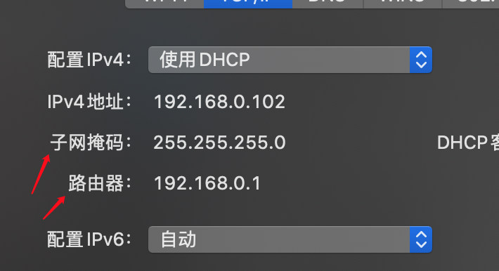
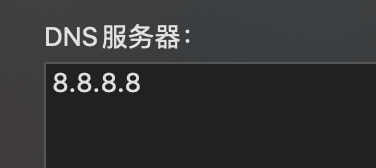
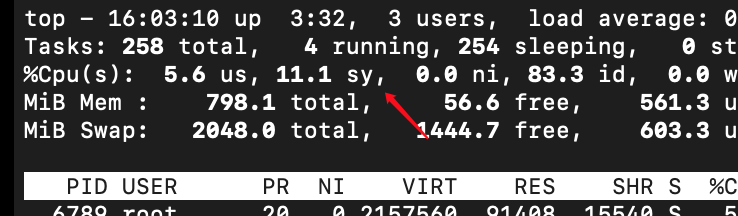

* [我的常用命令](#%E6%88%91%E7%9A%84%E5%B8%B8%E7%94%A8%E5%91%BD%E4%BB%A4)
    * [mac微信文件路径](#mac%E5%BE%AE%E4%BF%A1%E6%96%87%E4%BB%B6%E8%B7%AF%E5%BE%84)
    * [Maven项目打包成war包](#maven%E9%A1%B9%E7%9B%AE%E6%89%93%E5%8C%85%E6%88%90war%E5%8C%85)
    * [git仓库](#git%E4%BB%93%E5%BA%93)
    * [git提交命令](#git%E6%8F%90%E4%BA%A4%E5%91%BD%E4%BB%A4)
    * [nginx命令](#nginx%E5%91%BD%E4%BB%A4)
    * [mysql常见命令](#mysql%E5%B8%B8%E8%A7%81%E5%91%BD%E4%BB%A4)
    * [mac 终端连接centos](#mac-%E7%BB%88%E7%AB%AF%E8%BF%9E%E6%8E%A5centos)
    * [centos常用命令](#centos%E5%B8%B8%E7%94%A8%E5%91%BD%E4%BB%A4)
    * [Centos下tomcat查看实时日志](#centos%E4%B8%8Btomcat%E6%9F%A5%E7%9C%8B%E5%AE%9E%E6%97%B6%E6%97%A5%E5%BF%97)
    * [sublime常用快捷键](#sublime%E5%B8%B8%E7%94%A8%E5%BF%AB%E6%8D%B7%E9%94%AE)
    * [MyBatis](#mybatis)
    * [Mybatis生成模版](#mybatis%E7%94%9F%E6%88%90%E6%A8%A1%E7%89%88)
    * [npm](#npm)
    * [webpack](#webpack)
    * [postwomen使用方法](#postwomen%E4%BD%BF%E7%94%A8%E6%96%B9%E6%B3%95)
    * [gh\-md\-toc](#gh-md-toc)

[toc]

# 我的常用命令

### mac微信文件路径

/Users/littleboy/Library/Containers/com.tencent.xinWeChat/Data/Library/Application Support/com.tencent.xinWeChat/2.0b4.0.9/3a77a482bb0fa1361e7c64a15004da72/Message/MessageTemp/

### Maven项目打包成war包

mvn package -DskipTests

### git仓库

* 本地代码仓库

/Volumes/MyFile/gitRepository/file

* 图灵学院资料

cd /Volumes/MyFile/file/tuling/Document/

下载新的提交的资料

git pull origin master

### git提交命令

* 提交到github

git add .

git commit -m “info”

git push origin master

* 更新下来

git pull origin master

* 清空缓存，然后重新提交

git rm -r --cached .

### git提交同一patch

git add .

git commit -- amend

git review

### nginx命令

nginx -s reload 

重启nginx

nginx -s stop

停止nginx

nginx

启动nginx

查看进程nginx进程`ps -rf|grep nginx`

查看nginx日志：`tail -f logs/error.log`

### mysql常见命令

* 远程数据库

mysql -h 120.79.247.212 -u zxj -p

* 重启数据库

 /etc/init.d/mysqld restart

* 查看索引

show index from mytable；

* 查看表结构

desc table name;

### mac 终端连接centos

* 上传免密登录

ssh-copy-id root@ip_address

* 没有配置免密登陆

ssh -l root 120.79.247.212

* 免密登陆

ssh root@120.79.247.212

* 上传文件

scp filename root@120.79.247.212:/root/file

scp 文件路径名字 用户名@ip:存放文件

### centos常用命令

* kill端口

Netstat -anp | grep 8080

最后两列就是pid/pname

kill -9 pid

* shell文件授权

```shell
chmod +x test.sh
```


* 启动关闭jar

  1、后台运行jar包程序，输入：nohup java -jar demo-0.0.1-SNAPSHOT.jar > demoZhu.log 2>&1 &

  2、后台终止jar包程序，输入：ps -ef | grep java，查看使用java命令的进程，再输入：kill pid 即可终止运行

  \-------------------------------------------------------------------------------------------------------------------------

  ps -ef|grep指令介绍：
  ps命令：将某个进程显示出来，是Linux下最常用也是非常强大的进程查看命令
  grep命令：查找，全称是Global Regular Expression Print，表示全局正则表达式版本，它的使用权限是所有用户，
          是一种强大的文本搜索工具，它能使用正则表达式搜索文本，并把匹配的行打印出来
  |命令：管道命令，指ps命令与grep同时执行

  字段含义如下：
  UID  PID  PPID  C  STIME  TTY  TIME  CMD

  UID ：程序被该UID所拥有
  PID ：这个程序的ID
  PPID ：其上级父程序的ID
  C ：CPU使用的资源百分比
  STIME ：系统启动时间
  TTY ：登入者的终端机位置
  TIME ：使用掉的CPU时间
  CMD ：所下达的是什么指令

* 写入文件

echo "xxx" > /usr/index.html

* tip压缩命令

  zip -o xxx.war index.html

  zip -o xxx.zip user

* 解压命令

若后缀为.tar.gz，使用tar -xzvf filename  //安装到当前目录下t

tar -zxvf filename -C /usr/local/java/  //安装到指定目录下

* 安装jdk

  ```shell
  export JAVA_HOME=/root/jdk8
  export JRE_HOME=$JAVA_HOME/jre 
  export PATH=$PATH:$JAVA_HOME/bin:$JRE_HOME/bin
  export CLASSPATH=.:$JAVA_HOME/lib/dt.jar:$JAVA_HOME/lib/tools.jar:$JRE_HOME/lib
  ```
```
  
* 查看ip地址

ip addr  

* 配置环境变量

vim /etc/profile

~/.bash_profile

* centos重启之后要重新关闭防火墙，和重新开启服务

systemctl stop firewalld.service 

systemctl disable firewalld.service 

* Centos防火墙开放端口

sudo firewall-cmd --zone=public --add-port=443/tcp --permanent

sudo firewall-cmd --reload

重新启动

* 虚拟机设置静态IP

  su root

  cd /etc/sysconfig/network-scripts/

  vim ifcfg-ens33

  

  

  ```bash
  TYPE=Ethernet
  BOOTPROTO=static#改为静态
  DEFROUTE=yes
  IPV4_FAILURE_FATAL=no
  NAME=ens33
  UUID=08e05a74-381b-4cf2-aaaa-84161646813b
  DEVICE=ens33
  ONBOOT=yes
  
  IPADDR=192.168.0.107#随便设置
  NETMASK=255.255.255.0#和主机掩码一致
  DNS1=8.8.8.8#主机DNS添加8.8.8.8
  GATEWAY=192.168.0.1#和主机路由一致
  
  IPV6_PEERNDS=yes
  IPV6_PEEROUTES=yes
  IPV6_PRIVACY=no
```

  service NetworkManager restart

  如果还是不能联网，则重启虚拟机

* cpu实时信息

  top命令

  

### Centos下tomcat查看实时日志

cd到tomcat的log目录下执行命令，关闭日志ctrl+c

tail -f catalina.out

### sublime常用快捷键

* 格式化json

command+control+j

### MyBatis

association 一个类中嵌入另外一个类

collection一个类中嵌入了一个集合

property为类中的变量名

column为查询语句中的别名，或者列名，如果有重复的列，就写别名

```xml
 <resultMap id="BaseResultMapKecheng" type="com.zxj.model.Kecheng" >
        <id column="id2" property="id" jdbcType="INTEGER" />
        <result column="bianhao" property="bianhao" jdbcType="VARCHAR" />
        <result column="kechengmingcheng" property="kechengmingcheng" jdbcType="VARCHAR" />
    </resultMap>
		<!--两种方式，都可以-->
    <resultMap id="jiaoshiResultMap3" type="com.zxj.model.Jiaoshi" extends="BaseResultMap">
        <association property="kecheng" javaType="com.zxj.model.Kecheng" resultMap="BaseResultMapKecheng">
            <!--            <id property="id" column="id2" />-->
            <!--            <result property="bianhao" column="bianhao"/>-->
            <!--            <result property="kechengmingcheng" column="kechengmingcheng"/>-->
        </association>
        <collection property="xueshengs" javaType="list" ofType="com.zxj.model.Xuesheng">
            <id column="id1" property="id" jdbcType="INTEGER"></id>
            <result column="xuehao" property="xuehao" jdbcType="VARCHAR"/>
            <result column="xingming1" property="xingming" jdbcType="VARCHAR"/>
        </collection>
</resultMap>
```

### Mybatis生成模版

java -jar mybatis-generator-core-1.3.2.jar -configfile generator.xml -overwrite

### npm

```
下载babel包
npm i babel-loader babel-core babel-preset-es2015 babel-plugin-transform-runtime -D
下载vue包
npm i vue -S ; npm i vue-loader vue-template-compiler -D
```

### webpack

创建一个项目文件夹，初始化webpack

```bash
#创建一个工程目录
npm init
npm install webpack webpack-cli --save-dev
#下载babel包
npm i babel-loader babel-core babel-preset-es2015 babel-plugin-transform-runtime -D
#下载vue包
npm i vue -S ; npm i vue-loader vue-template-compiler -D

#在webpack.config.js目录执行命令，进行打包
npx webpack
```

### postwomen使用方法(Mac)

```bash
cd /Volumes/MyFile/vue/postwoman
npm run dev
```

然后输入网址：http://192.168.1.100:3000/

### gh-md-toc(Mac)

用这个工具生成github目录

```
cd /usr/local/Cellar/github-markdown-toc/1.0.0/bin
./gh-md-toc md文件名
然后复制目录到md文件中即可
```

### nacos启动和关闭(mac)

http://localhost:8848/nacos

账号密码nacos

```shell
#文件在MyFile中
cd /Volumes/MyFile/nacos
#单机模式启动
sh startup.sh -m standalone  
#服务注册
curl -X POST 'http://127.0.0.1:8848/nacos/v1/ns/instance serviceName=nacos.naming.serviceName&ip=20.18.7.10&port=8080'
#服务网发现
curl -X GET 'http://127.0.0.1:8848/nacos/v1/ns/instance/list?serviceName=nacos.naming.serviceName'
#关闭nacos
sh shutdown.sh
```

### redis(mac)

[使用方法](https://www.jb51.net/article/164902.htm)

启动关闭redis

```shell
#这个命令会在后台启动redis服务，并且每一次登录系统，都会自动重启
brew services start redis
#关闭redis服务
brew services stop redis

#假如你不需要后台启动服务，你可以使用配置文件启动：
redis-server /usr/local/etc/redis.conf
```

连接redis

```shell
# 不需要身份认证时
redis-cli -p 6379 -h 127.0.0.1
 
# 需要身份认证时，输入如下命令
redis-cli -p 6379 -h 127.0.0.1 -a 926454
redis-cli -p 6379 -h 47.97.216.76 -a 926454
# or
redis-cli -p 6379 -h 127.0.0.1
# 登录进去之后再进行身份认证
127.0.0.1:6379> auth 0903


服务器 47.97.216.76

#启动
./redis.service ./redis.confi

# 阿里云
redis-cli -h 6379 -h r-7xvjphhmzxbb6bl00opd.redis.rds.aliyuncs.com
```

### rabbitmq(mac)

docker 安装

https://www.cnblogs.com/angelyan/p/11218260.html

```shell
#启动
brew services start rabbitmq

#停止
brew services stop rabbitmq

# http://localhost:15672/
# 控制台 guest guest
# 服务端口5672

## 添加账号
./rabbitmqctl add_user admin admin
## 添加访问权限
./rabbitmqctl set_permissions -p "/" admin ".*" ".*" ".*"
## 设置超级权限
./rabbitmqctl set_user_tags admin administrator
```

### python

 **1. 显示可安装的python版本**

```shell
conda search -f python
```

 **2. 安装虚拟环境,名称为py2**

```shell
conda create -n py2 python=2.7
```

 **3. 激活py2**

```shell
conda activate py2
```

利用conda info –envs 或者conda env list 查询的虚拟环境，输入activate py2激活py2环境

conda remove -n yourenvname -all移除虚拟环境

python3 -m venv .venv 创建虚拟环境

### MongoDB

https://www.runoob.com/mongodb/mongodb-osx-install.html

### Docker

```shell
docker build -t node/email-login .
docker run -itd --name mongo -p 27017:27017 mongo
docker run -itd --name redis -p 6379:6379 redis
docker run -itd --name email-login -p 23170:7001 node/email-login

docker network create maimemonet
docker run -itd --name mongo -p 27017:27017 --network maimemonet --network-alias mongo mongo
docker run -itd --name redis -p 6379:6379 --network maimemonet --network-alias redis redis
```

docker切换容器网络

```
To see what network(s) your container is on, assuming your container is called c1:

$ docker inspect c1 -f "{{json .NetworkSettings.Networks }}"
To disconnect your container from the first network (assuming your first network is called test-net):

$ docker network disconnect test-net c1
Then to reconnect it to another network (assuming it's called test-net-2):

$ docker network connect test-net-2 c1
To check if two containers (or more) are on a network together:

$ docker network inspect test-net -f "{{json .Containers }}"
```


### ElasticSearch

```bash
docker run -d --name elasticsearch -p 9200:9200 -p 9300:9300 -e ES_JAVA_OPTS="-Xms1024m -Xmx1024m" -e "discovery.type=single-node" elasticsearch:7.1.1
```

https://www.cnblogs.com/fbtop/p/11005469.html

