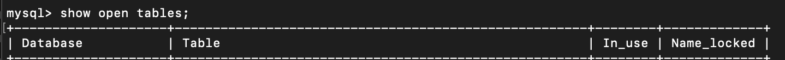
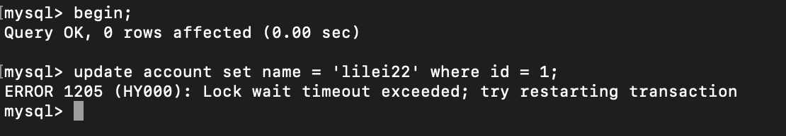
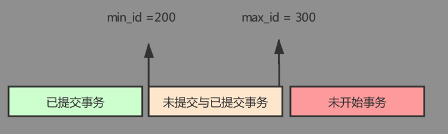
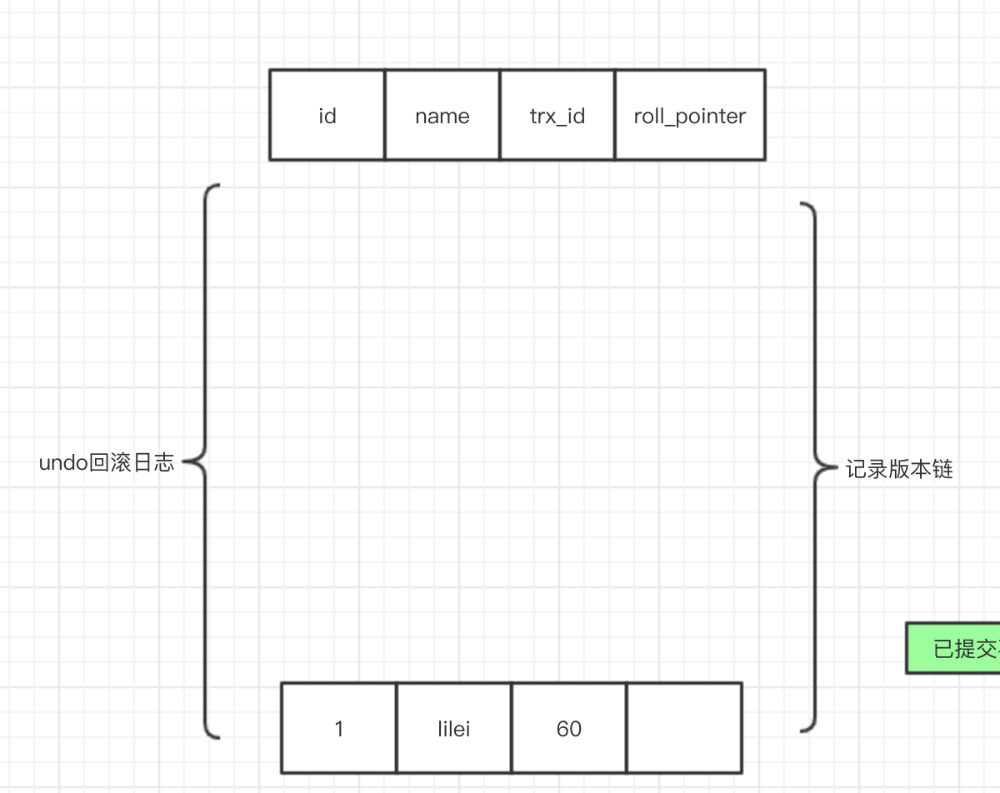
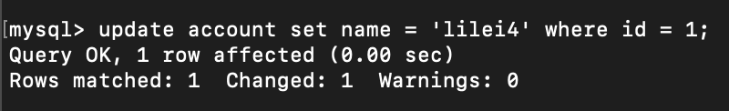
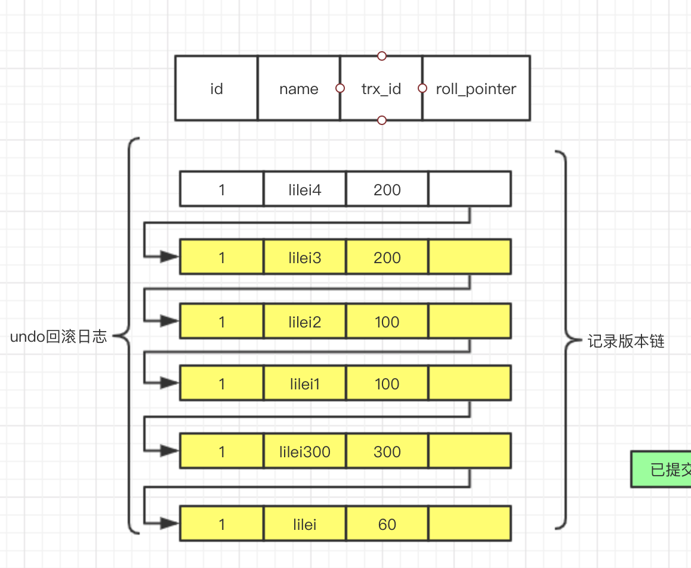

* [一、MySQL锁与事务隔离级别](#%E4%B8%80mysql%E9%94%81%E4%B8%8E%E4%BA%8B%E5%8A%A1%E9%9A%94%E7%A6%BB%E7%BA%A7%E5%88%AB)
  * [1 锁定义](#1-%E9%94%81%E5%AE%9A%E4%B9%89)
  * [2 锁分类](#2-%E9%94%81%E5%88%86%E7%B1%BB)
    * [2\.1 表锁](#21-%E8%A1%A8%E9%94%81)
      * [2\.1\.1 基本操作](#211-%E5%9F%BA%E6%9C%AC%E6%93%8D%E4%BD%9C)
      * [2\.1\.2 session1加读锁](#212-session1%E5%8A%A0%E8%AF%BB%E9%94%81)
      * [2\.1\.3 session1加写锁](#213-session1%E5%8A%A0%E5%86%99%E9%94%81)
      * [2\.1\.4案例总结](#214%E6%A1%88%E4%BE%8B%E6%80%BB%E7%BB%93)
    * [2\.2 行锁](#22-%E8%A1%8C%E9%94%81)
      * [2\.2\.1 行锁支持事务](#221-%E8%A1%8C%E9%94%81%E6%94%AF%E6%8C%81%E4%BA%8B%E5%8A%A1)
        * [<strong>1\. 事务（transaction）及其ACID属性</strong>](#1-%E4%BA%8B%E5%8A%A1transaction%E5%8F%8A%E5%85%B6acid%E5%B1%9E%E6%80%A7)
        * [<strong>2\. 并发事务处理带来的问题</strong>](#2-%E5%B9%B6%E5%8F%91%E4%BA%8B%E5%8A%A1%E5%A4%84%E7%90%86%E5%B8%A6%E6%9D%A5%E7%9A%84%E9%97%AE%E9%A2%98)
        * [<strong>3\. 事务隔离级别</strong>](#3-%E4%BA%8B%E5%8A%A1%E9%9A%94%E7%A6%BB%E7%BA%A7%E5%88%AB)
      * [2\.2\.2 行锁与隔离级别案例分析](#222-%E8%A1%8C%E9%94%81%E4%B8%8E%E9%9A%94%E7%A6%BB%E7%BA%A7%E5%88%AB%E6%A1%88%E4%BE%8B%E5%88%86%E6%9E%90)
        * [1\. 行锁演示](#1-%E8%A1%8C%E9%94%81%E6%BC%94%E7%A4%BA)
        * [2\. 读未提交](#2-%E8%AF%BB%E6%9C%AA%E6%8F%90%E4%BA%A4)
        * [3\. 读已提交](#3-%E8%AF%BB%E5%B7%B2%E6%8F%90%E4%BA%A4)
        * [4\. 可重复读](#4-%E5%8F%AF%E9%87%8D%E5%A4%8D%E8%AF%BB)
        * [<strong>5\. MVCC机制详解</strong>（可重复读）](#5-mvcc%E6%9C%BA%E5%88%B6%E8%AF%A6%E8%A7%A3%E5%8F%AF%E9%87%8D%E5%A4%8D%E8%AF%BB)
          * [a\. MVCC底层原理案例说明](#a-mvcc%E5%BA%95%E5%B1%82%E5%8E%9F%E7%90%86%E6%A1%88%E4%BE%8B%E8%AF%B4%E6%98%8E)
          * [b\. 删除示例](#b-%E5%88%A0%E9%99%A4%E7%A4%BA%E4%BE%8B)
        * [6\. 串行化](#6-%E4%B8%B2%E8%A1%8C%E5%8C%96)
      * [2\.2\.3 案例结论](#223-%E6%A1%88%E4%BE%8B%E7%BB%93%E8%AE%BA)
      * [2\.2\.4 行锁分析](#224-%E8%A1%8C%E9%94%81%E5%88%86%E6%9E%90)
      * [2\.2\.5 死锁](#225-%E6%AD%BB%E9%94%81)
      * [2\.2\.6 优化建议](#226-%E4%BC%98%E5%8C%96%E5%BB%BA%E8%AE%AE)

[toc]

# 一、MySQL锁与事务隔离级别

## 1 锁定义

锁是计算机协调多个进程或线程并发访问某一资源的机制。

在数据库中，除了传统的计算资源（如CPU、RAM、I/O等）的争用以外，数据也是一种供需要用户共享的资源。如何保证数据并发访问的一致性、有效性是所有数据库必须解决的一个问题，锁冲突也是影响数据库并发访问性能的一个重要因素。

## 2 锁分类

* 从性能上分为<font color=red>**乐观锁**</font>(用版本对比来实现)和<font color=red>**悲观锁**</font>(悲观锁会涉及到锁的等待)

  在表中加入一个版本version的字段，查找的时候来比对版本，乐观锁不会涉及到锁的等待。

  比如查找一个数据时，记录当前的versin字段，当update的时候在比较version字段，如果version一直则可以更新，如果不一致，说明有其他的session已经更改过，就不能在更新，以免把别人更新后的数据覆盖掉。

* 从对**数据库操作**的类型分，分为<font color=red>读锁和写锁</font>(都属于悲观锁)

  **读锁（共享锁 S）**：针对同一份数据，多个读操作可以同时进行而不会互相影响，同一份数据可以加多个S锁，但是不能再加X锁。

  **写锁（排它锁 X** ）：当前写操作没有完成前，它会阻断其他写锁和读锁，同一份数据只能加一个X锁，如果加了X锁，S和X锁都不能再加。

* 从对数据操作的**粒度**分，分为<font color=red>**表锁**和**行锁**</font>（常用的储存引擎：MYISAM和InnoDB），页锁不涉及（InnoDB不支持）

### 2.1 表锁

每次操作锁住整张表。开销小，加锁快；不会出现死锁；锁定粒度大，发生锁冲突的概率最高，并发度最低。

表锁一般用于对数据迁移，运维用得比较多，MyISAM只有表锁，更新数据时就会加写锁。

#### 2.1.1 基本操作

示例表（采用了MyISAM储存引擎）

```sql
CREATE TABLE `mylock` (
 `id` INT (11) NOT NULL AUTO_INCREMENT,
 `NAME` VARCHAR (20) DEFAULT NULL,
 PRIMARY KEY (`id`)
 ) ENGINE = MyISAM DEFAULT CHARSET = utf8;

 ‐‐插入数据
 INSERT INTO`test`.`mylock` (`id`, `NAME`) VALUES ('1', 'a');
 INSERT INTO`test`.`mylock` (`id`, `NAME`) VALUES ('2', 'b');
 INSERT INTO`test`.`mylock` (`id`, `NAME`) VALUES ('3', 'c');
 INSERT INTO`test`.`mylock` (`id`, `NAME`) VALUES ('4', 'd');
```

首先常见一个session先给表加读锁，然后在另外一个session中查询和修改

```sql
lock table mylock read;
```

#### 2.1.2 session1加读锁


session2

查询互不影响


当session对改表进行修改时，就会发生等待


```sql
show open tables; -- 查看加过锁的表
```




In_use为1表示正在加锁

当session1中删除表锁时，session2的更新语句才会执行。

* session1解锁

  ```sql
  unlock tables;--解锁
  ```

  


* session2完成更新，显示等待了2分钟


**读锁总结**：读锁是允许多个session同时读，但是其他session对表进行更改数据会发生等待。

#### 2.1.3 session1加写锁

```sql
lock table mylock write;
```


当前会话允许所有的操作


session2示例：

从结果可以看出，session2发现了等待


session1解锁


session2的查询语句执行成功


**写锁总结**：如果一个会话对表加了**写锁**，这个表只允许这个会话进行操作，其他的会话的所有操作都将发生等待。

#### 2.1.4案例总结

<font color=red>MyISAM在执行查询语句（select）前，会自动给涉及的所有表加**读锁**，在执行增删改操作前，会自动给涉及的表加**写锁**。</font>

1. 对MyISAM表的读操作（加读锁），不会阻塞其他进程对同一表的读请求，但会阻塞对同一表的写请求。只有当读锁释放后，才会执行其他进程的写操作。
2. 对MyISAM表的写操作（加写锁），会阻塞其他进程对同一表的读和写操作，只有当写锁释放后，才会执行其他进程的读写操作。

简而言之：**读锁会阻塞写，但是不会阻塞读，而写锁则会把读和写都阻塞**

### 2.2 行锁

每次操作只锁住一行数据。缺点：<font color=red>**开销大，加锁慢；会出现死锁；锁定粒度最小，发生所冲突的概率最小，并发度最高。**</font>

InnoDB与MyISAM的最大不同有两点：

* 支持事务（transaction）
* 支持行级锁

#### 2.2.1 行锁支持事务

##### **1. 事务（transaction）及其ACID属性**

事务是由一组SQL语句组成的逻辑处理单元，事务具有以下4个属性，通常简称为事务的ACID属性。

<font color=red size=3>**原子性（Atomicity）**</font>：事务是一个原子操作单元，其对数据的修改，要么全部执行，要么全部不执行（即回滚rollback）（一个事务中的数据库操作语句不能被分割，操作的一致性）

<font color=red size=3>**一致性（Consistent）**</font>：在事务开始和完成时，数据都必须保持一致状态。这意味着所有相关的数据规则都必须应用于事务的修改，以保持数据的完整性；事务结束时，所有的内部数据结构（如B树索引或双向链表）也都必须是正确的。（操作的结果要么全部把数据库修改完，要么全部不能修改，操作结果的一致性）

<font color=red size=3>**隔离性（Isolation）**</font>：数据库系统提供一定的隔离机制，保证事务在不受外部并发操作影响的“独立”环境执行。这意味着事务处理过程中状态对外部是不可见的，反之亦然。

<font color=red size=3> **持久性（Durable）**</font>：事务完成之后，它对数据的修改时永久性的，即使出现系统故障也能够保持。

##### **2. 并发事务处理带来的问题**

<font color=red>**更新丢失（Lost Update）**</font>

 		当两个或者多个事务选择同一行，然后基于最初选定的值更新该行时，由于每个事务都不知道其他事务的存在，就会发生丢失更新问题-最后更新覆盖了由其他事务所做的更新。

<font color=red>**脏读（Dirty Reads）**</font>

​		一个事务正在对一条记录做修改，在这个事务完成并提交前，这条记录的数据就处于不一致的状态；这是，另一个事务也来读取同一条记录，如果不加控制，第二个事务读取了这些“脏数据”，并据此作进一步处理，就会产生未提交的数据依赖关系。这种现象被形象的叫做“脏读”。

​		一句话：事务A读取到了事务B已经修改但尚未提交的数据，还在这个数据基础上做了操作。此时如果事务B回滚，A读取的数据无效，不符合一致性要求。

<font color=red>**不可重读（Non-Repeatable Reads）**</font>

​		一个事务在读取某些数据后的某个时间，再次读取以前读过的数据，却发现其读出的数据已经发生了改变、或某些记录已经被删除了！这种现象就做“不可重复读”。

​		一句话：事务A读取到了事务B已经提交的修改数据，不符合隔离性。

<font color=red>**幻读（Phantom Reads）**</font>

​		一个事务按相同的查询条件重新读取以前检索过的数据， 却发现其他事务插入了满足其查询条件的新数据，这种现象就称为“幻读”。

​		一句话：事务A读取到了事务B提交的新增数据，不符合隔离性。

##### **3. 事务隔离级别**

| 隔离级别                     | 脏读（Dirty Read） | 不可重复读（NonRepeatable Read） | 幻读（Phantom Read） |
| ---------------------------- | ------------------ | -------------------------------- | -------------------- |
| 读未提交（Read uncommitted） | 可能               | 可能                             | 可能                 |
| 读已提交（Read committed）   | 不可能             | 可能                             | 可能                 |
| 可重复读（Repeatable read）  | 不可能             | 不可能                           | 可能                 |
| 可串行化（Serializable）     | 不可能             | 不可能                           | 不可能               |

​		数据库的事务隔离越严格，并发副作用越小，但付出的代价也就越大，因为事务隔离实质上就是使事务在一定程度上“串行化”进行，这显然与“并发”使矛盾的。

​		同时，不同的应用对读一致性和事务隔离程度的要求也是不同的，比如许多应用对“不可重复读”和“幻读”并不敏感，可能更关心数据并发访问的能力。

​		**查看当前数据库的事务隔离级别**

```sql
show variables like 'tx_isolation';
```

​		**设置事务隔离级别**

```sql
set tx_isolation = 'REPEATABLE-READ';
```


#### 2.2.2 行锁与隔离级别案例分析

  示例表：

  ```sql
  CREATE TABLE `account` (
   `id` int(11) NOT NULL AUTO_INCREMENT,
   `name` varchar(255) DEFAULT NULL,
   `balance` int(11) DEFAULT NULL,
   PRIMARY KEY (`id`)
    ) ENGINE=InnoDB DEFAULT CHARSET=utf8;
   INSERT INTO `test`.`account` (`name`, `balance`) VALUES ('lilei', '450');
   INSERT INTO `test`.`account` (`name`, `balance`) VALUES ('hanmei',
  '16000');
   INSERT INTO `test`.`account` (`name`, `balance`) VALUES ('lucy', '2400');
  ```

##### 1. 行锁演示

一个session开启事务更新不提交，另一个session更新同一条记录会阻塞，更新不同的记录不会阻塞。

* 开启session1
  
 ```sql
  begin;
  select * from account;
 ```

    update account set name = 'lilei11' where id = 1;
       --但是没有提交
      ```


​       


  * 开启session2

    ```sql
    begin;
    update account set name = 'lilei11' where id = 1;
    ```

    

这时候发现session2已经阻塞，如果长时间没有反应，行锁会超时。

这时候重新执行更新语句，发现继续阻塞，然后提交session1，session成功修改。


提交session1，session2更新成功。


##### 2. 读未提交

(1) 打开一个客户端A，并设置当前事务模式为read uncommitted（读未提交），查询account的初始值：

```sql
set tx_isolation = 'read-uncommitted';
```


​		(2)在客户端A的事务没有提交之前，打开客户端B，设置事务等级为**读未提交**更新表account；


​		(3)这是，虽然客户端B的事务还没有提交，但是客户端A就可以查询到B已经更新的数据：

Session1：


​		(4)一旦客户端B的事务因为某种原因回滚，所有的操作都将会被撤销，那么客户端A查询到的数据其实就是**脏数据**：

​		意思就是客户端A将查询的数据保存到了java的变量中进行操作，客户端B进行了回滚操作，A已经读取的数据将不会改变，A的数据就是**脏数据**。


​	(5) 当B回滚之后，在客户端执行更新语句

```sql
update account set balance = balance - 50 where id = 1;
```

执行之后发现第一条数据的值还是400，而不是350，就会出现数据不一致的状况。**因为在update的语句中，会直接调用数据库最新的数据来执行**，但是A并不知道B已经回滚，所以数据就会错乱。要解决这个问题，可以采用**读已提交**的隔离级别。


##### 3. 读已提交

(1)先打开客户端A，设置当前的事务隔离级别为read committed（读已提交），查询account的所有记录

```sql
set tx_isolation = 'read-committed';
```


(2) 在客户端A的事务提交前，打开另外一个客户端B，更新表account:

客户端B开启一个事务，执行更新语句：

```sql
update account set balance = balance - 50 where id = 1;
```

(3) 客户端B已经将数据库的数据进行了更改，这时候客户端B还没有提交，客户端A将查询不到B没有提交的数据，解决了**脏数据**


客户端A查询的语句，还是之前的300


(4)客户端B提交事务


(5) 客户端A执行与上一步相同的查询，结果 与上一步不一致，即产生了**不可重复读**的问题


##### 4. 可重复读

（1）打开一个客户端A，并设置当前事务模式为repeatable read，查询表account的所有记录

```sql
set tx_isolation='repeatable-read';
```


(2) 在客户端A的事务提交之前，打开另一个客户端B，设置事务隔离级别为可重复读，更新表account并提交，可以看出数据由之前的250变为了200；


(3) 在客户端A查询表account的所有记录，与步骤（1）查询结果一致，没有出现不可重复读的问题


<font color=red>（4）在客户端A，接着执行更新语句，balance没有变成250-50=200，lilei的balance值用的是步骤（2）中的200来算的，所以是150，数据的一致性倒是没有被破坏。可重复读的隔离级别下使用了MVCC(multi-version concurrency control)机制，select操作不会更新版本号，是快照读（历史版本）；insert、update和delete会更新版本号，是当前读（当前版本）。</font>

```sql
update account set balance = balance - 50 where id = 1;
```


##### <font color=red>**5. MVCC机制详解**</font>（可重复读）

MVCC(multi-version concurrency control)，主要解决的是**可重复读**，底层实现原理讲解。

当查询执行sql时会生成一致性视图read-view，它由执行查询时所有未提交事务id数组（数组里最小的id为min_id）和已创建的最大事务id（max_id）组成，查询的数组结果需要跟read-view做比对，从而得到快照结果。

<font color=red>readview:[min_id,trx_id1,trx_id2],max_id</font>

<font color=red>readview:[未提交的事务],已创建的事务的最大的事务id</font>

版本链比对规则：



1. 如果落在绿色部分（trx_id < min_id），表示这个版本是已经提交的事务生成的，这个数据是可见的；
2. 如果落在红色部分（trx_id > max_id），表示这个版本是由将来启动的事务生成的，是肯定不可见的；
3. 如果落在黄色部分（min_id <= trx_id <= max_id），那就包括两种情况
   1. 若row的trx_id在数组中，表示这个版本是由还没有提交的事务生成的，不可见，当前自己的事务是可见的；
   2. 若row的trx_id不在数组中，表示这个版本是已经提交了的事务生成的，可见。

对于删除的情况可以认为是update的特殊情况，会将版本链上最新的数据复制一份，然后将trx_id修改删除操作的trx_id，同时在该条记录的头信息（record header）里的（deleted_flag）标记为写上true，来表示当前记录已经被删除，在查询时按照上面的规则查到对应的记录如果deleted_flag标记为为true，意味着记录已经被删除，则不返回数据。

###### a. MVCC底层原理案例说明

Transaction100、200和300为模拟更新操作，select 1和2为模拟其他事务查找事务，模拟可重复读的执行过程，主要针对account表，执行顺序按照行号执行。**100 200 300为假设的事务id**




初始版本，可能之前有事务创建或者更新过该条记录，假设trx_id=60作为初始：

1. 首先开启五个事务

2. Transaction100执行更新语句，开始事务，创建事务id为100，test只是为了获得事务id，示例主要针对account表：

   ```sql
   update test set c1 = '123' where id = 1;
   ```

   

3. Transaction200执行更新语句，开始事务，创建事务id为200，test也是为了获得事务id：

   ```sql
   update test set c1 = '666' where id = 2;
   ```

   

4. Transaction300执行更新语句，开始事务，创建事务id为300，此时操作的是account表，所以mysql会在undo回滚日志中生成快照版本：

   ```sql
   update account set name = 'lilei300' WHERE id = 1;
   ```

   

   此时undo回滚日志中就会插入一行更新记录，即trx_id为300执行的更新语句，现在的版本链最顶端的即为最新的数据，roll_pointer则指向之前旧的数据。

   

5. 提交Transaction300 执行`commit;`

   

6. select1开始事务的查询

   ```sql
   select name from account where id = 1;
   ```

   当执行查询语句的时候才会自动的生成readview，记录当前的未提交事务和最大的事务的trx_id。

   这条查询的readview为 ---> readview:[100,200],300

   100和200为还未提交的事务，300为max_id，已经提交，100为min_id。

   由于300在min_id和max_id之间，所以符合了规则的第三条，第b项，300为已经提交的事务，不在readview数组中，所以这条记录是可见的，所以查询结果为**lilei300**。

   

查询结果


7. Transaction100执行更新语句

   ```sql
   update account set name = 'lilei1' where id = 1;
   ```

   

   记录版本链中加入刚才更新的数据

   

8. Transaction100继续执行更新语句

   ```sql
   update account set name = 'lilei2' where id = 1;
   ```

   

   版本链的记录添加一条最新的记录

   

9. select1执行查询语句

   ```sql
   select name from account where id = 1;
   ```

这时候，用于该模式是<font color=red>**可重复读**</font>，所以readview会用之前已经生成的readview，而不会去更新，所以readview是：readview:[100,200],300


根据readview来查找值，第一条最新的记录，trx_id为100，在min_id和max_id之间，而且在未提交的数组中，所以满足规则的第3条a项，所以这行记录是不可见的，只能由Transaction100事务可见。然后根据roll_pointer继续先下查找，这时trx_id同上一条记录一样，也是不可见的。然后继续查找下一条，这时trx_id为300，也在min_id和max_id之间，这时300不在未提交的数组中，所以这条数据是可见的，即这条数据为该事务所查找的最新数据。所以查询的结果还是lilei300。


10. 提交Transaction100，Transaction200执行更新语句

    ```sql
    #Transaction200
    update account set name = 'lilei3' where id = 1;
    ```

    Transaction100 `commit;`

    

    Transaction200执行更新语句

    

    此时记录版本链更新记录：

    

11. Transaction2记录执行更新语句

    ```sql
    update account set name = 'lilei4' where id = 1;
    ```

    

    更新记录版本链：

    

12. select1执行查询语句

    ```sql
    select name from account where id = 1;
    ```

    这时候，用于该模式是<font color=red>**可重复读**</font>，所以readview会用之前已经生成的readview，而不会去更新，所以readview还是：readview:[100,200],300，不会更改

    

    根据记录版本链，虽然其他的事务已经更新了四条了记录，但是前面四条的trx_id都在readview的未提交的事务id数组中，虽然Transaction100已经提交了，但是由于readview没有改变，是不用理会实际是否提交，所以前面四条记录都满足规则的第3条a项，其他事务更改的数据只由更改的事务可见，该查询事务不可见，所以顺着roll_pointer向下查找到trx_id=300，300没有在未提交数组中，满足规则第3条b项，数据可见，所以这条查询语句查询的结果还是lilei300。

    

    13. select2执行查询语句

        ```sql
        select name from account where id = 1;
        ```

        这时执行了查询语句，自动生成readview，现在Transaction100和Transaction300都已经提交，Transaction200还没有提交，所以min_id=200，max_id=300

        read_view:[200],300

        select2的记录版本链示例

        

        该查询从最新的版本开始查询，由于trx_id=200，在min_id和max_id之间，所以满足第3条规则，而200在未提交的数组中，所以满足第a项规则，所以trx_id=200的数据不可见，所以前面两条的记录select2不可见，所以顺着roll_pointer向下查询到trx_id=100，100小于min_id，在已提交的事务中，满足第1条规则，所以数据是可见的，所以查找的结果是**lilei2**

        

    14. 最后提交Transaction200的事务。

###### b. 删除示例

1. 开始三个事务，一个事务更新，一个事务删除，一个事务查询

2. Transaction100，执行更新语句，并且之间提交：

```sql
begin;
update account set name = 'lilei100' where id = 1;
commit;
```


记录版本链初始：


3. Transaction200，进行其他表的操作，获得trx_id


4. select1进行查询：

```sql
begin;
select name from account where id = 1;
```

这时候raed_view为：readview:[200],200


所以查询的结果是100


5. Transaction200删除该条记录：

   ```sql
   delete from account where id = 1;
   ```

   

   记录版本链的变化：

   

   删除记录是，该事务会将之前的版本复制一版，然后把trx_id更改为自己的trx_id，即为200，然后修改该行数据的头部信息（record header）中的删除标志（deleted flag）为true，当其他的查询查找这条记录的时候会判断删除标志是否为true，如果为true，则不可见，向下寻找记录。

6. select1 记录查询该条记录

   ```sql
   select name from account where id = 1;
   ```

   这时的readview会使用之前的readview，即为：readview:[200],200

   

   通过记录版本链可以看出，最新的记录为trx_id=200，该记录的deleted flag为true，表示该条记录已被删除，所以这条记录不可见，所以继续向下查找，最终结果为lilei100。

   


##### 6. 串行化

(1)打开一个客户端A，并设置当前事务模式为serializable（串行化），查询表account的初始值：

```sql
set tx_isolation = 'serializable';
```


(2) 打开一个客户端B，并设置当前事务模式为serializable，插入一条记录报错，表被锁了插入失败，<font color=red>mysql中事务隔离级别为serializable时会锁表，因此不会出现幻读的情况，这种隔离级别并发性极低，开发中很少会用到。</font>>


* <font color=red>MySQL默认级别是repeatable-read（可重复读），有什么办法可以解决幻读？</font>

  ```sql
  set tx_isolation = 'repeatable-read';--将之前设置的还原
  ```

  

<font color=red>间隙锁在某些情况下可以解决幻读问题</font>

先插入几个id隔离的数据，3-11中间有空隙，11-25中间也有空隙。当session1执行update时，条件在这两个空隙内

比如：

```sql
updata account set name = 'lfx' where id > 10 and id < 15;
```

10在3-11的空隙中，15在11-25的空隙中，那么这两个空隙就被加锁，其他的session操作这个范围的数据将会等待。


session2执行插入语句到空隙中，发生了等待，当sesssion1提交的时候，session2才会执行，或者超时。


session1提交


session2执行


* <font color=red>无索引行锁会升级为表锁</font>：锁主要是加在索引上，如果对非索引字段更新，条件不是索引，行锁可能会变为表锁。

session1执行更新：

```sql
update account set balance = 800 where name = 'lfx';
```

条件为非索引字段，行锁变为了表锁


session2对第一行记录更改，也发生了等待。<font color=red>**可以支持查询**</font>


<font color=red>InnoDB的行锁时针对索引加的锁，不是针对记录加的锁。并且该索引不能失效，否则都会从行锁升级为表锁。</font>

* 锁定某一行还可以用lock in share mode（共享锁）和for update（排它锁）[lock in share mode和for update区别](https://blog.csdn.net/sinat_27143551/article/details/89968902)

  例如：

  ```sql
  select * from test_account where name = 'lfx' for update;
  ```

  这样其他session只能读这行数据，修改则会被阻塞，知道锁定的行的session提交。

  session1添加排它锁

  

  session2可以查询，但是不能其他操作，直到session1提交。

  

  session1添加共享锁

  

  session2可以查询，但是不能其他操作，直到session1提交。


#### 2.2.3 案例结论

​		InnoDB存储引擎由于实现了行级锁，虽然在锁定机制的实现方面锁带来的性能损耗可能比表级锁定会要更高，但是在整体并发处理能力方面要远远优于MyISAM的表级锁定。当系统并发量高的时候，InnoDB的整体性能和MyISAM相比就会有比较明显的优势。

​		但是，InnoDB的行级锁定同样也有其脆弱的一面，当我们使用不当的时候，可能会让InnoDB的整体性能表现不仅不能比MyISAM高，甚至会更差。

#### 2.2.4 行锁分析

通过检查InnoDB_row_lock状态变量来分析系统上的行锁的争夺情况

```sql
show status like 'innodb_row_lock%';
```


各个状态量的说明如下：

Innodb_row_lock_current_waits：当前正在等待锁定的数量

Innodb_row_lock_time：从系统启动到现在锁定总时间长度

Innodb_row_lock_time_avg：每次等待所花平均时间

Innodb_row_lock_max：从系统启动到现在等待最长的一次所花时间

Innodb_row_lock_waits：系统启动后到现在总共等待的次数

对于这5个状态变量，比较重要的主要是：

<font color=red>Innodb_row_lock_time_avg（等待平均时长）</font>

<font color=red>Innodb_row_lock_time（等待总时长）</font>

<font color=red>Innodb_row_lock_waits（等待总次数）</font>

尤其是当等待次数很高，而且每次等待时长也不小的时候，我们就要分析系统中为什么会有如此多的等待，然后根据分析结果着手制定优化计划。

#### 2.2.5 死锁

排它锁只能加一次，而且不能再加排它锁和共享锁。

共享锁可以加多次，可以加多个共享锁，但是不能加排它锁。

开启两个不同的事务

```sql
set tx_isolation = 'repeatable-read';
select * from account where id = 1 for update;--session1 添加了排它锁
select * from account where id = 2 for update;--session2 添加量排它锁
select * from account where id = 2 for update;--session1 继续添加排它锁，将会等待
select * from account where id = 1 for update;--session2 继续添加排它锁，将会等待，然后出现了死锁
```

session1开始一个事务，为id=1添加排它锁


session2开启一个事务，为id=2添加排它锁


session1继续为id=2添加排它锁，这时候由于session2已经添加了排它锁，所以，被阻塞。


session2继续为id=1添加排它锁，这时候由于发生了死锁，mysql为自动检测，自动终止session2的执行，并且回滚，释放锁。


session1从死锁中解脱出来


查看近期死锁日志信息：

```sql
show engine innodb status\G;
```

大多数情况mysql可以自动检测死锁并回滚产生死锁的那个事务，但是有些情况mysql没有办法自动检测死锁。

#### 2.2.6 优化建议

* 尽可能让所有数据都通过索引来完成，避免无索引行锁升级为表锁
* 合理设计索引，尽量缩小锁的范围
* 尽可能减少检索条件，避免间隙锁
* 尽量控制事务大小，减少锁定资源量和时间长度，涉及事务加锁的sql尽量放在事务最后执行
* 尽可能低级别事务隔离