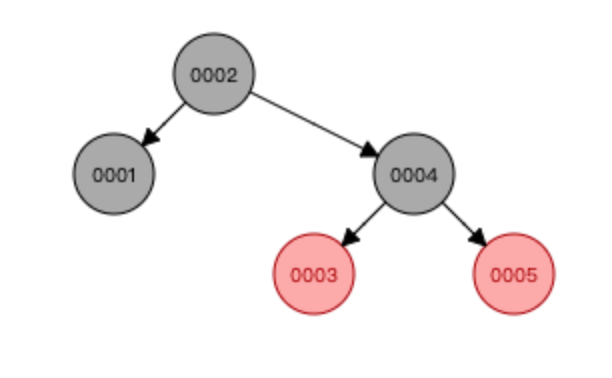
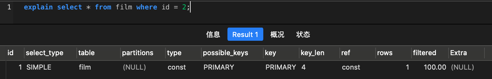
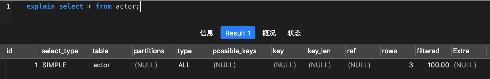
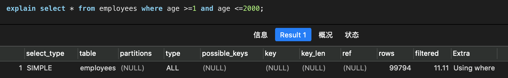

* [一、mysql索引底层数据结构与算法（主要是5\.7）版本](#%E4%B8%80mysql%E7%B4%A2%E5%BC%95%E5%BA%95%E5%B1%82%E6%95%B0%E6%8D%AE%E7%BB%93%E6%9E%84%E4%B8%8E%E7%AE%97%E6%B3%95%E4%B8%BB%E8%A6%81%E6%98%AF57%E7%89%88%E6%9C%AC)
  * [1 数据结构](#1-%E6%95%B0%E6%8D%AE%E7%BB%93%E6%9E%84)
    * [1\. 排序二叉树 [Binary Search Trees]二叉搜索树](#1-%E6%8E%92%E5%BA%8F%E4%BA%8C%E5%8F%89%E6%A0%91-binary-search-trees%E4%BA%8C%E5%8F%89%E6%90%9C%E7%B4%A2%E6%A0%91)
    * [2\. 红黑树 [Red\-Black Trees]](#2-%E7%BA%A2%E9%BB%91%E6%A0%91-red-black-trees)
    * [3\. Hash](#3-hash)
    * [4\. B树 [B Trees]](#4-b%E6%A0%91-b-trees)
    * [5\. B\+树 [B\+ Trees]](#5-b%E6%A0%91-b-trees)
  * [2 MySQL索引文件和数据文件](#2-mysql%E7%B4%A2%E5%BC%95%E6%96%87%E4%BB%B6%E5%92%8C%E6%95%B0%E6%8D%AE%E6%96%87%E4%BB%B6)
    * [1\. MYISAM引擎（非聚集）](#1-myisam%E5%BC%95%E6%93%8E%E9%9D%9E%E8%81%9A%E9%9B%86)
    * [2\. InnoDB(聚集)](#2-innodb%E8%81%9A%E9%9B%86)
    * [3\. 联合索引的底层存储结构](#3-%E8%81%94%E5%90%88%E7%B4%A2%E5%BC%95%E7%9A%84%E5%BA%95%E5%B1%82%E5%AD%98%E5%82%A8%E7%BB%93%E6%9E%84)
  * [3 常见问题](#3-%E5%B8%B8%E8%A7%81%E9%97%AE%E9%A2%98)
* [二、Explain工具示例](#%E4%BA%8Cexplain%E5%B7%A5%E5%85%B7%E7%A4%BA%E4%BE%8B)
  * [1 explain中的列](#1-explain%E4%B8%AD%E7%9A%84%E5%88%97)
    * [1\. id列](#1-id%E5%88%97)
    * [2\. select\_type列](#2-select_type%E5%88%97)
      * [1）simple](#1simple)
      * [2）primary](#2primary)
      * [3）subquery](#3subquery)
      * [4）derived](#4derived)
      * [5）union](#5union)
    * [3\. table列](#3-table%E5%88%97)
    * [4\. type列](#4-type%E5%88%97)
      * [1）const，system](#1constsystem)
      * [2）eq\_ref](#2eq_ref)
      * [3）ref](#3ref)
      * [4）range](#4range)
      * [5）index](#5index)
      * [6）ALL](#6all)
    * [5\. possible列](#5-possible%E5%88%97)
    * [6\. key列](#6-key%E5%88%97)
    * [7\. key\_len列](#7-key_len%E5%88%97)
    * [8\. ref列](#8-ref%E5%88%97)
    * [9\. rows列](#9-rows%E5%88%97)
    * [10\. Extra列](#10-extra%E5%88%97)
      * [1）Using index](#1using-index)
      * [2）Useing where](#2useing-where)
      * [3）Using index condition](#3using-index-condition)
      * [4）Using temporary](#4using-temporary)
      * [5）Using filesort](#5using-filesort)
      * [6）Select tables optimized away](#6select-tables-optimized-away)
  * [2 最佳实践](#2-%E6%9C%80%E4%BD%B3%E5%AE%9E%E8%B7%B5)
    * [1\. 全值匹配](#1-%E5%85%A8%E5%80%BC%E5%8C%B9%E9%85%8D)
    * [2\. 最左前缀法则](#2-%E6%9C%80%E5%B7%A6%E5%89%8D%E7%BC%80%E6%B3%95%E5%88%99)
    * [3\. 不在索引列上做任何操作](#3-%E4%B8%8D%E5%9C%A8%E7%B4%A2%E5%BC%95%E5%88%97%E4%B8%8A%E5%81%9A%E4%BB%BB%E4%BD%95%E6%93%8D%E4%BD%9C)
    * [4\. 存储引擎不能使用索引中范围条件右边的列](#4-%E5%AD%98%E5%82%A8%E5%BC%95%E6%93%8E%E4%B8%8D%E8%83%BD%E4%BD%BF%E7%94%A8%E7%B4%A2%E5%BC%95%E4%B8%AD%E8%8C%83%E5%9B%B4%E6%9D%A1%E4%BB%B6%E5%8F%B3%E8%BE%B9%E7%9A%84%E5%88%97)
    * [5\. 尽量使用覆盖索引](#5-%E5%B0%BD%E9%87%8F%E4%BD%BF%E7%94%A8%E8%A6%86%E7%9B%96%E7%B4%A2%E5%BC%95)
    * [6\. mysql在使用不等于（！=或者&lt;&gt;）的时候无法使用索引会导致全表扫描](#6-mysql%E5%9C%A8%E4%BD%BF%E7%94%A8%E4%B8%8D%E7%AD%89%E4%BA%8E%E6%88%96%E8%80%85%E7%9A%84%E6%97%B6%E5%80%99%E6%97%A0%E6%B3%95%E4%BD%BF%E7%94%A8%E7%B4%A2%E5%BC%95%E4%BC%9A%E5%AF%BC%E8%87%B4%E5%85%A8%E8%A1%A8%E6%89%AB%E6%8F%8F)
    * [7\. is null,is not null 也无法使用索引](#7-is-nullis-not-null-%E4%B9%9F%E6%97%A0%E6%B3%95%E4%BD%BF%E7%94%A8%E7%B4%A2%E5%BC%95)
    * [8\. like以通配符开头](#8-like%E4%BB%A5%E9%80%9A%E9%85%8D%E7%AC%A6%E5%BC%80%E5%A4%B4)
    * [9\. 字符串不加单引号索引失效](#9-%E5%AD%97%E7%AC%A6%E4%B8%B2%E4%B8%8D%E5%8A%A0%E5%8D%95%E5%BC%95%E5%8F%B7%E7%B4%A2%E5%BC%95%E5%A4%B1%E6%95%88)
    * [10\. 少用or或in](#10-%E5%B0%91%E7%94%A8or%E6%88%96in)
    * [11\. 范围查询优化](#11-%E8%8C%83%E5%9B%B4%E6%9F%A5%E8%AF%A2%E4%BC%98%E5%8C%96)
  * [3 总结](#3-%E6%80%BB%E7%BB%93)
* [三、Mysql如何选择合适的索引](#%E4%B8%89mysql%E5%A6%82%E4%BD%95%E9%80%89%E6%8B%A9%E5%90%88%E9%80%82%E7%9A%84%E7%B4%A2%E5%BC%95)
* [四、常见sql深入优化](#%E5%9B%9B%E5%B8%B8%E8%A7%81sql%E6%B7%B1%E5%85%A5%E4%BC%98%E5%8C%96)
  * [1 Order by与Group by优化](#1-order-by%E4%B8%8Egroup-by%E4%BC%98%E5%8C%96)
  * [2 优化总结](#2-%E4%BC%98%E5%8C%96%E6%80%BB%E7%BB%93)
  * [3 Using file sort 文件排序原理详解（面试题）](#3-using-file-sort-%E6%96%87%E4%BB%B6%E6%8E%92%E5%BA%8F%E5%8E%9F%E7%90%86%E8%AF%A6%E8%A7%A3%E9%9D%A2%E8%AF%95%E9%A2%98)
    * [1\. filesort文件排序方式](#1-filesort%E6%96%87%E4%BB%B6%E6%8E%92%E5%BA%8F%E6%96%B9%E5%BC%8F)
    * [2\. 总结](#2-%E6%80%BB%E7%BB%93)
  * [4 分页查询优化](#4-%E5%88%86%E9%A1%B5%E6%9F%A5%E8%AF%A2%E4%BC%98%E5%8C%96)
    * [1\. 根据自增且连续的主键排序的分页查询](#1-%E6%A0%B9%E6%8D%AE%E8%87%AA%E5%A2%9E%E4%B8%94%E8%BF%9E%E7%BB%AD%E7%9A%84%E4%B8%BB%E9%94%AE%E6%8E%92%E5%BA%8F%E7%9A%84%E5%88%86%E9%A1%B5%E6%9F%A5%E8%AF%A2)
    * [2\. 根据非主键字段排序的分页查询](#2-%E6%A0%B9%E6%8D%AE%E9%9D%9E%E4%B8%BB%E9%94%AE%E5%AD%97%E6%AE%B5%E6%8E%92%E5%BA%8F%E7%9A%84%E5%88%86%E9%A1%B5%E6%9F%A5%E8%AF%A2)
  * [5 Join关联查询优化](#5-join%E5%85%B3%E8%81%94%E6%9F%A5%E8%AF%A2%E4%BC%98%E5%8C%96)
    * [1\. 嵌套循环连接 Nested\-Loop Join(NLJ) 算法](#1-%E5%B5%8C%E5%A5%97%E5%BE%AA%E7%8E%AF%E8%BF%9E%E6%8E%A5-nested-loop-joinnlj-%E7%AE%97%E6%B3%95)
    * [2\. 基于块的嵌套循环连接Block Nested—Loop Join（BNL）算法](#2-%E5%9F%BA%E4%BA%8E%E5%9D%97%E7%9A%84%E5%B5%8C%E5%A5%97%E5%BE%AA%E7%8E%AF%E8%BF%9E%E6%8E%A5block-nestedloop-joinbnl%E7%AE%97%E6%B3%95)
  * [6\. in和exsits优化](#6-in%E5%92%8Cexsits%E4%BC%98%E5%8C%96)
  * [7\. count(\*)查询优化](#7-count%E6%9F%A5%E8%AF%A2%E4%BC%98%E5%8C%96)
    * [1\. 查询mysql自己维护的总行数](#1-%E6%9F%A5%E8%AF%A2mysql%E8%87%AA%E5%B7%B1%E7%BB%B4%E6%8A%A4%E7%9A%84%E6%80%BB%E8%A1%8C%E6%95%B0)
    * [2\. show table status](#2-show-table-status)
    * [3\. 将总数维护到Redis里](#3-%E5%B0%86%E6%80%BB%E6%95%B0%E7%BB%B4%E6%8A%A4%E5%88%B0redis%E9%87%8C)
    * [4\. 增加计数表](#4-%E5%A2%9E%E5%8A%A0%E8%AE%A1%E6%95%B0%E8%A1%A8)

[toc]

------

# 一、mysql索引底层数据结构与算法（主要是5.7）版本

## 1 数据结构

[数据结构模拟网站](https://www.cs.usfca.edu/~galles/visualization/Algorithms.html)

### 1. 排序二叉树 [Binary Search Trees]二叉搜索树

（1）若左子树不空，则左子树上所有结点的值均小于它的根结点的值；

（2）若右子树不空，则右子树上所有结点的值均大于它的根结点的值；

（3）左、右子树也分别为二叉排序树；

（4）没有键值相等的结点。


缺点，当数值有序插入的时候，会退化啊成一个链表


### 2. 红黑树 [Red-Black Trees]

性质1. 节点是红色或黑色。

性质2. 根节点是黑色。

性质3 每个红色节点的两个子节点都是黑色。(从每个叶子到根的所有路径上不能有两个连续的红色节点)

性质4. 从任一节点到其每个叶子的所有路径都包含相同数目的黑色节点。



主要的缺点：一个节点只能保存一条数据，当数据非常庞大时，树的深度非常大，I/O操作次数增加

### 3. Hash

Hash，一般翻译做散列、杂凑，或音译为哈希，是把任意长度的输入（又叫做预映射pre-image）通过散列算法变换成固定长度的输出，该输出就是散列值。这种转换是一种压缩映射，也就是，散列值的空间通常远小于输入的空间，不同的输入可能会散列成相同的输出，所以不可能从散列值来确定唯一的输入值。简单的说就是一种将任意长度的消息压缩到某一固定长度的函数。

### 4. B树 [B Trees]


红黑树的升级，支持一个节点可以包含多个值，mysql中data存放在了每个节点中

mysql中的缺点：B树data保存在节点中，每次查询时，会将节点中的全部数据放入内存中，这样会增加磁盘IO的次数和负担

### 5. B+树 [B+ Trees]

B+树是B-树的变种

- 非叶子节点不存储data，只存储索引（冗余），可以放更多的索引
- 叶子节点包含所有索引字段
- 叶子节点用指针连接，提高区间访问性能

B树的升级版，数据只保存在了叶子节点中，在mysql中，每个叶子节点都会有双向指针，首尾也会有双向指针，叶子节点构成的是一个循环链表


mysql中的索引树这里应该是循环双向链表

## 2 MySQL索引文件和数据文件

[MyISAM和InnoDB两张储存引擎的区别](https://blog.csdn.net/qq_27607965/article/details/79925288)

### 1. MYISAM引擎（非聚集）

这种方式会生成三个文件.frm .MYD .MYI

- .frm 用于存储表的定义
- .MYD 用于存放数据
- .MYI 用于存放表索引


索引的叶子节点储存的数据的地址

### 2. InnoDB(聚集)

- .frm 储存表的定义
- .ibd 储存表的索引和数据


这种方式叶子节点包含了对应的完整的记录，**mysql中应该是循环双向链表**

### 3. 联合索引的底层存储结构


（col1,col2,col3）索引按照定义的顺序进行排序、筛选，当第一个列有相同的值，就找第二个，一次类推。叶子节点存储的也是主键值。**mysql中应该是循环双向链表**

## 3 常见问题

1. 为什么InnoDB表必须要有主键，并且推荐使用整型的自增主键？

   因为mysql需要一个主键来建立索引，这个索引必须需要一个唯一的主键

   整型主键是因为整型的内存大小比字符型的小，也就是UUID

   自增是因为每次插入一条记录的时候，自增id会被插入到后面，不会大规模对面前已经索引好的造成太大的影响，减少树平衡的次数。

2. 为什么非主键索引结构叶子节点存储的是主键值？

   这样可以节省空间，不用每个索引都去保留数据，可以做到一致性，数据插入的时候是会先建立索引，最后插入数据成功后，这个事务才会结束，如果两个不同的索引都需要插入数据，这会造成性能降低，修改数据是也会同时更新两个表。

# 二、Explain工具示例

使用EXPLAIN关键字可以模拟优化器执行SQL语句，分析你的查询语句或是结构的性能瓶颈 在 select 语句之前增加 explain 关键字，MySQL 会在查询上设置一个标记，执行查询会返 回执行计划的信息，而不是执行这条SQL
 注意:如果 from 中包含子查询，仍会执行该子查询，将结果放入临时表中 。

~~~sql
EXPLAIN SELECT * FROM actor;
~~~


## 1 explain中的列

~~~sql
set session optimizer_switch='derived_merge=off'; 
~~~

关闭对衍生表合并的优化mysql5.7的新特性

~~~sql
set session optimizer_switch='derived_merge=on'; 
~~~

打开对衍生表合并的优化mysql5.7的新特性

```sql
SET NAMES utf8mb4;
SET FOREIGN_KEY_CHECKS = 0;

-- ----------------------------
-- Table structure for actor
-- ----------------------------
DROP TABLE IF EXISTS `actor`;
CREATE TABLE `actor` (
  `id` int(11) NOT NULL,
  `name` varchar(45) DEFAULT NULL,
  `update_time` datetime DEFAULT NULL,
  PRIMARY KEY (`id`)
) ENGINE=InnoDB DEFAULT CHARSET=utf8;

-- ----------------------------
-- Records of actor
-- ----------------------------
BEGIN;
INSERT INTO `actor` VALUES (1, 'a', '2019-11-28 10:17:07');
INSERT INTO `actor` VALUES (2, 'b', '2019-11-29 10:17:13');
INSERT INTO `actor` VALUES (3, 'c', '2019-11-30 10:17:17');
COMMIT;

-- ----------------------------
-- Table structure for film
-- ----------------------------
DROP TABLE IF EXISTS `film`;
CREATE TABLE `film` (
  `id` int(11) NOT NULL AUTO_INCREMENT,
  `name` varchar(10) DEFAULT NULL,
  PRIMARY KEY (`id`),
  KEY `idx_name` (`name`)
) ENGINE=InnoDB AUTO_INCREMENT=4 DEFAULT CHARSET=utf8;

-- ----------------------------
-- Records of film
-- ----------------------------
BEGIN;
INSERT INTO `film` VALUES (3, 'film0');
INSERT INTO `film` VALUES (1, 'film1');
INSERT INTO `film` VALUES (2, 'film2');
COMMIT;

-- ----------------------------
-- Table structure for film_actor
-- ----------------------------
DROP TABLE IF EXISTS `film_actor`;
CREATE TABLE `film_actor` (
  `id` int(11) NOT NULL,
  `film_id` int(11) NOT NULL,
  `actor_id` int(11) NOT NULL,
  `remark` varchar(255) DEFAULT NULL,
  PRIMARY KEY (`id`),
  KEY `idx_film_actor_id` (`film_id`,`actor_id`)
) ENGINE=InnoDB DEFAULT CHARSET=utf8;

-- ----------------------------
-- Records of film_actor
-- ----------------------------
BEGIN;
INSERT INTO `film_actor` VALUES (1, 1, 1, NULL);
INSERT INTO `film_actor` VALUES (2, 1, 2, NULL);
INSERT INTO `film_actor` VALUES (3, 2, 1, NULL);
COMMIT;

SET FOREIGN_KEY_CHECKS = 1;

```


### 1. id列

id：编号为select的序号列，有几个select就有几个id，并且id顺序是按select出现的顺序增长的

id列越大，执行优先级越高，id相同则从上往下执行，id为NULL最后执行

```sql
explain select (select 1 from actor where id = 1) from (select * from film where id = 1) der;
```


table中derived3为一个衍生表的表，加上该表的id号

id = 3表示这个select最先执行，id = 1为最后执行

### 2. select_type列

select_type表示对应行是简单还是复杂的查询

#### 1）simple

简单查询，查询不包含子查询和union

```sql
explain select * from film where id = 2;
```



#### 2）primary

复杂查询中最外层的select

#### 3）subquery

包含在select中的子查询（不在from子句中）

#### 4）derived

包含在from子句中的子查询（MySQL会将结果放在一个临时表中，也称为派生表，如果之前不关闭衍生表的优化，就不会看见这个衍生表）

```sql
explain select (select 1 from actor where id = 1) from (select * from film where id = 1) der;
```


第一个select为最外层查询，所以为primary，第二个查询为不在from的子句中，所以为subquery，第三个查询在from子句中，所以为derived，这个查询会生成一个DREIVED衍生表，MySQL5.7会自动合并，所以要关闭这个合并。

```sql
set session optimizer_switch='derived_merge=on'; 
```

还原默认配置，再次查询只有两条记录


#### 5）union

当有 union 时，UNION RESULT 的 table 列的值为<union1,2>，1和2表示参与 union 的select 行id。

```sql
explain select 1 union all select 1;
```


### 3. table列

这一列表示explain的一行正在访问哪个表

当from子句中有子查询时，table时**derivenN**的格式,表示当前查询依赖id=N的查询，于是先执行id=N的查询

当有union时，UNION RESULT 的table列的值为<union1,2>,1和2表示参与union的select行的id

### 4. type列

这一列表示关联类型或访问类型，即MySQL决定如何查找表中的行，查找数据行记录的大概范围。这行表示where后面的类型。

依次从最优到最差分别为：**system > const > eq_ref > ref >r ange > index > ALL**

一般来说，得保证查询达到range级别，最好达到ref

####0）**NULL**

mysql能够在优化极端分解查询语句，在执行阶段用不着在访问表或索引。

例如：在索引列中选取最小值，可以单独查找索引来完成，不需要在执行时访问表

```sql
explain select min(id) from film;--基本用不到
```

 所以这条语句没有表和type列，值都为NULL


#### 1）const，system

mysql能对查询的某部分进行优化并将其转化成一个常量（可以看show warnings的结果）。用于primary key或unique key的所有列与常数比较时，所以表最多有一个匹配行，读取1次，速度比较快。system时const的特例，表里只有一条元组匹配时为system

```sql
explain extended select * from (select * from film where id = 1) tmp; 
```


id=2的查询where id = 1，id为主键，所以记录只有一条，所以type为const，而id=1的查询选择的也是唯一的一条记录，这个衍生表里只有一条记录匹配，所以为system。

show warnings;执行的信息

```sql
/* select#1 */ select '1' AS `id`,'film1' AS `name` from `pytest`.`film` where 1
```


#### 2）eq_ref

primary key 或unique key索引的所有部分被连接使用，最多只会返回一条符合条件的记录。这可能是在const之外最好的联接类型了，简单的select查询不会出现这种type。


#### 3）ref

相比eq_ref，不使用唯一索引，而是使用普通索引或者唯一性索引的部分前缀，索引要和某个值相比较，可能会找出多个符合条件的行。

- 简单select查询，name是普通索引（非唯一索引）

```sql
explain select * from film where name = 'film1'; 
```


- 关联表查询，idx_film_actorid是film_id 和actor_id的联合索引，这里使用了film_actor的左边前缀film_id部分。

```sql
explain select film_id from film left join film_actor on film.id = film_actor.film_id; 
```


join左边的代码就相当于一个查询语句，film_id为一个联合索引的其中一个。

#### 4）range

范围扫描通常出现in(),between,>,<,>=等操作中。使用一个索引来检索给定的范围的行。

```sql
explain select * from actor where id > 1; 
```


#### 5）index

扫描全表索引，这通常会比ALL快一些。


film里面全部都是索引，所以为index

#### 6）ALL

即全表扫描，意味着mysql需要从头到尾去查找所需要的行。通常情况下这需要增加索引来进行优化。

```sql
 explain select * from actor; 
```



### 5. possible列

这一列显示查询可能使用哪些索引来查找，explain时有可能会出现possible_keys有列，但是key显示NULL的情况，这种情况是因为表中数据不多，mysql认为索引对此查询帮助不大，选择了全表查询。


表示主键索引查询

如果possible_keys为NULL，则没有相关的索引。这种情况下，可以通过检查where子句看是否可以创造一个适当的索引来提高查询性能，然后用explain查看效果。

### 6. key列

这一列显示mysql实际采用哪一个索引来优化对该表的访问。

如果没有使用索引，则该列是NULL。如果想强制mysql使用或忽视possible_keys列中的索引，在查询中使用force index 或者ignore index。

### 7. key_len列

这一列显示了mysql在索引里使用的字节数，通过这个值可以算出具体使用了索引中的哪些列。

表结构


其中idx_film_actor_id索引中有两个列，int的值一个是4字节，两个就是8字节，而key_len的值是4，表示只用了索引中的一个列，根据顺序就是第一个列。

```sql
explain select * from film_actor where film_id = 2;
```


####key_len长度计算

- 字符串
  - char(n)：n字节长度
  - varchar(n)：2字节存储字符串长度，如果是utf-8，则长度 3n+2
- 数值类型
  - tinyint：1字节
  - smallint：2字节
  - int：4字节
  - bigint：8字节
- 时间类型
  - date：3字节
  - timestamp：4字节
  - datetime：8字节
- 如果字段允许为 NULL，需要1字节记录是否为 NULL

### 8. ref列

这一列显示了在key列记录的索引中，表查找值所用到的列或常量，常见的有：const（常量），字段名（例：数据库名+表名+字段名），不常用。

用到的索引字段中的列的类型，第一个film_id的值为1，所以为const，第二个查询为一个字段名。

```sql
explain select film_id from film_actor where film_id = 1;
explain select film_id from film left join film_actor on film.id = film_actor.film_id;
```


### 9. rows列

这一列是mysql估计要读区并检测的行数，但是这个不是结果集里面的行数，只是一个预估

### 10. Extra列

这一列的每一种情况有很多的信息，不能确定，只是一个附加的参考值。下面是每个类型的常见信息。

#### 1）Using index

使用覆盖索引，即查找的字段都在索引中，这样可以直接在索引树中找出值。

```sql
explain select film_id from film_actor where film_id = 1;
```

file_id在索引中


#### 2）Useing where

使用where语句来处理结果，查询的列未被索引覆盖，即有一些列没有在索引中

```sql
explain select * from actor where name = 'a';
```


#### 3）Using index condition

查询的列不完全被索引覆盖，where条件中是一个前导列的范围，选择的列有一些没有在索引中，where的选择句在索引中

```sql
explain select * from film_actor where film_id > 1;
```


#### 4）Using temporary

mysql需要创建一张临时表来处理查询。出现这种情况一般是要进行优化的，首先是想到用索引来优化。

* actor.name没有索引，此时创建了张**临时表**来distinct

```sql
plain select distinct name from actor;
```


* film.name建立了idx_name索引，此时查询时extra是using index,没有用临时表

```sql
explain select distinct name from film;
```


#### 5）Using filesort

将用外部排序而不是索引排序，**数据较小时从内存排序，否则需要在磁盘完成排序**。这种情况下一般也是要考虑使用索引来优化的。

* actor.name未创建索引，会浏览actor整个表，保存排序关键字name和对应的id，然后排序name并检索行记录

```sql
explain select * from actor order by name;
```


* film.name建立了idx_name索引,此时查询时extra是using index

```sql
explain select * from film order by name;
```


#### 6）Select tables optimized away

使用某些聚合函数（比如 max、min）来访问存在索引的某个字段

```sql
explain select min(id) from film;
```


## 2 最佳实践

```sql
CREATE TABLE `employees` (
  `id` int(11) NOT NULL AUTO_INCREMENT,
  `name` varchar(24) NOT NULL DEFAULT '' COMMENT '姓名',
  `age` int(11) NOT NULL DEFAULT '0' COMMENT '年龄',
  `position` varchar(20) NOT NULL DEFAULT '' COMMENT '职位',
  `hire_time` timestamp NOT NULL DEFAULT CURRENT_TIMESTAMP COMMENT '入职时间',
  PRIMARY KEY (`id`),
  KEY `idx_name_age_position` (`name`,`age`,`position`) USING BTREE,
  KEY `idx_hire_time` (`hire_time`) USING BTREE
) ENGINE=InnoDB AUTO_INCREMENT=100007 DEFAULT CHARSET=utf8 COMMENT='员工记录表';
INSERT INTO employees(name,age,position,hire_time) VALUES('LiLei',22,'manager',NOW());
INSERT INTO employees(name,age,position,hire_time) VALUES('HanMeimei',23,'dev',NOW());
INSERT INTO employees(name,age,position,hire_time) VALUES('Lucy',23,'dev',NOW());
```

### 1. 全值匹配

* name：varchar(24) 每个字符3个字节，还有2个字节存取长度，所以为3 * 24 + 2 = 74

* age:  int为四个字节，括号中表示位数，所以为4

* position：varchar(20) 为3 * 20 + 2 = 72


id：表示查询的次序，值越大，优先级越大

select_type：这个查询是一个简单的查询，所以为SIMPLE

table：表示查找的表名，查找的employess表，所以值为employess

type：name为联合索引的前中的一个前缀，使用了部分的索引，可能会找出行数据所以为ref

possible_keys：可能的索引，name是idx_name_age_position索引中的第一个，所以，可能使用到idx_name_age_position索引

key：查询实际使用的索引，name是idx_name_age_position的前导列，所以使用了该索引，一般情况是这样，有特殊

key_len：第一个查询语句条件为name，所以长度为74

ref：name的值为一个字符串，所以是常量，为const

rows：可能查找出来的列，为一个估计值。

* 结果一


* 结果二


* 结果三


### 2. 最左前缀法则

```sql
KEY `idx_name_age_position` (`name`,`age`,`position`) USING BTREE
```

该索引顺序为name，age，position，

最左前缀表示索引是从最左列开始，并且不跳过索引中的列。

所有的前缀就有三种

* name
* name age
* name age position


* 结果一

第一个查询是从age开始，没有name列，所以这个查询不会使用到索引进行查询。


* 结果二

第二个查询是从position开始，也不会使用索引查询


* 结果三

第三个查询是从name开始，所以会使用索引进行查询。


* 结果四

该查询跳过了age，根据最左前缀法则，position这个字段不会使用索引进行查询，根据key_len可以判断，name的长度就为74，所以该查询只使用了name来索引查询，而position为name查询后的结果进行全部扫描。


### 3. 不在索引列上做任何操作

不要在索引列上做任何操作（计算、函数、（自动or手动）类型转换），会导致索引失效而转向全表扫描。

* 结果一

  第一个查询正常使用索引


* 结果二

  第二个查询对name列做了left操作，取name的前面前三位进行比较，这是对name进行了函数操作，所以导致了索引失效。


* 结果三

该查询的hire_time是有一个单独的索引，但是对这个列做了data的函数操作，导致了索引失效

```sql
ALTER TABLE `employees` ADD INDEX `idx_hire_time` (`hire_time`) USING BTREE ;--添加一个索引
```


简单的优化结果，不一定都可以适用，把函数操作改为范围查询


```sql
ALTER TABLE `employees` DROP INDEX `idx_hire_time`;
--还原
```

### 4. 存储引擎不能使用索引中范围条件右边的列

* 结果一

  第一个查询正常全部的索引使用索引，name+age+position = 140，所以使用了三个索引。


* 结果二

  第二个查询，第二个列使用了范围查询，所以索引查询直到前面两个列，即name和age，key_len=78

  即范围查询右边的索引列将不会使用索引，假如是name是范围查询，age和position都不会使用索引查询。

  因为只有name和age使用了索引进行查询，索引Extra的值为Using index condition，只使用了部分前导列进行查询


### 5. 尽量使用覆盖索引

尽量使用覆盖索引（只访问索引的查询（索引列包含查询列）），减少select *语句

即查询的列都在索引中，这样可以通过索引将全部的值查询出来，不用在去访问磁盘数据。

* 结果一

  select 中的name和age在联合索引中，所以只需要查询索引就可以查找出数据，

  where后面的条件是这个索引的全部字段，所以Extra的值为Using index


### 6. mysql在使用不等于（!=或者<>）的时候无法使用索引会导致全表扫描

这是查询使用了 != 所以导致了索引失效，导致全表扫描。


### 7. is null,is not null 也无法使用索引

这是查询使用了is null 所以导致了索引失效，导致全表扫描。


### 8. like以通配符开头

like以通配符开头（'$abc...'）mysql索引失效会变成全表扫描操作

* 结果一

  由于like后面通配符是%开头，导致无法使用索引查询。


* 结果二

  该查询的通配符在后面，可以通过前面三个字符，进行索引查询，like在mysql中转换成了='Lei%'，相当于一个常量，和函数不同，所以可以使用查询。


解决办法：

a）查找的列在联合索引中，这样就可以通过通配符在索引中查找数据，不用访问数据集中


b）如果不能使用覆盖索引则可能需要借助索引引擎

### 9. 字符串不加单引号索引失效

* 结果一

  name为varchar类型的，本身只一个字符集，所以正常索引


* 结果二

  1000为一个整数，在这个查询中隐式转换成了字符集，但是转换导致了索引失效。


### 10. 少用or或in

少用or或in，用它查询时，mysql不一定使用索引，mysql内部优化器会根据检索比例、表大小等多个因素整体评估是否使用索引，详见范围查询优化。

```sql
EXPLAIN SELECT * FROM employees WHERE name = 'LiLei' or name = 'HanMeimei';
```


### 11. 范围查询优化

先给age添加索引

```sql
ALTER TABLE `employees` ADD INDEX `idx_age` (`age`) USING BTREE ;
```
**之前添加了10W条数据，而且年龄都设置为了18**

```sql
explain select * from employees where age >=1 and age <=2000;
```



没走索引原因：mysql内部优化器会根据检索比例、表大小等多个因素整体评估是否使用索引。比如这个例子，可能是由于单次数据量查询过大导致优化器最终选择不走索引

优化方法：可以讲大的范围拆分成多个小范围

```sql
explain select * from employees where age >=1 and age <=1000;
explain select * from employees where age >=1001 and age <=2000;
```

* 结果一

  第一个块还是没有使用索引


* 结果二

  但是第二个结果就是用了索引


```sql
ALTER TABLE `employees` DROP INDEX `idx_age`;
```

还原索引

## 3 总结


like KK%相当于=常量，%KK和%KK% 相当于范围

# 三、Mysql如何选择合适的索引

```sql
CREATE TABLE `employees` (
  `id` int(11) NOT NULL AUTO_INCREMENT,
  `name` varchar(24) NOT NULL DEFAULT '' COMMENT '姓名',
  `age` int(11) NOT NULL DEFAULT '0' COMMENT '年龄',
  `position` varchar(20) NOT NULL DEFAULT '' COMMENT '职位',
  `hire_time` timestamp NOT NULL DEFAULT CURRENT_TIMESTAMP COMMENT '入职时间',
  PRIMARY KEY (`id`),
  KEY `idx_name_age_position` (`name`,`age`,`position`) USING BTREE
) ENGINE=InnoDB AUTO_INCREMENT=100007 DEFAULT CHARSET=utf8 COMMENT='员工记录表';
INSERT INTO employees(name,age,position,hire_time) VALUES('LiLei',22,'manager',NOW());
INSERT INTO employees(name,age,position,hire_time) VALUES('HanMeimei', 23,'dev',NOW());
INSERT INTO employees(name,age,position,hire_time) VALUES('Lucy',23,'dev',NOW());
```

* 示例一

  如果使用name索引需要遍历name字段联合索引树，然后根据遍历出来的主键值再去主键索引树中查处最终的数据，成本比全表扫描还高。

  ```sql
  EXPLAIN select * from employees where name > 'a';
  ```

  

* 示例二

  可以用覆盖索引来优化，这样只需要遍历name字段的联合索引树即可查询出结果。

  ```sql
  EXPLAIN select name,age,position from employees where name > 'a' ;
  ```

  

* 示例三

  对于上面两种name>'a'和name>'zzz'的执行结果，mysql最终是否选择走索引或者一张表涉及多个索引，mysql最

  终如何选择索引，我们可以用trace工具来一查究竟。

  ```sql
  EXPLAIN select * from employees where name > 'zzz' ;
  ```

  

开启trace工具会影响mysql性能，所以只能临时分析sql使用，用完之后立即关闭，**亲测**，电脑也会变卡。

```sql
set session optimizer_trace="enabled=on",end_markers_in_json=on; --开启trace
```

```sql
select * from employees where name > 'a' order by position;
SELECT * FROM information_schema.OPTIMIZER_TRACE;
```


需要拷贝TRACE中的json格式字符串，进行分析


```json
查看trace字段：
{
  "steps": [
    {
      "join_preparation": {‐‐第一阶段：SQL准备阶段
        "select#": 1,
        "steps": [
          {
            "expanded_query": "/* select#1 */ select `employees`.`id` AS `id`,`employees`.`name` AS `name`,`employees`.`age` AS `age`,`employees`.`position` AS `position`,`employees`.`hire_time` AS `hire_time` from `employees` where (`employees`.`name` > 'zxj1000') order by `employees`.`position`"
          }
        ] /* steps */
      } /* join_preparation */
    },
    {
      "join_optimization": {‐‐第二阶段：SQL优化阶段
        "select#": 1,
        "steps": [
          {
            "condition_processing": {‐‐条件处理
              "condition": "WHERE",
              "original_condition": "(`employees`.`name` > 'zxj1000')",
              "steps": [
                {
                  "transformation": "equality_propagation",
                  "resulting_condition": "(`employees`.`name` > 'zxj1000')"
                },
                {
                  "transformation": "constant_propagation",
                  "resulting_condition": "(`employees`.`name` > 'zxj1000')"
                },
                {
                  "transformation": "trivial_condition_removal",
                  "resulting_condition": "(`employees`.`name` > 'zxj1000')"
                }
              ] /* steps */
            } /* condition_processing */
          },
          {
            "substitute_generated_columns": {
            } /* substitute_generated_columns */
          },
          {
            "table_dependencies": [‐‐表依赖详情
              {
                "table": "`employees`",
                "row_may_be_null": false,
                "map_bit": 0,
                "depends_on_map_bits": [
                ] /* depends_on_map_bits */
              }
            ] /* table_dependencies */
          },
          {
            "ref_optimizer_key_uses": [
            ] /* ref_optimizer_key_uses */
          },
          {
            "rows_estimation": [‐‐预估表的访问成本
              {
                "table": "`employees`",
                "range_analysis": {
                  "table_scan": {‐‐全表扫描情况，估计值，底层逻辑比较复杂
                    "rows": 99794,‐‐扫描行数
                    "cost": 20314‐‐查询成本
                  } /* table_scan */,
                  "potential_range_indexes": [‐‐查询可能使用的索引
                    {
                      "index": "PRIMARY",‐‐主键索引，该条件不是主键
                      "usable": false,
                      "cause": "not_applicable"
                    },
                    {
                      "index": "idx_name_age_position",‐‐辅助索引
                      "usable": true,
                      "key_parts": [
                        "name",
                        "age",
                        "position",
                        "id"
                      ] /* key_parts */
                    },
                    {
                      "index": "idx_hire_time",
                      "usable": false,
                      "cause": "not_applicable"
                    }
                  ] /* potential_range_indexes */,
                  "setup_range_conditions": [
                  ] /* setup_range_conditions */,
                  "group_index_range": {
                    "chosen": false,
                    "cause": "not_group_by_or_distinct"
                  } /* group_index_range */,
                  "analyzing_range_alternatives": {‐‐分析各个索引使用成本
                    "range_scan_alternatives": [
                      {
                        "index": "idx_name_age_position",
                        "ranges": [
                          "zxj1000 < name"‐‐索引使用范围
                        ] /* ranges */,
                        "index_dives_for_eq_ranges": true,
                        "rowid_ordered": false,‐‐使用该索引获取的记录是否按照主键排序
                        "using_mrr": false,
                        "index_only": false,‐‐是否使用覆盖索引
                        "rows": 49897,‐‐索引扫描行数
                        "cost": 59877,‐‐索引使用成本
                        "chosen": false,‐‐是否选择该索引
                        "cause": "cost"
                      }
                    ] /* range_scan_alternatives */,
                    "analyzing_roworder_intersect": {
                      "usable": false,
                      "cause": "too_few_roworder_scans"
                    } /* analyzing_roworder_intersect */
                  } /* analyzing_range_alternatives */
                } /* range_analysis */
              }
            ] /* rows_estimation */
          },
          {
            "considered_execution_plans": [
              {
                "plan_prefix": [
                ] /* plan_prefix */,
                "table": "`employees`",
                "best_access_path": {‐‐最优访问路径
                  "considered_access_paths": [‐‐最终选择的访问路径
                    {
                      "rows_to_scan": 99794,
                      "access_type": "scan",‐‐访问类型：为scan，全表扫描
                      "resulting_rows": 99794,
                      "cost": 20312,
                      "chosen": true,‐‐确定选择
                      "use_tmp_table": true
                    }
                  ] /* considered_access_paths */
                } /* best_access_path */,
                "condition_filtering_pct": 100,
                "rows_for_plan": 99794,
                "cost_for_plan": 20312,
                "sort_cost": 99794,
                "new_cost_for_plan": 120106,
                "chosen": true
              }
            ] /* considered_execution_plans */
          },
          {
            "attaching_conditions_to_tables": {
              "original_condition": "(`employees`.`name` > 'zxj1000')",
              "attached_conditions_computation": [
              ] /* attached_conditions_computation */,
              "attached_conditions_summary": [
                {
                  "table": "`employees`",
                  "attached": "(`employees`.`name` > 'zxj1000')"
                }
              ] /* attached_conditions_summary */
            } /* attaching_conditions_to_tables */
          },
          {
            "clause_processing": {
              "clause": "ORDER BY",
              "original_clause": "`employees`.`position`",
              "items": [
                {
                  "item": "`employees`.`position`"
                }
              ] /* items */,
              "resulting_clause_is_simple": true,
              "resulting_clause": "`employees`.`position`"
            } /* clause_processing */
          },
          {
            "reconsidering_access_paths_for_index_ordering": {
              "clause": "ORDER BY",
              "steps": [
              ] /* steps */,
              "index_order_summary": {
                "table": "`employees`",
                "index_provides_order": false,
                "order_direction": "undefined",
                "index": "unknown",
                "plan_changed": false
              } /* index_order_summary */
            } /* reconsidering_access_paths_for_index_ordering */
          },
          {
            "refine_plan": [
              {
                "table": "`employees`"
              }
            ] /* refine_plan */
          }
        ] /* steps */
      } /* join_optimization */
    },
    {
      "join_execution": {‐‐第三阶段：SQL执行阶段
        "select#": 1,
        "steps": [
          {
            "filesort_information": [
              {
                "direction": "asc",
                "table": "`employees`",
                "field": "position"
              }
            ] /* filesort_information */,
            "filesort_priority_queue_optimization": {
              "usable": false,
              "cause": "not applicable (no LIMIT)"
            } /* filesort_priority_queue_optimization */,
            "filesort_execution": [
            ] /* filesort_execution */,
            "filesort_summary": {
              "rows": 99995,
              "examined_rows": 100003,
              "number_of_tmp_files": 32,
              "sort_buffer_size": 262056,
              "sort_mode": "<sort_key, packed_additional_fields>"
            } /* filesort_summary */
          }
        ] /* steps */
      } /* join_execution */
    }
  ] /* steps */
}
```

**结论**

全表扫描的成本低于索引扫描，所以mysql最终选择全表扫描

```sql
select * from employees where name > 'zzz' order by position;
SELECT * FROM information_schema.OPTIMIZER_TRACE;
```

比较该查询的代价。

查看trace字段可知索引扫描的成本低于全表扫描，所以mysql最终选择索引扫描

```sql
set session optimizer_trace="enabled=off";--关闭trace
```

# 四、常见sql深入优化

## 1 Order by与Group by优化

* case 1

  ```sql
  explain select * from employees where name = 'Lilei' and position = 'dev' order by age;
  ```

  联合索引是按照name 、age和position排序，先试name升序排序，然后age最后position，所以这个查询会使用索引，先是使用name查找，age本身就是升序，所以age也是索引查找，但是age是排序，不是条件查找，索引key_len只有name一个。

  利用最左前缀法则：中间字段不能断，因此查询用到了name索引，从key_len=74也能看出，age索引列用在排序过程中，因为Extra字段里没有using filesort

  

* case 2

  ```sql
  explain select * from employees where name = 'LiLei' order by position;
  ```

  首先name是肯定会走索引，但是position跳过了age，position就不会走索引进行排序，所以Extra出现了Using filesort，即文件排序。

  

* case 3 

  ```sql
  explain select * from employees where name = 'LiLei' order by age,position;
  ```

索引文件中这三个字段本省就是相同的排序，三个要么同时升序，或者同时降序，而且order by后面的字段顺序是和联合索引中顺序一致，所以不会出现文件排序。

查找只用到索引name，age和position用于排序，无Using filesort。


* case 4

  ```sql
  explain select * from employees where name = 'LiLei' order by position,age;
  ```

  name还是正常的索引，但是order by不遵循左前缀法则，所以出现了文件排序，即Using filesort

  和Case 3中explain的执行结果一样，但是出现了Using filesort，因为索引的创建顺序为name,age,position，但是排序的时候age和position颠倒位置了。


* case 5

  ```sql
  explain select * from employees where name = 'LiLei' and age = 18 order by position,age;
  ```

  name和age正常索引，order by后面，由于age是个常量，常量不存在排序，所以就等价于order by position一个字段，所以不会出现Using filesort

  与Case 4对比，在Extra中并未出现Using filesort，因为age为常量，在排序中被优化，所以索引未颠倒，不会出现Using filesort。


* case 6

  ```sql
  explain select * from employees where name = 'LiLei' order by age asc,position desc;
  ```

  由于age为升序，这可以走索引排序，但是position降序，导致与索引的排序方式不同，从而产生了Using filesort。**MySQL8以上的版本有将序索引可以支持这种查询**


* case 7

  ```sql
  explain select * from employees where name in ('LiLei','zhuge') order by age,position;
  ```

  对于排序来说，in条件相当于一个范围查询，所以产生了Using filesort


* case 8

  ```sql
  explain select * from employees where name > 'a' order by name;
  ```

  范围查找会导致后面的order by不会在索引中排序，而且范围查找有时候不会使用索引进行查询。


如果允许，可以优化成覆盖索引

```sql
explain select name ,age ,position from employees where name > 'a' order by name;
```

覆盖索引由于可以直接从索引中找出全部的值，所以会走索引进行查询，而且不会产下Using filesort


## 2 优化总结

1. MySQL支持两种方式的排序filesort和index，Using index是指MySQL扫描索引本身完成排序。index效率高，filesort效率低。
2. order by满足两种情况会使用Using index：
   1. order by语句使用索引最左前列。
   2. 使用where子句与order by子句条件组合满足索引最左前列。
3. 尽量在索引上完成排序，遵循索引建立（索引创建的顺序）时的最左前缀法则。
4. 如果order by的条件不在索引列上，就会产生Using filesort。
5. 能用覆盖索引尽量用覆盖索引。
6. group by 与order by很类似，其实质是先排序后分组，遵照索引创建顺序的最左前缀法则。对于group by的优化如果不需要排序的可以加**order by null 来禁止排序**。注意，**where性能高于having**，能写在where中的限定条件就不要去having中限定。

## 3 Using file sort 文件排序原理详解（面试题）

### 1. filesort文件排序方式

* 单路排序：是一次性取出满足条件性的所有字段，然后在sort buffer中进行排序；用trace工具可以看到sort_mode信息里显示<sort_key,additional_fields>或者<sort_key,packed_additinoal_field>
* 双路排序（又叫**回表**排序模式）：是首先根据相应的条件去除想要的**排序字段**和**可以直接定位行数据的行id**，然后在sort buffer中进行排序，排序完后需要再次去会其他需要的字段；用trace工具可以看到sort_mode信息里显示<sort_key,rowid>

MySQL 通过比较系统变量 max_length_for_sort_data(默认1024字节) 的大小和需要查询的字段总大小来判断使用哪种排序模式。

* 如果 max_length_for_sort_data 比查询字段的总长度大，那么使用 单路排序模式；

* 如果 max_length_for_sort_data 比查询字段的总长度小，那么使用 双路排序模式。

```sql
explain select * from employees where name = 'zhuge' order by position;
```


查看下这条sql对应trace结果如下(只展示排序部分)：

```json
set session optimizer_trace="enabled=on",end_markers_in_json=on; ‐‐开启trace
select * from employees where name = 'zhuge' order by position;
select * from information_schema.OPTIMIZER_TRACE;

trace排序部分结果：
"join_execution": { ‐‐Sql执行阶段
"select#": 1,
"steps": [
{
"filesort_information": [
{
"direction": "asc",
"table": "`employees`",
"field": "position"
}
] /* filesort_information */,
"filesort_priority_queue_optimization": {
"usable": false,
"cause": "not applicable (no LIMIT)"
} /* filesort_priority_queue_optimization */,
"filesort_execution": [
] /* filesort_execution */,
"filesort_summary": { ‐‐文件排序信息
"rows": 10000, ‐‐预计扫描行数
"examined_rows": 10000, ‐‐参数排序的行
"number_of_tmp_files": 3, ‐‐使用临时文件的个数，这个值如果为0代表全部使用的sort_buffer内存排序，否则使用的磁盘文件排序
"sort_buffer_size": 262056, ‐‐排序缓存的大小
"sort_mode": "<sort_key, packed_additional_fields>" ‐‐排序方式，这里用的单路排序
} /* filesort_summary */
}
] /* steps */
} /* join_execution */
set max_length_for_sort_data = 10; ‐‐employees表所有字段长度总和肯定大于10字节
select * from employees where name = 'zhuge' order by position;
select * from information_schema.OPTIMIZER_TRACE;

trace排序部分结果：
"join_execution": {
"select#": 1,
"steps": [
{
"filesort_information": [
{
"direction": "asc",
"table": "`employees`",
"field": "position"
}
] /* filesort_information */,
"filesort_priority_queue_optimization": {
"usable": false,
"cause": "not applicable (no LIMIT)"
} /* filesort_priority_queue_optimization */,
"filesort_execution": [
] /* filesort_execution */,
"filesort_summary": {
"rows": 10000,
"examined_rows": 10000,
"number_of_tmp_files": 2,
"sort_buffer_size": 262136,
"sort_mode": "<sort_key, rowid>" ‐‐排序方式，这里用的双路排序
} /* filesort_summary */
}
] /* steps */
} /* join_execution */
set session optimizer_trace="enabled=off"; ‐‐关闭trace
```

* 我们先看单路排序的详细过程：

1. 从索引name找到第一个满足 name = ‘zhuge’ 条件的主键 id

2. 根据主键 id 取出整行，取出所有字段的值，存入 sort_buffer 中

3. 从索引name找到下一个满足 name = ‘zhuge’ 条件的主键 id

4. 重复步骤 2、3 直到不满足 name = ‘zhuge’

5. 对 sort_buffer 中的数据按照字段 position 进行排序

6. 返回结果给客户端

* 我们再看下双路排序的详细过程：

1. 从索引 name 找到第一个满足 name = ‘zhuge’ 的主键id

2. 根据主键 id 取出整行，把排序字段 position 和主键 id 这两个字段放到 sort buffer 中

3. 从索引 name 取下一个满足 name = ‘zhuge’ 记录的主键 id

4. 重复 3、4 直到不满足 name = ‘zhuge’

5. 对 sort_buffer 中的字段 position 和主键 id 按照字段 position 进行排序

6. 遍历排序好的 id 和字段 position，按照 id 的值回到原表中取出 所有字段的值返回给客户端

### 2. 总结

其实对比两个排序模式，**单路排序**会把所有需要查询的字段都放到 sort buffer 中，而**双路排序**只会把主键和需要排序的字段放到 sort buffer 中进行排序，然后再通过主键回到原表查询需要的字段。如果 MySQL 排序内存配置的比较小并且没有条件继续增加了，可以适当把**max_length_for_sort_data**配置小点，让优化器选择使用双路排序算法，可以在sort_buffer 中一次排序更多的行，只是需要再根据主键回到原表取数据。如果 MySQL 排序内存有条件可以配置比较大，可以适当增大**max_length_for_sort_data**的值，让优化器优先选择全字段排序(单路排序)，把需要的字段放到 sort_buffer 中，这样排序后就会直接从内存里返回查询结果了。所以，MySQL通过 **max_length_for_sort_data** 这个参数来控制排序，在不同场景使用不同的排序模式，从而提升排序效率。

注意，如果全部使用**sort_buffer**内存排序一般情况下效率会高于磁盘文件排序，但不能因为这个就随便增大**sort_buffer(默认1M**)，mysql很多参数设置都是做过优化的，不要轻易调整。

如果值为null，索引会放在最前面，索引的最前面。

## 4 分页查询优化

示例表

```sql

CREATE TABLE `employees` (
	`id` INT ( 11 ) NOT NULL AUTO_INCREMENT,
	`name` VARCHAR ( 24 ) NOT NULL DEFAULT '' COMMENT '姓名',
	`age` INT ( 11 ) NOT NULL DEFAULT '0' COMMENT '年龄',
	`position` VARCHAR ( 20 ) NOT NULL DEFAULT '' COMMENT '职位',
	`hire_time` TIMESTAMP NOT NULL DEFAULT CURRENT_TIMESTAMP COMMENT '入职时间',
	PRIMARY KEY ( `id` ),
	KEY `idx_name_age_position` ( `name`, `age`, `position` ) USING BTREE 
) ENGINE = INNODB AUTO_INCREMENT = 1 DEFAULT CHARSET = utf8 COMMENT = '员工记录表';
DROP PROCEDURE
IF
	EXISTS insert_emp;

delimiter;;
CREATE PROCEDURE insert_emp () BEGIN
	DECLARE
		i INT;
	
	SET i = 1;
	WHILE
			( i <= 100000 ) DO
			INSERT INTO employees ( NAME, age, position )
		VALUES
			( CONCAT( 'zhuge', i ), i, 'dev' );
		
		SET i = i + 1;
		
	END WHILE;
	
END;;

delimiter;
CALL insert_emp ();
```

在业务功能中的分页查询有可能又到该sql，表示从表的第10000行开始，取后面的 10条记录返回。

看似只查询了 10 条记录，实际这条 SQL 是先读取 10010条记录，然后抛弃前 10000 条记录，然后读到后面 10 条想要的数据。因此要查询一张大表比较靠后的数据，执行效率是非常低的。

```sql
select * from employees limit 10000,10;
```

* 常见的分页优化

### 1. 根据自增且连续的主键排序的分页查询

如果一个表是按照主键**自增**且**连续排序**的情况：

```sql
select * from employees limit 90000,10;
```


该 SQL 表示查询从第 90001开始的五行数据，没添加单独 order by，表示通过主键排序。我们再看表 employees ，因为主键是自增并且连续的，所以可以改写成按照主键去查询从第 90001开始的五行数据。

可以写成范围查询：

```sql
select * from employees where id > 90000 limit 5;
```

因为该表的性质为从1开始，并且连续自增，所以id的数就是个数，所以就可以通过id>90000，根据索引找到90000行，然后找出后面5条数据，但是这种限制很大。


对比这两条sql的执行计划：

```sql
EXPLAIN select * from employees limit 90000,5;
EXPLAIN select * from employees where id > 90000 limit 5;
```

对比两条结果，明显看出，第一条sql几乎是全表扫描，而且不会使用索引进行查询，而第二条记录使用了主键索引进行查询，性能大大增加，但是局限很大。第二种方式，如果中间某一条记录被删除，查找出来的记录就没有实际意义。

* 结果一


* 结果二


另外如果原 SQL 是 **order by** 非主键的字段，按照上面说的方法改写会导致两条 SQL 的结果不一致。

所以这种改写得满足以下两个条件：

* 主键自增且连续

* 结果是按照主键排序的

### 2. 根据非主键字段排序的分页查询

```sql
select * from employees ORDER BY name limit 90000,5;
```


查询执行计划

```sql
explain select * from employees ORDER BY name limit 90000,5;
```

从结果可以看出，这条查询没有使用联合索引中的name字段，而且使用了文件排序。

原因：扫描整个索引并查找到没索引的行(可能要遍历多个索引树)的成本比扫描全表的成本更高，所以优化器放弃使用索引。


优化方式：其实关键是让排序时返回的字段尽可能少，所以可以让排序和分页操作先查出主键，然后根据主键查到对应的记录，SQL改写如下

```sql
select * from employees e inner join (select id from employees order by name limit 90000,5) ed on e.id = ed.id;
```

这条sql 的意思是选择需要分页的5条记录的id，因为二级索引上，name为该联合索引的第一个字段，而最后的叶子节点保存的就是id信息，所以里面的查询查找出来该5条记录的id，然后在根据这5个id查找出全部记录，虽然进行了两次查索引，但是嵌套的查询直接使用的二级索引，效率比文件排序快很多。

 可以看出查询的结果一致


```sql
explain select * from employees e inner join (select id from employees order by name limit 90000,5) ed on e.id = ed.id;
```

执行计划可以看出，嵌套的查询使用了索引，而且，中间还使用了主键索引，查找全部的记录。


原 SQL 使用的是 filesort 排序，而优化后的 SQL 使用的是索引排序。

## 5 Join关联查询优化

示例表

```sql
CREATE TABLE `t1` (
	`id` INT ( 11 ) NOT NULL AUTO_INCREMENT,
	`a` INT ( 11 ) DEFAULT NULL,
	`b` INT ( 11 ) DEFAULT NULL,
	PRIMARY KEY ( `id` ),
	KEY `idx_a` ( `a` ) 
) ENGINE = INNODB AUTO_INCREMENT = 10001 DEFAULT CHARSET = utf8;
CREATE TABLE t2 LIKE t1;
```

t1中插入10000行记录，t2中插入100条记录。

### 1. 嵌套循环连接 Nested-Loop Join(NLJ) 算法

在这里**a**是有索引的一次一行循环地从第一张表（称为驱动表）中读取行，在这行数据中取到关联字段，根据关联字段在另一张表（被驱动表）里取出满足条件的行，然后取出两张表的结果合集。

```sql
EXPLAIN select*from t1 inner join t2 on t1.a= t2.a;
```

从执行计划可以看出来，因为id列都为1，所以执行顺序是从第一个开始。第一个查询先查询的t2表，所以一般来说，小表会作为驱动表，大表作为被驱动表。所以用inner join时，排在前面的表并不一定就是驱动表。


从执行计划中可以看到这些信息：

* 驱动表是 t2，被驱动表是 t1。先执行的就是驱动表(执行计划结果的id如果一样则按从上到下顺序执行sql)；优化器一般会优先选择小表做驱动表。所以使用 inner join 时，排在前面的表并不一定就是驱动表。

* 使用了 NLJ算法。一般 join 语句中，如果执行计划 Extra 中未出现 Using join buffer 则表示使用的 join 算法是 NLJ。

上面的sql大致的执行流程：

1. 从t2中读取一行数据；
2. 从第一步的数据中，取出关联的字段a，到表t1中查找；
3. 取出表t1中满足条件的行，跟t2中获取的结果进行合并，作为结果返回给客户端
4. 重复上面3步。

整个过程会读取t2表的所有数据（扫描100行），然后遍历这每行数据中的字段a的值，根据t2表中a的值索引扫描t1表中的对应行（**扫描100次t1表的索引，1次扫描可以认为最终值扫描了t1表一行完整数据，也就是总共t1表也扫描了100行**）。因此整个过程扫描了200行数据。

如果被驱动表的关联字段没有索引，**使用NLJ算法性能会比较低**，mysql会选择Block Nested—Loop Join算法。

### 2. 基于块的嵌套循环连接Block Nested—Loop Join（BNL）算法

把**驱动表**的数据读入到**join_buffer**中，然后扫描**被驱动表**，把**被驱动表**的每一行取出来跟join_buffer中的数据做对比

```sql
EXPLAIN select*from t1 inner join t2 on t1.b= t2.b;--b是没有索引的
```

Extra中出现了Using join buffer(Block Nested Loop)，表示该查询使用的是NBL算法。


上面的sql大致流程如下：

* 把t2的所有数据放入到join_buffer中
* 把t1中每一行取出来，根join_buffer中的数据做对比
* 返回满足join条件的数据

整个过程对表t1和t2都做了一次全表扫描，因此扫描的总行数为10000（表t1的数据总量） + 100（表t2的数据总量） = 10100。并且join_buffer里的数据是无序的，因此对表t1中的每一行，都要做100次判断，银梭内存中的判断次数是100*10000 = 100W次。

**被驱动表的关联字段没索引为什么要选择使用BNL算法而不是用Nested-Loop Join**

如果上面的第二个sql使用Nested-Loop Join，那么扫描行数为100 * 10000 = 100w次，而且这个是磁盘扫描。效率更加低于join_buffer。

很显然，用BNL磁盘扫描次数少很多，相比于磁盘扫描，BNL的内存计算会快很多。

因此MySQL对于被驱动表得关联字段没索引的关联查询，一般都会使用BNL算法。如果有索引一般选择NLJ算法，有索引的情况下NLJ算法比BNL算法性能更高。

**对于关联sql的优化：**

* **关联字段加索引**：让mysql做join操作时，尽量选择NLJ算法
* **小表驱动大表**：写多表连接sql时如果明确知道哪张表是小表，可以用straight_join写法固定连接驱动方式，省去mysql优化器自己判断的时间。

**straight_join解释：**straight_join功能同join类似，但能让左边的表来驱动右边的表，能改变优化器对联表查询的执行顺序。

比如，代表指定mysql选择t2表作为驱动表。

```sql
select * from t2 straight_join t1 on t2.a = t1.a;
```

* **straight_join**只适用于inner join，并不适用于left join，right join。（因为left join, right join 已经代表指定了表的而执行顺序）
* 尽可能让优化器去判断，因为大部分情况下mysql优化器时比人聪明的。用straight_join一定要慎用，因为部分情况下人为制定的额执行顺序并不一定比优化引擎要靠谱。

## 6. in和exsits优化

原则：**小表驱动大表**，即晓得数据集驱动大的数据集

in：当B表的数据集大于A表的数据集时，in优于exists

```sql
select * from A where id in (select id from B)
--等价于
for(select id from B){
	select * from A where A.id = B.id
}
```

exists: 当A表的数据集小于B表的数据集时，exists优于in

将主查询A的数据放到子查询B中做条件验证，根据验证结果（true或false）来决定主查询的数据是否保留

```sql
select * from A where exists (select 1 from B where B.id = A.id)

# 等价于

for (select * from A) {
	select * from B where B.id = A.id
}
# A表与B表的ID字段应建立索引
```

1. exists（subquery）只返回true或false，因此子查询中的select * 也可以用select 1 替换，官方说法是实际执行时会忽略select清单，因为没有区别
2. exists子查询的实际执行过程可能经过了优化，而不是我们理解上的逐条对比
3. exists子查询旺旺可以用用join来代替，何种最优需要具体问题具体分析

## 7. count(*)查询优化

```sql
# 临时管理mysql查询缓存，为了查看sql多次执行的真实时间
# name是一个联合索引的前缀
set global query_cache_size = 0;
set global query_cache_type = 0;

explain select count(1) from employees;
explain select count(id) from employees;
explain select count(name) from employees;
explain select count(*) from employees;
```

这四个的执行计划一样，说明这四个sql执行的效率应该差不多，区别在于根据某个字段count不会统计**字段为null值**得数据行

为什么mysql最终没有选择主键索引，而是选择了辅助索引？

因为二级索引的存储数据少检索性能应该更高，二级索引的叶子节点保存的是主键值，而主键索引叶子节点保存的是整行的数据。


* **常见的优化方式**

### 1. 查询mysql自己维护的总行数

对于MYISAM储存引擎的表做不带where条件的count查询性能是很高的，因为MYISAM存储引擎的表的总行数会被mysql存储在磁盘上，查询不需要计算。

```sql
explain select count(*) from test_myisam;
```


### 2. show table status

如果只需要知道表总行数的估计值，可以使用下面的语句，性能很高。

```sql
show table status like 'employees';
```


### 3. 将总数维护到Redis里

插入或删除表数据行的时候同时维护Redis里的表总行数key的计数值(用incr或decr命令)，但是这种方式可能不准，很难保证表操作和redis操作的事务一致性。表的事务完成，可能redis里的事务失败，导致数据不统一。

### 4. 增加计数表

插入或删除表数据行的时候同时维护计数表，让他们在同一个事物里操作，当需要频繁统计总数的时候，可以用这个方法。