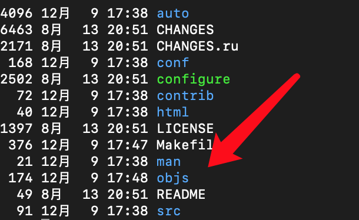
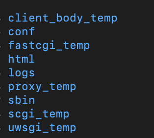
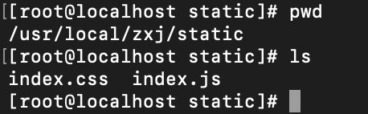
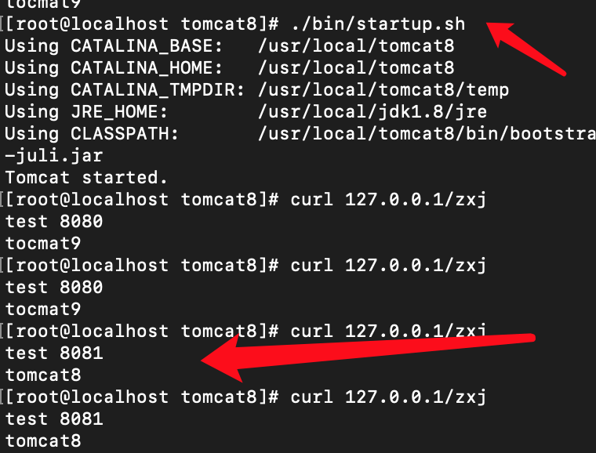

* [一、Nginx 简介与安装](#%E4%B8%80nginx-%E7%AE%80%E4%BB%8B%E4%B8%8E%E5%AE%89%E8%A3%85)
  * [1、知识点：](#1%E7%9F%A5%E8%AF%86%E7%82%B9)
  * [<strong>2、编译与安装</strong>](#2%E7%BC%96%E8%AF%91%E4%B8%8E%E5%AE%89%E8%A3%85)
  * [3、<strong>模块更新：</strong>](#3%E6%A8%A1%E5%9D%97%E6%9B%B4%E6%96%B0)
  * [4、<strong>控制命令：</strong>](#4%E6%8E%A7%E5%88%B6%E5%91%BD%E4%BB%A4)
* [二、Nginx 架构说明](#%E4%BA%8Cnginx-%E6%9E%B6%E6%9E%84%E8%AF%B4%E6%98%8E)
* [三、Nginx 配置与使用](#%E4%B8%89nginx-%E9%85%8D%E7%BD%AE%E4%B8%8E%E4%BD%BF%E7%94%A8)
  * [1、 配置其他路径的一个站点](#1-%E9%85%8D%E7%BD%AE%E5%85%B6%E4%BB%96%E8%B7%AF%E5%BE%84%E7%9A%84%E4%B8%80%E4%B8%AA%E7%AB%99%E7%82%B9)
    * [<strong>alias和root的区别</strong>](#alias%E5%92%8Croot%E7%9A%84%E5%8C%BA%E5%88%AB)
  * [<strong>2、配置文件的语法格式：</strong>](#2%E9%85%8D%E7%BD%AE%E6%96%87%E4%BB%B6%E7%9A%84%E8%AF%AD%E6%B3%95%E6%A0%BC%E5%BC%8F)
  * [3、配置第一个静态WEB服务](#3%E9%85%8D%E7%BD%AE%E7%AC%AC%E4%B8%80%E4%B8%AA%E9%9D%99%E6%80%81web%E6%9C%8D%E5%8A%A1)
  * [4、日志配置：](#4%E6%97%A5%E5%BF%97%E9%85%8D%E7%BD%AE)
* [四、Nginx 反向代理实现](#%E5%9B%9Bnginx-%E5%8F%8D%E5%90%91%E4%BB%A3%E7%90%86%E5%AE%9E%E7%8E%B0)
  * [<strong>1\.正向代理的概念：</strong>](#1%E6%AD%A3%E5%90%91%E4%BB%A3%E7%90%86%E7%9A%84%E6%A6%82%E5%BF%B5)
  * [2\.负载均衡配置与参数解析](#2%E8%B4%9F%E8%BD%BD%E5%9D%87%E8%A1%A1%E9%85%8D%E7%BD%AE%E4%B8%8E%E5%8F%82%E6%95%B0%E8%A7%A3%E6%9E%90)
  * [<strong>3\.upstream 负载均衡算法介绍</strong>](#3upstream-%E8%B4%9F%E8%BD%BD%E5%9D%87%E8%A1%A1%E7%AE%97%E6%B3%95%E4%BB%8B%E7%BB%8D)
* [五、Nginx 高速缓存](#%E4%BA%94nginx-%E9%AB%98%E9%80%9F%E7%BC%93%E5%AD%98)
  * [知识点：](#%E7%9F%A5%E8%AF%86%E7%82%B9)
  * [<strong>1、案例分析：</strong>](#1%E6%A1%88%E4%BE%8B%E5%88%86%E6%9E%90)
  * [2\.Nginx 静态缓存基本配置](#2nginx-%E9%9D%99%E6%80%81%E7%BC%93%E5%AD%98%E5%9F%BA%E6%9C%AC%E9%85%8D%E7%BD%AE)
  * [<strong>3\.缓存的清除：</strong>](#3%E7%BC%93%E5%AD%98%E7%9A%84%E6%B8%85%E9%99%A4)
* [六、Nginx 性能参数调优](#%E5%85%ADnginx-%E6%80%A7%E8%83%BD%E5%8F%82%E6%95%B0%E8%B0%83%E4%BC%98)

## 一、Nginx 简介与安装

### 1、知识点：
1. Nginx 简介

Nginx是一个高性能WEB服务器，除它之外Apache、Tomcat、Jetty、IIS，它们都是Web服务器，或者叫做WWW（World Wide Web）服务器，相应地也都具备Web服务器的基本功能。Nginx  相对基它WEB服务有什么优势呢？
1. Tomcat、Jetty 面向java语言，先天就是重量级的WEB服务器，其性能与Nginx没有可比性。
2. IIS只能在Windows操作系统上运行。Windows作为服务器在稳定性与其他一些性能上都不如类UNIX操作系统，因此，在需要高性能Web服务器的场合下IIS并不占优。
3. Apache的发展时期很长，而且是目前毫无争议的世界第一大Web服务器，其有许多优点，如稳定、开源、跨平台等，但它出现的时间太长了，在它兴起的年代，互联网的产业规模远远比不上今天，所以它被设计成了一个重量级的、不支持高并发的Web服务器。在Apache服务器上，如果有数以万计的并发HTTP请求同时访问，就会导致服务器上消耗大量内存，操作系统内核对成百上千的Apache进程做进程间切换也会消耗大量CPU资源，并导致HTTP请求的平均响应速度降低，这些都决定了Apache不可能成为高性能Web服务器，这也促使了Lighttpd和Nginx的出现。 下图可以看出07年到17 年强劲增长势头。


### **2、编译与安装**

这个教程是通过Nginx的源码进行编译安装

**安装环境准备：**
**（1）linux 内核2.6及以上版本:**
只有2.6之后才支持epool ，在此之前使用select或pool多路复用的IO模型，无法解决高并发压力的问题。通过命令uname -a 即可查看。

```
#查看 linux 内核
uname -a  
```
4.18.0表示Centos内核的版本


**（2）GCC编译器**
GCC（GNU Compiler Collection）可用来编译C语言程序。Nginx不会直接提供二进制可执行程序,只能下载源码进行编译。
**（3）PCRE库**
PCRE（Perl Compatible Regular Expressions，Perl兼容正则表达式）是由Philip Hazel开发的函数库，目前为很多软件所使用，该库支持正则表达式。
**（4）zlib库**
zlib库用于对HTTP包的内容做gzip格式的压缩，如果我们在nginx.conf里配置了gzip on，并指定对于某些类型（content-type）的HTTP响应使用gzip来进行压缩以减少网络传输量。
**（5）OpenSSL开发库**
如果我们的服务器不只是要支持HTTP，还需要在更安全的SSL协议上传输HTTP，那么就需要拥有OpenSSL了。另外，如果我们想使用MD5、SHA1等散列函数，那么也需要安装它。
上面几个库都是Nginx 基础功能所必需的，为简单起见我们可以通过yum 命令统一安装。

```
#yum 安装nginx 环境
yum -y install make zlib zlib-devel gcc-c++ libtool openssl openssl-devel pcre pcre-devel
```

**源码获取：**
[nginx 下载页](http://nginx.org/en/download.html )：http://nginx.org/en/download.html 。


最简单的安装：

将下载后的压缩包解压至`/usr/local/`目录

```
tar -zxvf nginx-1.16.1.tar.gz -C /usr/local/
cd /usr/local/
ll
cd nginx-1.16.1
```

这时解压后生成的文件夹


然后采用默认的安装方式`./configure`进行安装，会生成一个objs的文件夹

```
./configure;
```



然后执行`make`命令，生成二进制文件

```
make
```


执行完之后，在objs目录下就会生成nginx文件，执行`./nginx -V就可以看见nginx的版本`

```
./nginx -V
```


执行`make install`把nginx安装到系统中，默认的路径是`/usr/local/nginx`

```
make install
cd /usr/local/nginx
ll
```


这是安装完后的目录文件

启动nginx

```
./sbin/nginx
```

在浏览器输入服务器的ip就可以访问nginx了，默认是80端口

* 终端啊检测是否成功


* 浏览器访问服务器的ip地址


这里默认的安装结束。

可以通过以下命令一步默认安装：

```
./configure & make & make install 
```

* **nginx目录：**



conf：配置文件

html：默认的静态站点

logs：nginx日志

sbin：nginx的执行文件

_temp：为临时文件


### 3、**模块更新：**

[nginx模块地址](http://nginx.org/en/docs/)：http://nginx.org/en/docs/

给nginx添加新的模块，比如给ngx-http-stub-status-module模块提供对各种状态信息的访问。

cd到之前nginx解压的目录中

在configure后面添加模块参数

```
cd /usr/local/nginx-1.16.1
# 添加状态查查看模块
./configure --with-http_stub_status_module 
#重新创建主文件
make
```

cd到objs目录下，这时候在查看nginx的版本，就会发现，成功添加了该模块


现在绿色的nginx是编译好的新的文件，需要替换到系统中执行的sbin下的nginx

```
#只需要执行下面的命令，nginx自动帮助你替换之前的文件，并且备份
#在nginx的根目录下执行
cd /usr/local/nginx-1.16.1
make install
```

自动生成nginx.old备份文件

```
cd /usr/local/nginx/sbin
ls
```


然后修改配置文件

```
cd /usr/local/nginx/conf
vim nginx.conf
```

在server中添加配置

```
location = /basic_status {
	stub_status;
}
```


然后重新启动nginx，必须要先stop在启动，不能直接reload，因为替换了nginx执行文件

启动之后用你的服务器ip加`/basic_status`就可以访问该新模块了

http://192.168.1.107/basic_status


### 4、**控制命令：**

```
#查看命令帮助
./nginx -?
#nginx的版本
./nginx -v
#nginx版本和其他的模块信息
./nginx -V
#默认方式启动：
./nginx 
#指定配置文件启动 
./nginx -c /tmp/nginx.conf 
#指定nginx程序目录启动
./nginx -p /usr/local/nginx/

#快速停止，之前断开所有的连接
./nginx -s stop
#优雅停止 把nginx对外的端口关闭，外面的新的请求不能在接收，旧的请求要出来玩之后才会断开
./nginx -s quit

# 热装载配置文件，配置文件更新，nginx服务不会被中断
./nginx -s reload
# 重新打开日志文件
./nginx -s reopen
# 设置全局命令，如下表示设置启动用户为root
./nginx -g "user root;"

```


* `./nginx -s reopen`使用方式：

当日志文件过大，需要新建文件来写日志的时候执行。

1. 备份日志文件

2. 新建日志文件

   ```
   mv access.log access.log.backup
   > access.log
   ```

   

   这时你会发现，当有请求的时候，日志还是写在了之前的文件中，是由于备份的时候拷贝的文件中的fd，而nginx写日志的只认fd，不管文件名，所以还是会把日志写在之前的文件中。

   

3. 执行命令

   ```
   cd /usr/local/nginx/sbin
   ./nginx -s reopen # 重新打开日志文件
   ```

   这时候日志就写在了新的文件中

   

## 二、Nginx 架构说明

---
**Nginx 架构图:**


**架构说明：**
1）nginx启动时，会生  不处理网络请求，主要负责调度工作进程，也就是图示的三项：加载配置、启动工作进程及非停升级。所以，nginx启动以后，查看操作系统的进程列表，我们就能看到至少有两个nginx进程。
2）服务器实际处理网络请求及响应的是工作进程（worker），在类unix系统上，nginx可以配置多个worker，而每个worker进程都可以同时处理数以千计的网络请求。
3）模块化设计。nginx的worker，包括核心和功能性模块，核心模块负责维持一个运行循环（run-loop），执行网络请求处理的不同阶段的模块功能，如网络读写、存储读写、内容传输、外出过滤，以及将请求发往上游服务器等。而其代码的模块化设计，也使得我们可以根据需要对功能模块进行适当的选择和修改，编译成具有特定功能的服务器。
4）事件驱动、异步及非阻塞，可以说是nginx得以获得高并发、高性能的关键因素，同时也得益于对Linux、Solaris及类BSD等操作系统内核中事件通知及I/O性能增强功能的采用，如kqueue、epoll及event ports。

**Nginx 核心模块：**


## 三、Nginx 配置与使用

---
### 1、 配置其他路径的一个站点

```
cd /usr/local/nginx/conf
vim nginx.conf
```

修改配置文件（去掉注释）

```shell
#user  nobody;
worker_processes  1;

events {
    worker_connections  1024;
}

http {
    include       mime.types;
    default_type  application/octet-stream;

    sendfile        on;
    keepalive_timeout  65;

    server {
    		#配置的端口
        listen       80;
        #配置的名称
        server_name  localhost;
            
        location / {
        		#项目站点路径
            root   /usr/local/zxj;
            index  index.html index.htm;
        }   
        #服务器运行信息，其他的模块
        location = /basic_status {
            stub_status;
        }
        
        error_page   500 502 503 504  /50x.html;
        location = /50x.html {
            root   html;
        }
    }

}
```

在`/usr/local/zxj`目录下创建一个index.html文件，配置完后重启nginx，在浏览器输入ip即可访问该站点。

```
mkdir /usr/local/zxj
cd /usr/local/zxj
echo 'hello' > index.html
```


```
cd /usr/local/nginx
./sbin/nginx -s reload
```


在zxj文件夹中创建user文件夹，在里面创建hello.html，可以在ip后面添加路径，访问该页面

```
cd /usr/local/zxj
mkdir user
echo 'hi' > user/hello.html
```


如果API有新的版本，但是又要保留之前的版本，可以配置多个location

#### **alias和root的区别**

* root：整个站点的更目录，匹配的时候是绝对匹配，url加root的目录，可以配置在server或者location模块下，location优先级高于server的优先级。

* alias：站点的别名，去除location中的对应的前缀，只能配置在locaion中，不能配置在server上

```shell
location /v2 {
		#设置别名
		alias /usr/local/new_zxj/;
		index  index.html index.htm;
}
```

然后重启nginx，同样可以访问，新的页面


子目录


### **2、配置文件的语法格式：**
先来看一个简单的nginx 配置
```shell
worker_processes  1;
events {
    worker_connections  1024;
}
http {
    include       mime.types;
    default_type  application/octet-stream;
    sendfile        on;
    keepalive_timeout  65;
    server {
        listen       80;
        server_name  localhost;
        location / {
        		#nginx目录中的html路径，静态资源的路径
            root   html;
            index  index.html index.htm;
        }
        location /nginx_status {
    	   stub_status on;
    	   access_log   off;
  	    }
    }
    
    server {
   	    listen               80;
   	    #多个值，左右匹配，匹配规则，最大匹配规则，
   	    server_name          www.zxj.*;
    }
}
```
上述配置中的events、http、server、location、upstream等属于配置项块。而worker_processes 、worker_connections、include、listen  属于配置项块中的属性。   /nginx_status   属于配置块的特定参数参数。其中server块嵌套于http块，其可以直接继承访问Http块当中的参数。
| **配置块** | 名称开头用大口号包裹其对应属性                               |
| :--------- | :----------------------------------------------------------- |
| **属性**   | 基于空格切分属性名与属性值，属性值可能有多个项 都以空格进行切分 如：  access_log  logs/host.access.log  main |
| **参数**   | 其配置在 块名称与大括号间，其值如果有多个也是通过空格进行拆  |

注意 如果配置项值中包括语法符号，比如空格符，那么需要使用单引号或双引号括住配置项值，否则Nginx会报语法错误。例如：
    log_format  main  '$remote_addr - $remote_user [$time_local] "$request" '
                     '$status $body_bytes_sent "$http_referer" '
                     '"$http_user_agent" "$http_x_forwarded_for"';
### 3、配置第一个静态WEB服务
基本配置介绍说明：
（1）监听端口
语法：listen address：
默认：listen 80;
配置块：server

（2）主机名称
语法：server_name name[……];
默认：server_name "";
配置块：server
server_name后可以跟多个主机名称，如server_name [www.testweb.com](http://www.testweb.com)、download.testweb.com;。 支持通配符与正则

**（3）location**
语法：location[=|～|～*|^～|@]/uri/{……}
配置块：server

1. =表示把URI作为字符串，以便与参数中的uri做完全匹配。
```shell
   #通过精确匹配，代理到百度
   location = /baidu {
   		proxy_pass http://www.baidu.com/;
   }
```
2. / 基于uri目录匹配

3. ～表示正则匹配URI时是字母大小写敏感的。

   ```shell
   #配置静态文件
   location ~ \.(png|jpg|gif|avi|mp4|css|js)$ {
   		root /usr/local/zxj/static;
   }
   ```

   

   

4. ～*表示正则匹配URI时忽略字母大小写问题。

5. ^～表示正则匹配URI时只需要其前半部分与uri参数匹配即可。

**匹配优先规则：**

1. 精确匹配优先 =
  
2. 正则匹配优先 ^~

3. 前缀最大匹配优先。

4. 配置靠前优化

（4）root 指定站点根目录
可配置在 server与location中，基于ROOT路径+URL中路径去寻找指定文件。
（5）alias 指定站点别名
只能配置location 中。基于alias 路径+ URL移除location  前缀后的路径来寻找文件。
如下示例：

```shell
location /V1 {
      alias  /www/old_site;
      index  index.html index.htm;
}
#防问规则如下
URL：http://xxx:xx/V1/a.html
最终寻址：/www/old_site/a.thml
```

**基于目录动静分离**

```shell
   server {
        listen 80;
        server_name *.luban.com;
        root /usr/www/luban;
        location / {
                index luban.html;
        }
        location /static {
         alias /usr/www/static;
        }
 }
```
**基于正则动静分离**
```
location ~* \.(gif|jpg|png|css|js)$ {
      root /usr/www/static;
}
```

**防盗链配置演示：**

```shell
# 加入至指定location 即可实现，为静态文件添加防盗链
location ~* \.(gif|jpg|png|css|js)$ {
      root /usr/www/static;
      valid_referers none blocked *.luban.com;
 			if ($invalid_referer) {
      		return 403;
			}
}

```

**下载限速：**
```shell
location /download {
    limit_rate 1m; //限制每S下载速度
    limit_rate_after 30m; // 超过30 之 后在下载
}

```
**创建IP黑名单**

```shell
#封禁指定IP
deny 192.168.0.1;
allow 192.168.0.1;
#开放指定IP 段
allow 192.168.0.0/24;
#封禁所有
deny    all;
#开放所有
allow    all;
# 创建黑名单文件
echo 'deny 192.168.0.132;' >> balck.ip
#http 配置块中引入 黑名单文件
include       black.ip;
```


### 4、日志配置：
**日志格式：**
```shell
log_format  main  '$remote_addr - $remote_user [$time_local]   "$request" '
                     '$status $body_bytes_sent "$http_referer" '
                  '"$http_user_agent" "$http_x_forwarded_for"';
access_log  logs/access.log  main;
#基于域名打印日志
access_log logs/$host.access.log main;
```

**error日志的设置**
语法：error_log /path/file level;
默认：error_log logs/error.log error;
level是日志的输出级别，取值范围是debug、info、notice、warn、error、crit、alert、emerg，
**针对指定的客户端输出debug级别的日志**
语法：debug_connection[IP|CIDR]
events {
debug_connection 192.168.0.147; 
debug_connection 10.224.57.0/200;
}
注意：debug 日志开启 必须在安装时 添加  --with-debug (允许debug)
[nginx.conf配置](https://attachments-cdn.shimo.im/uhMsgcdhudg2yAND/nginx.conf)


## 四、Nginx 反向代理实现

提问：什么是反向代理其与正向代理有什么区别？

### **1.正向代理的概念：**

正向代理是指客户端与目标服务器之间增加一个代理服务器，客户端直接访问代理服务器，在由代理服务器访问目标服务器并返回客户端并返回 。这个过程当中客户端需要知道代理服务器地址，并配置连接。由于客户端直连服务器可能无法连接，或者网速很慢的情况，就可以考虑使用正向代理连接。


**反向代理的概念：**
反向代理是指 客户端访问目标服务器，在目标服务内部有一个统一接入网关将请求转发至后端真正处理的服务器并返回结果。这个过程当中客户端不需要知道代理服务器地址，代理对客户端而言是透明的。 服务端为了屏蔽内部的实现，或者有多个服务端需要实现负载均衡或者缓存之类的，可以使用反向代理。


**反向代理与正向代理的区别**
|                | **正向代理**                                               | **反向代理**                         |
| :------------- | :--------------------------------------------------------- | :----------------------------------- |
| 代理服务器位置 | 客户端与服务都能连接的们位置                               | 目标服务器内部                       |
| 主要作用       | 屏蔽客户端IP、集中式缓存、解决客户端不能直连服务端的问题。 | 屏蔽服务端内部实现、负载均衡、缓存。 |
| 应用场景       | 爬虫、翻墙、maven 的nexus 服务                             | Nginx 、Apache负载均衡应用           |

正向代理和反向代理在技术上是没有区别的，主要区别在于应用的场景。

**Nginx代理基本配置**
Nginx 代理只需要配置 location 中配置proxy_pass 属性即可。其指向代理的服务器地址。

* 正向代理到百度服务器

```
# 正向代理到baidu 服务
location = /baidu {
         proxy_pass http://www.baidu.com/;
}
```

* 反向代理到其他服务，比如tomcat

```
# 反向代理至 本机的8080tomcat服务
location /luban/ {
     proxy_pass http://127.0.0.1:8080;  
}
```
**代理相关参数：**
```
proxy_pass           # 代理服务
proxy_redirect off;   # 是否允许重定向
proxy_set_header Host $host; # 传 header 参数至后端服务
proxy_set_header X-Forwarded-For $remote_addr; # 设置request header 即客户端IP 地址
proxy_connect_timeout 90; # 连接代理服务超时时间
proxy_send_timeout 90; # 请求发送最大时间
proxy_read_timeout 90;  # 读取最大时间
proxy_buffer_size 4k; 
proxy_buffers 4 32k;
proxy_busy_buffers_size 64k; 
proxy_temp_file_write_size 64k;
```
### 
### 2.负载均衡配置与参数解析
通过proxy_pass 可以把请求代理至后端服务，但是为了实现更高的负载及性能， 我们的后端服务通常是多个， 这个是时候可以通过upstream 模块实现负载均衡。


**演示upstream 的实现。**
```bash
upstream backend {     
   server 127.0.0.1:8080 weight=1;
   server 127.0.0.1:8081 weight=2;

  server 127.0.0.1:8030 weight=1 backup;#备用服务器
}
location / {
    proxy_pass http://backend;
}
```

服务器配置，upstream是在http模块下的子模块


配置了权重后，权重大的被访问到的比例就要大，默认的负载均衡算法（轮询，根据权重轮询访问）


**如果配置的多个服务器，其中一个挂掉之后，轮询算法会跳过挂掉的服务器**

<font color=red>Nginx会进行健康监测，监测服务是否还存活，如果挂掉之后，会自动的踢出该服务器，如果再次上线之后，也会重新加入。</font>


关掉tomcat8之后，看见的所有的访问都发向了tomcat9



tomcat8再次启动，发现负载均衡的服务又开始访问到tomcat8了。

**upstream 相关参数:**

* server	反向服务地址 加端口

* **weight	 **权重

* **max_fails	**失败多少次 认为主机已挂掉则，踢出

* **fail_timeout	**踢出后重新探测时间

* **backup	**备用服务，当其他的服务都挂掉之后，才会被启用

* **max_conns	**允许最大连接数

* **slow_start	**当节点恢复，不立即加入,而是等待 slow_start	后加入服务对列。

  ```shell
  server 127.0.0.1:8081 weight=2 fail_timeout=5s slow_start=30s;#示例
  ```

  
### **3.upstream 负载均衡算法介绍**
* **ll+weight： **轮询加权重 (默认)
* **ip_hash : **基于Hash 计算 ,用于保持session 一至性，比如多个服务器，一个用户登录之后，数据保存在session中，如果过了一会再次连接，没有到session过期的时间，则根据ip_hash算法，还是会访问之前的服务器。弊端，可能会加重某个服务器的负担，有些学校或者小区，公网IP都只有一个，在某个时间可能会有高并发。
* **url_hash:** 静态资源缓存,节约存储，加快速度（第三方），多个服务器保存图片或者视频资源，如果每个服务器都保存所有的资源，则浪费空间，可以通过url_hash，将图片或者视频的url进行hash，则每次访问的都是该服务器上的图片地址，回去去其他服务器上找资源。
* **least_conn **：最少链接（第三方）
* **least_time  **：最小的响应时间,计算节点平均响应时间，然后取响应最快的那个，分配更高权重（第三方）
## 五、Nginx 高速缓存

---
### 知识点：
1. 缓存案例分析
2. Nginx 静态缓存基本配置
3. 缓存更新 

### **1、案例分析：**
	某电商平台商品详情页需要实现 700+ QPS，如何着手去做？每秒700个请求 

1. 首先为分析一下一个商品详情页有哪些信息


**对于商品详情页涉及了如下主要服务：**

* 商品详情页HTML页面渲染
* 价格服务
*  促销服务
*  库存状态/配送至服务
*  广告词服务
*  预售/秒杀服务
*  评价服务
*  试用服务
*  推荐服务
*  商品介绍服务
*  各品类相关的一些特殊服务

**解决方案：**
1. 采用Ajax 动态加载 价格、广告、库存等服务
2. 采用key value 缓存详情页主体html。

方案架构：


**问题：**
	当达到500QPS 的时候很难继续压测上去。
**分析原因**：一个详情页html  主体达平均150 kb  那么在500QPS 已接近千M局域网宽带极限。必须减少内网通信。

**基于Nginx 静态缓存的解决方案：**


### 
### 2.Nginx 静态缓存基本配置
一、在http元素下添加缓存区声明。
```bash
#proxy_cache_path 缓存路径
#levels 缓存层级及目录位数
#1:2的意思，b87fe19e2c834d52183568a5 首先把URL进行MD5运算，然后取值，不包括（http://）1就是第一级目录去链接最后一个字符，即5，2就是第二级目录取一级目录后的2个字符，即8a，组成的文件夹 5/8a/b87fe19e2c834d52183568a5
#keys_zone 缓存区内存大小
#inactive 有效期
#max_size 硬盘大小
proxy_cache_path /data/nginx/cache_luban levels=1:2 keys_zone=cache_luban:500m inactive=20d max_size=1g;

```

二、为指定location 设定缓存策略。 

只有代理其他服务才会缓存，本地静态文件不需要缓存。

```bash
# 指定缓存区
proxy_cache cache_luban;
#以全路径md5值做做为Key 
proxy_cache_key $host$uri$is_args$args;
#对不同的HTTP状态码设置不同的缓存时间
proxy_cache_valid 200 304 12h;

```
**演示缓存生效过程**
- [ ] 配置声明缓存路径
- [ ] 为location 配置缓存策略
- [ ] 重启nginx（修改了）
- [ ] 查看缓存目录生成

缓存参数详细说明	
| 父元素   | 名称              | 描述                                                         |
| :------- | :---------------- | :----------------------------------------------------------- |
| http     | proxy_cache_path  | 指定缓存区的根路径                                           |
|          | levels            | 缓存目录层级最高三层，每层1~2个字符表示。如1:1:2 表示三层。  |
|          | keys_zone         | 缓存块名称 及内存块大小。如 cache_item:500m 。表示声明一个名为cache_item 大小为500m。超出大小后最早的数据将会被清除。 |
|          | inactive          | 最长闲置时间 如:10d 如果一个数据被闲置10天将会被清除         |
|          | max_size          | 缓存区硬盘最大值。超出闲置数据将会被清除                     |
| location | proxy_cache       | 指定缓存区，对应keys_zone 中设置的值                         |
|          | proxy_cache_key   | 通过参数拼装缓存key 如：$host$uri$is_args$args 则会以全路径md5值做做为Key |
|          | proxy_cache_valid | 为不同的状态码设置缓存有效期                                 |


### **3.缓存的清除：**
	该功能可以采用第三方模块 ngx_cache_purge 实现。
**为nginx 添加 ngx_cache_purge  模块**
```bash
#下载ngx_cache_purge 模块包 ,这里nginx 版本为1.6.2 purge 对应2.0版
wget http://labs.frickle.com/files/ngx_cache_purge-2.3.tar.gz
#查看已安装模块
./sbin/nginx -V
#进入nginx安装包目录 重新安装 --add-module为模块解压的全路径
./configure --prefix=/root/svr/nginx --with-http_stub_status_module --with-http_ssl_module  --add-module=/root/svr/packages/ngx_cache_purge-2.3
#重新编译
make
#拷贝 安装目录/objs/nginx 文件用于替换原nginx 文件
#检测查看安装是否成功
nginx -t 
```

**清除配置：**
```bash
location ~ /clear(/.*) {
  #允许访问的IP
   allow           127.0.0.1;
   allow           192.168.0.193;
   #禁止访问的IP
   deny            all;
   #配置清除指定缓存区和路径(与proxy_cache_key一至)
   proxy_cache_purge    cache_luban $host$1$is_args$args;
}                        
```
配置好以后 直接访问 ：
```bash
# 访问生成缓存文件
http://www.luban.com/?a=1
# 清除生成的缓存,如果指定缓存不存在 则会报404 错误。
http://www.luban.com/clear/?a=1
```


## 六、Nginx 性能参数调优

---

**worker_processes number;**
每个worker进程都是单线程的进程，它们会调用各个模块以实现多种多样的功能。如果这些模块确认不会出现阻塞式的调用，那么，有多少CPU内核就应该配置多少个进程；反之，如果有可能出现阻塞式调用，那么需要配置稍多一些的worker进程。例如，如果业务方面会致使用户请求大量读取本地磁盘上的静态资源文件，而且服务器上的内存较小，以至于大部分的请求访问静态资源文件时都必须读取磁盘（磁头的寻址是缓慢的），而不是内存中的磁盘缓存，那么磁盘I/O调用可能会阻塞住worker进程少量时间，进而导致服务整体性能下降。

**每个worker 进程的最大连接数**
**语法**：worker_connections number;
**默认**：worker_connections 1024

**worker_cpu_affinity cpumask[cpumask……]**
**绑定Nginx worker进程到指定的CPU内核**
为什么要绑定worker进程到指定的CPU内核呢？假定每一个worker进程都是非常繁忙的，如果多个worker进程都在抢同一个CPU，那么这就会出现同步问题。反之，如果每一个worker进程都独享一个CPU，就在内核的调度策略上实现了完全的并发。
例如，如果有4颗CPU内核，就可以进行如下配置：
worker_processes 4;
worker_cpu_affinity 1000 0100 0010 0001;
注意 worker_cpu_affinity配置仅对Linux操作系统有效。
1在哪里，即表示绑定的哪个cpu，不是二进制中的数字，相当于1表示这个cpu打开，0表示其他cpu不相关，如果有8个cpu即00000001 00000010 00000100 00001000 00010000 00100000 01000000 10000000表示。


**Nginx worker 进程优先级设置**
**语法**：worker_priority nice;
**默认**：worker_priority 0;
优先级由静态优先级和内核根据进程执行情况所做的动态调整（目前只有±5的调整）共同决定。nice值是进程的静态优先级，它的取值范围是–20～+19，–20是最高优先级，+19是最低优先级。因此，如果用户希望Nginx占有更多的系统资源，那么可以把nice值配置得更小一些，但不建议比内核进程的nice值（通常为–5）还要小


**Nginx worker进程可以打开的最大句柄描述符个数**
**语法**： worker_rlimit_nofile limit;
**默认：**空
更改worker进程的最大打开文件数限制。如果没设置的话，这个值为操作系统的限制。设置后你的操作系统和Nginx可以处理比“ulimit -a”更多的文件，所以把这个值设高，这样nginx就不会有“too many open files”问题了。


**是否打开accept锁**
**语法**：accept_mutex[on|off]
**默认**：accept_mutext on;
accept_mutex是Nginx的负载均衡锁，当某一个worker进程建立的连接数量达到worker_connections配置的最大连接数的7/8时，会大大地减小该worker进程试图建立新TCP连接的机会，accept锁默认是打开的，如果关闭它，那么建立TCP连接的耗时会更短，但worker进程之间的负载会非常不均衡，因此不建议关闭它。

**使用accept锁后到真正建立连接之间的延迟时间**
语法：accept_mutex_delay Nms; 
默认：accept_mutex_delay 500ms; 
在使用accept锁后，同一时间只有一个worker进程能够取到accept锁。这个accept锁不是堵塞锁，如果取不到会立刻返回。如果只有一个worker进程试图取锁而没有取到，他至少要等待accept_mutex_delay定义的时间才能再次试图取锁。

