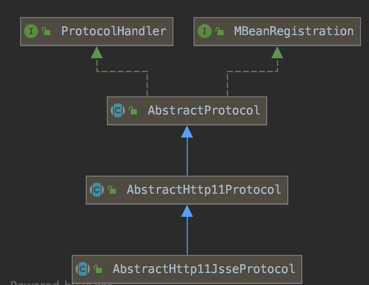

* [一、Tomcat各组件认知](#%E4%B8%80tomcat%E5%90%84%E7%BB%84%E4%BB%B6%E8%AE%A4%E7%9F%A5)
  * [1\. Tomcat的安装](#1-tomcat%E7%9A%84%E5%AE%89%E8%A3%85)
  * [2\. Tomcat 各组件及关系](#2-tomcat-%E5%90%84%E7%BB%84%E4%BB%B6%E5%8F%8A%E5%85%B3%E7%B3%BB)
* [二、Tomcat server\.xml 配置详解](#%E4%BA%8Ctomcat-serverxml-%E9%85%8D%E7%BD%AE%E8%AF%A6%E8%A7%A3)
  * [<strong>1\.server</strong>](#1-server)
  * [<strong>2\. service</strong>](#2-service)
  * [<strong>3\. Connector</strong>](#3-connector)
  * [<strong>4\. Engine</strong>](#4-engine)
  * [<strong>5\. Host</strong>](#5-host)
  * [<strong>6\. Context</strong>](#6-context)
    * [配置临时的Context](#%E9%85%8D%E7%BD%AE%E4%B8%B4%E6%97%B6%E7%9A%84context)
  * [<strong>7\. Valve</strong>](#7-valve)
* [三、Tomcat 自动部署脚本编写](#%E4%B8%89tomcat-%E8%87%AA%E5%8A%A8%E9%83%A8%E7%BD%B2%E8%84%9A%E6%9C%AC%E7%BC%96%E5%86%99)
  * [1\. Tomcat启动参数说明](#1-tomcat%E5%90%AF%E5%8A%A8%E5%8F%82%E6%95%B0%E8%AF%B4%E6%98%8E)
  * [2\. 程序与配置站点分离](#2-%E7%A8%8B%E5%BA%8F%E4%B8%8E%E9%85%8D%E7%BD%AE%E7%AB%99%E7%82%B9%E5%88%86%E7%A6%BB)
  * [3\. 自动部署脚本：（暂时用不了）](#3-%E8%87%AA%E5%8A%A8%E9%83%A8%E7%BD%B2%E8%84%9A%E6%9C%AC%E6%9A%82%E6%97%B6%E7%94%A8%E4%B8%8D%E4%BA%86)
* [<strong>四、Tomcat 支持四种线程模型介绍</strong>](#%E5%9B%9Btomcat-%E6%94%AF%E6%8C%81%E5%9B%9B%E7%A7%8D%E7%BA%BF%E7%A8%8B%E6%A8%A1%E5%9E%8B%E4%BB%8B%E7%BB%8D)
  * [1\. tomcat源码mavan依赖](#1-tomcat%E6%BA%90%E7%A0%81mavan%E4%BE%9D%E8%B5%96)
  * [2\. IO](#2-io)
  * [3\. IO模型](#3-io%E6%A8%A1%E5%9E%8B)
  * [<strong>4\. Tomcat支持的IO模型</strong>](#4-tomcat%E6%94%AF%E6%8C%81%E7%9A%84io%E6%A8%A1%E5%9E%8B)
* [<strong>五、Tomcat BIO、NIO实现过程源码解析</strong>](#%E4%BA%94tomcat-bionio%E5%AE%9E%E7%8E%B0%E8%BF%87%E7%A8%8B%E6%BA%90%E7%A0%81%E8%A7%A3%E6%9E%90)
  * [<strong>1\. BIO 线程模型讲解</strong>](#1-bio-%E7%BA%BF%E7%A8%8B%E6%A8%A1%E5%9E%8B%E8%AE%B2%E8%A7%A3)
  * [<strong>2\. NIO 线程模型讲解</strong>](#2-nio-%E7%BA%BF%E7%A8%8B%E6%A8%A1%E5%9E%8B%E8%AE%B2%E8%A7%A3)
* [六、Tomcat 类加载机制源码解析](#%E5%85%ADtomcat-%E7%B1%BB%E5%8A%A0%E8%BD%BD%E6%9C%BA%E5%88%B6%E6%BA%90%E7%A0%81%E8%A7%A3%E6%9E%90)
  * [1\. 类加载的本质](#1-%E7%B1%BB%E5%8A%A0%E8%BD%BD%E7%9A%84%E6%9C%AC%E8%B4%A8)
  * [<strong>2\. Tomcat的 类加载顺序</strong>](#2-tomcat%E7%9A%84-%E7%B1%BB%E5%8A%A0%E8%BD%BD%E9%A1%BA%E5%BA%8F)
  * [3\. 常见异常](#3-%E5%B8%B8%E8%A7%81%E5%BC%82%E5%B8%B8)

## 一、Tomcat各组件认知

​		Tomcat是一个基于JAVA的WEB容器，其实现了JAVA EE中的 Servlet 与 jsp 规范，与Nginx apache 服务器不同在于一般用于动态请求处理。在架构设计上采用面向组件的方式设计。即整体功能是通过组件的方式拼装完成。另外每个组件都可以被替换以保证灵活性。


### 1. Tomcat的安装

[Tomcat9下载链接](https://tomcat.apache.org/download-90.cgi) https://tomcat.apache.org/download-90.cgi

Centos下载tar.gz，放到自己想放的目录，解压即可。


### 2. Tomcat 各组件及关系

* Server 和 Service
* Connector   连接器
  * HTTP 1.1
  * SSL  https
  * AJP（ Apache JServ Protocol） apache 私有协议，用于apache 反向代理Tomcat
* Container 
  * Engine  引擎 catalina
  * Host   虚拟机 基于域名 分发请求
  * Context 隔离各个WEB应用 每个Context的  ClassLoader都是独立
* Component 
  * Manager （管理器）
  * logger （日志管理）
  * loader （载入器）
  * pipeline (管道)
  * valve （管道中的阀）
  
  一个tomcat只有一个Server，可以有多个Service，每个Service只有一个Engine，Engine包含多个Host，每个Host里面包含多个Context。


## 二、Tomcat server.xml 配置详解

服务器示例代码

```xml
<?xml version="1.0" encoding="UTF-8"?>
<Server port="8005" shutdown="SHUTDOWN">
    <Listener className="org.apache.catalina.startup.VersionLoggerListener" />
    <Listener className="org.apache.catalina.core.AprLifecycleListener" SSLEngine="on" />
    <Listener className="org.apache.catalina.core.JreMemoryLeakPreventionListener" />
    <Listener className="org.apache.catalina.mbeans.GlobalResourcesLifecycleListener" />
    <Listener className="org.apache.catalina.core.ThreadLocalLeakPreventionListener" />
    <GlobalNamingResources>
        <Resource name="UserDatabase" auth="Container" type="org.apache.catalina.UserDatabase" description="User database that can be updated and saved" factory="org.apache.catalina.users.MemoryUserDatabaseFactory" pathname="conf/tomcat-users.xml" />
    </GlobalNamingResources>
    
    <Service name="Catalina">
        <Connector port="9264" protocol="HTTP/1.1" connectionTimeout="20000" redirectPort="8443" />
        <Connector port="8009" protocol="AJP/1.3" redirectPort="8443" />
        <Engine name="Catalina" defaultHost="localhost">
            <Realm className="org.apache.catalina.realm.LockOutRealm">
                <Realm className="org.apache.catalina.realm.UserDatabaseRealm" resourceName="UserDatabase" />
            </Realm>
            <Host name="localhost" appBase="webapps" unpackWARs="true" autoDeploy="true">
                <Context docBase="../webapps/images" path="/imgs" />
                <Valve className="org.apache.catalina.valves.AccessLogValve" directory="logs" prefix="localhost_access_log" suffix=".txt" pattern="%h %l %u %t &quot;%r&quot; %s %b" />
            </Host>
        </Engine>
    </Service>
</Server>
```

### **1. server**
server：为root元素
port：执行关闭命令的端口号
shutdown：关闭命令

* 演示shutdown的用法

```bash
#基于telent 执行SHUTDOWN 命令即可关闭(必须大写)
telent 127.0.0.1 8005
SHUTDOWN
```

### **2. service**
服务：将多个connector 与一个Engine组合成一个服务，可以配置多个服务，name可以自己定义。

```xml
<Service name="Catalina"></Service>
```

### **3. Connector**
连接器：用于接收 指定协议下的连接 并指定给唯一的Engine 进行处理。一个service可以有多个Connector。

默认最大连接数为：10K，可以连接，但是不一定要处理，处理需要线程。BIO是无法承受这么多的并发，只能用NIO或者AIO模型。

主要属性：

* protocol 监听的协议，默认是http/1.1(http的版本) 在tomcat6和tomcat7默认BIO模型，tomcat8以后支持NIO模型，BIO被移除。

  阻塞模型：

  BIO：同步阻塞模型 tomcat6.0

  NIO：同步非阻塞模型 tomcat7.0新增 

  AIO：基于事件异步非阻塞模型 tomcat8.0新增

  tomcat8和tomcat9默认为NIO，tomcat8取消了BIO，代码还在，tomcat9把代码都取消掉了。

  ```xml
  protocol="org.apache.coyote.http11.Http11NioProtocol"
  ```

* connectionTimeout	指定超时的时间数(以毫秒为单位)，有请求到tomcat，tomcat应答，如果连接数已经满了，tomcat会将请求放入连接队列，如果在**等待队列到处理**时的时间为连接超时时间。

* redirectPort	指定服务器正在处理http请求时收到了一个SSL传输请求后重定向的端口号，当访问该端口的时候，会自动的转到定向的端口

* URIEncoding URL进行编码

* useBodyEncodingForURI 页面编码是否和URL编码是否一致

* compression 是否压缩

* compressionMinSize 压缩的最小的大小

* compressableMimeType 压缩的类型

* maxThread	最大可以创建的处理请求的线程数

* minThread	服务器启动时创建的处理请求的线程数

* port 指定服务器端要创建的端口号

* minSpareThreads

* acceptCount	指定当所有可以使用的处理请求的线程数都被使用时，可以放到处理队列中的请求数，超过这个数的请求将不予处理

* enableLookups	如果为true，则可以通过调用request.getRemoteHost()进行DNS查询来得到远程客户端的实际主机名，若为false则不进行DNS查询，而是返回其ip地址

* SSLEnabled 是否开启 sll 验证，在Https 访问时需要开启。

  | 名称                               | 描述                                                         |
  | :--------------------------------- | :----------------------------------------------------------- |
  | acceptCount                        | 等待最大队列                                                 |
  | address                            | 绑定客户端特定地址，127.0.0.1                                |
  | bufferSize                         | 每个请求的缓冲区大小。bufferSize * maxThreads                |
  | compression                        | 是否启用文档压缩                                             |
  | compressableMimeTypes              | text/html,text/xml,text/plain                                |
  | connectionTimeout                  | 客户发起链接 到 服务端接收为止，中间最大的等待时间           |
  | connectionUploadTimeout            | upload 情况下连接超时时间                                    |
  | disableUploadTimeout               | true 则使用connectionTimeout                                 |
  | enableLookups                      | 禁用DNS查询 true                                             |
  | keepAliveTimeout                   | 当长链接闲置 指定时间主动关闭 链接 ，前提是客户端请求头 带上这个 head"connection" " keep-alive" |
  | maxKeepAliveRequests               | 最大的 长连接数                                              |
  | maxHttpHeaderSize                  |                                                              |
  | maxSpareThreads                    | BIO 模式下 最多线闲置线程数                                  |
  | maxThreads（执行线程）             | 最大执行线程数                                               |
  | minSpareThreads(初始线业务线程 10) | BIO 模式下 最小线闲置线程数                                  |

**AJP/1.3**是Apache和Tomcat的私有协议，是一个二进制协议，性能比http协议高，有一些代理服务器不支持，可以去掉。

```xml
<Connector port="8009" protocol="AJP/1.3" redirectPort="8443"/> 
<Connector port="8860" protocol="org.apache.coyote.http11.Http11NioProtocol"
                connectionTimeout="20000"
                redirectPort="8862" 
                URIEncoding="UTF-8" 
                useBodyEncodingForURI="true"
                compression="on" compressionMinSize="2048"
compressableMimeType="text/html,text/xml,text/plain,text/javascript,text/css,application/x-json,application/json,application/x-javascript"
                maxThreads="1024" minSpareThreads="200"
                acceptCount="800"
                enableLookups="false"
        />
```
### **4. Engine**
引擎：用于处理连接的执行器，默认的引擎是catalina。一个service 中只能配置一个Engine。
主要属性：name 引擎名称 defaultHost 默认host

```xml
<Engine name="Catalina" defaultHost="localhost"></Engine>
```

### **5. Host**
虚拟机：基于域名匹配至指定虚拟机。类似于nginx 当中的server,默认的虚拟机是localhost.

* name：根据名称匹配对象虚拟机

* appBase：站点集合的根目录，可以写绝对路径，可以写相对路径

* unpackWARs：是否自动解压War包

* autoDeploy：是否自动部署

如果要访问站点，需要放到appBase目录下 比如有默认的ROOT文件夹，访问格式localhost:8080，即可访问，如果不在ROOT目录中，需要在URL添加项目名称，即contextPath。

```xml
<Host name="localhost"  appBase="/usr/www/luban"
            unpackWARs="true" autoDeploy="true">
        <Valve className="org.apache.catalina.valves.AccessLogValve" directory="logs"               prefix="www.luban.com.access_log" suffix=".txt"
               pattern="%h %l %u %t &quot;%r&quot; %s %b" />
</Host>
```

### **6. Context**
应用上下文：一个host 下可以配置多个Context ，每个Context 都有其独立的classPath。相互隔离，以免造成ClassPath 冲突。

都可以通过项目名或者path的前缀来访问该站点。

* path：指定访问该Web应用的URL入口。

* docBase：指定Web应用的文件路径，可以给定绝对路径，绝对路径可以直接忽略掉Host中的appBase目录，也可以给定相对于`<Host>`的appBase属性的相对路径，如果Web应用采用开放目录结构，则指定Web应用的根目录，如果Web应用是个war文件，则指定war文件的路径。

* reloadable：如果这个属性设为true，tomcat服务器在运行状态下会监视在WEB-INF/classes和WEB-INF/lib目录下class文件的改动，如果监测到有class文件被更新的，服务器会自动重新加载Web应用。

```xml
<Context docBase="hello" path="/h" reloadable="true"/>
```

#### 配置临时的Context

部署文件时，不用修改server.xml文件，直接编写xml放入目录中，xml的名称即为项目名称。

在tomcat的conf目录中的Catalina文件夹中创建XML配置文件，命名为hello.xml，docBase中写入站点的绝对路径，这时候访问的路径是hello，即配置文件的名称，而不是hello1，这时候path的功能已经失效。


```xml
<?xml version="1.0" encoding="UTF-8"?>
<Context docBase="/example/hello" path="/hello1" reloadable="true"/>
```


### **7. Valve**

阀门：可以理解成信息的过滤器，具体配置要基于具体的Valve 接口的子类。以下即为一个访问日志的Valve。

className：驱动文件

directory：目录，相当于tomcatBase的目录，即在tomcat的根目录中

prefix：日志前缀名

suffix：日志后缀名

pattern：日志打印格式

```xml
 <Valve className="org.apache.catalina.valves.AccessLogValve" directory="logs"
               prefix="www.luban.com.access_log" suffix=".txt"
               pattern="%h %l %u %t &quot;%r&quot; %s %b" />
```


## 三、Tomcat 自动部署脚本编写

---
### 1. Tomcat启动参数说明
但是我们在Eclipse 或idea 中启动WEB项目的时候 也是把War包复杂至webapps 目录解压吗？显然不是，其真正做法是在Tomcat程序文件之外创建了一个部署目录，在一般生产环境中也是这么做的 即：Tomcat 程序目录和部署目录分开 。
 我们只需要在启动时指定CATALINA_HOME 与  CATALINA_BASE 参数即可实现。

Xms：堆内存最小值

Xmx：堆内存最大值

Dfile.encoding：默认的编码，new String()时没有指定编码，会采用该编码。


| **启动参数**    | **描述说明**                                                 |
| :-------------- | :----------------------------------------------------------- |
| JAVA_OPTS       | jvm 启动参数 , 设置内存  编码等 -Xms100m -Xmx200m -Dfile.encoding=UTF-8 |
| JAVA_HOME       | 指定jdk 目录，如果未设置从java 环境变量当中去找。            |
| CATALINA_HOME   | Tomcat 程序根目录（lib bin）                                 |
| CATALINA_BASE   | 应用部署目录，默认为$CATALINA_HOME，（webapps conf）         |
| CATALINA_OUT    | 应用日志输出目录：默认$CATALINA_BASE/log                     |
| CATALINA_TMPDIR | 应用临时目录：默认：$CATALINA_BASE/temp                      |

### 2. 程序与配置站点分离

tomcat本身的应用（bin lib）和配置文件、日志、站点（conf logs webapps）分离。

第一步，把tomcat程序中的conf logs webapps拷贝到自己指定的目录中


tomcat目录


第二步：编写tomcat.sh并且授权，

添加执行权限，既可以正常使用

`chmod +x tomcat.sh`

```shell
#!/bin/bash 
export JAVA_OPTS="-Xms100m -Xmx200m"
export JAVA_HOME=/usr/local/jdk1.8/
export CATALINA_HOME=/usr/local/tomcat8
export CATALINA_BASE="`pwd`" 
# pwd为当前路径
case $1 in
        start)
        $CATALINA_HOME/bin/catalina.sh start
                echo start success!!
        ;;
        stop)
                $CATALINA_HOME/bin/catalina.sh stop
                echo stop success!!
        ;;
        restart)
        $CATALINA_HOME/bin/catalina.sh stop
                echo stop success!!
                sleep 3
        $CATALINA_HOME/bin/catalina.sh start
        echo start success!!
        ;;
        version)
        $CATALINA_HOME/bin/catalina.sh version
        ;;
        configtest)
        $CATALINA_HOME/bin/catalina.sh configtest
        ;;
        esac
exit 0
```

第三步，执行命令

```shell
./tomcat.sh start
./tomcat.sh restart
./tomcat.sh stop
```

目前管理员界面配置了用户名和密码不能登录，所以只能手动把war包上传到指定目录，可以利用idea的阿里的自动部署插件（Alibaba Cloud Toolkit）自动部署。


### 3. 自动部署脚本：（暂时用不了）

```shell
#!/bin/bash -e
export now_time=$(date +%Y-%m-%d_%H-%M-%S)
echo "deploy time:$now_time"

app=$1
version=$2
mkdir -p war/
#从svn下载程序至 war目录
war=war/${app}_${version}.war
echo "$war"
svn export svn://192.168.0.147/release/${app}_${version}.war $war

deploy_war() {
#解压版本至当前目录
target_dir=war/${app}_${version}_${now_time}
unzip -q $war -d $target_dir
rm -f appwar
ln -sf $target_dir appwar
target_ln=`pwd`/appwar
echo '<?xml version="1.0" encoding="UTF-8" ?>
<Context docBase="'$target_ln'" allowLinking="false">
</Context>' > conf/Catalina/localhost/ROOT.xml
#重启Tomcat服务
./tomcat.sh restart
}

deploy_war
```

[tomcat.sh](https://uploader.shimo.im/f/afw5sVmvkvYc0KdS.sh)

[deploy.sh](https://uploader.shimo.im/f/6OyNgPvFdTYxRv7I.sh)


**课程概要：**
1. Tomcat 支持四种线程模型介绍
2. Tomcat BIO、NIO实现过程源码解析
3. Tomcat connector 并发参数解读
4. Tomcat 类加载机制源码解析
## **四、Tomcat 支持四种线程模型介绍**

### 1. tomcat源码mavan依赖

版本

```
<!--<tomcat>9.0.30</tomcat>-->
<!--<tomcat>8.5.50</tomcat>-->
<tomcat>7.0.99</tomcat>
```

依赖

```xml
<dependency>
    <groupId>org.apache.tomcat</groupId>
    <artifactId>tomcat-catalina</artifactId>
    <version>${tomcat}</version>
    <scope>provided</scope>
  </dependency>

  <dependency>
    <groupId>org.apache.tomcat</groupId>
    <artifactId>tomcat-coyote</artifactId>
    <version>${tomcat}</version>
    <scope>provided</scope>
  </dependency>
```

### 2. IO

IO是指为数据传输所提供的输入输出流，其输入输出对象可以是：文件、网络服务、内存等，数据交换。


### 3. IO模型

假设应用在从硬盘中读取一个大文件过程中，此时CPU会与硬盘一样出于高负荷状态么？

演示结果：CPU 没有太高的增涨，磁盘忙碌百分百。
通常情况下IO操作是比较耗时的，所以为了高效的使用硬件，应用程序可以用一个专门线程进行IO操作，而另外一个线程则利用CPU的空闲去做其它计算。这种为提高应用执行效率而采用的IO操作方法即为IO模型。

### **4. Tomcat支持的IO模型**

| IO模型                   | 描述                                                         |
| :----------------------- | :----------------------------------------------------------- |
| BIO                      | 同步阻塞式IO，即Tomcat使用传统的java.io进行操作。该模式下每个请求都会创建一个线程，线程会等待数据传输，对性能开销大，不适合高并发场景。优点是稳定，适合连接数目小且固定架构。 |
| NIO                      | 同步非阻塞式IO，jdk1.4 之后实现的新IO。该模式基于多路复用选择器监测连接状态在同步通知线程处理，从而达到非阻塞的目的。比传统BIO能更好的支持并发性能。Tomcat 8.0之后默认采用该模式，不是Java特有的，是操作系统本身就支持，Java调用了API |
| APR                      | 全称是 Apache Portable Runtime/Apache可移植运行库)，是Apache HTTP服务器的支持库。可以简单地理解为，Tomcat将以JNI的形式调用Apache HTTP服务器的核心动态链接库来处理文件读取或网络传输操作。使用需要编译安装APR 库 |
| AIO  (asynchronous  I/O) | 异步非阻塞式IO，jdk1.7后之支持 。与nio不同在于不需要多路复用选择器，而是请求处理线程执行完程进行回调调知，已继续执行后续操作。Tomcat 8之后支持。 |

**使用指定IO模型的配置方式:**
配置 server.xml 文件当中的 <Connector  protocol="HTTP/1.1">   修改即可。
默认配置 8.0  protocol=“HTTP/1.1” 8.0 之前是 BIO 8.0 之后是NIO，tomcat7没有AIO
**BIO**
protocol="org.apache.coyote.http11.Http11Protocol"
**NIO**
protocol="org.apache.coyote.http11.Http11NioProtocol"
**AIO**
protocol="org.apache.coyote.http11.Http11Nio2Protocol"
**APR**
protocol="org.apache.coyote.http11.Http11AprProtocol"

BIO比NIO的编写更加友好，网络编程一般不采用Java原生的NIO编程，一般采用Netty或者其他。AIO是对NIO的进一步封装。

## **五、Tomcat BIO、NIO实现过程源码解析**


BIO 与NIO有什么区别？

实验环境：网络没有任何阻塞，本机操作。

模拟生成环境：添加网络延迟时间。

**演示数据：**

|              | **每秒提交数** | **BIO执行线程**  | **NIO执行线程** |
| :----------- | :------------- | :--------------- | :-------------- |
| 预测         | 200            | 200线程          | 20线程          |
| 实验实际     | 200            | 55 wait个线程    | 23个线程        |
| 模拟生产环境 | 200            | 235个running线程 | 20个wait 线程   |

如果BIO和NIO的业务代码执行时间越长，执行的线程越多。

### **1. BIO 线程模型讲解**

​		客户端想tomcat发起连接，有tomcat的Acceptor同意进行连接，然后才进行读写，然后从线程池中分配一个线程Thread，客户端和线程之间就会建立连接，进行实时通信。如果网络进行阻塞，线程是不会释放，也不会做其他的事情，会一直等待，处于wait状态。只有等客户端写数据，服务端读数据，服务端写数据，客户端读数据，步骤做完，线程才会被回收，处理下一个请求。阻塞是因为网络传输中的线程阻塞。

tomcat7支持BIO模型，tomcat8以上意见废弃了BIO，tomcat8还保留了源代码，tomcat9源代码也已经去掉了。

所以BIO的代码只能用tomcat7的maven依赖

文件位置：org.apache.coyote.http11.Http11Protocol


Http11Protocol继承图


JIoEndpoint是用来处理IO模型的代码 JIo（Java IO）

**JIoEndpoint类：**

**Acceptor**继承Acceptor，Acceptor只用来处理连接的，实现了Runnable接口，所以Acceptor会有相信的线程对连接进行处理，对应了模型图中的Acceptor。


SocketProcessor实现了Runable接口，对应了模型图中的线程池，用来分配线程，来处理Acceptor接收的请求。

有请求来的时候就会调用SocketProcessor中的run方法

AsyncTimeout实现了Runable接口，用来处理连接超时。


BIO协议大致源码解析:


[**volatile**关键字](https://www.cnblogs.com/monkeysayhi/p/7654460.html) https://www.cnblogs.com/monkeysayhi/p/7654460.html

执行到BIO模型协议的大致堆栈


tomcat运行时的线程


**BIO**
 线程数量 会受到 客户端阻塞、网络延迟、业务处理慢===>线程数会更多，BIO中每次请求都会new出一些对象，而且这些对象是采用的java的虚拟机中的gc进行回收，而NIO是程序中进行回收。

### **2. NIO 线程模型讲解**

Tocmat8的NIO模型


Http11NioProtocol类 NIO模型类



​		NIO比BIO中间多了IO线程，即Poller线程，接收请求还是通过Acceptor进行接收，然后提交给Poller线程，由Poller和客户端进行连接，Poller线程只会处理客户端的连接，不会处理业务，当Poller处理完IO之后，才会提交给业务的线程池。Poller线程和业务线程之间的数据交换是在内存中进行，所以，不存在网络IO，所以印象业务线程数量的是业务逻辑执行的快慢。默认的Poller线程只有两个，就可以轮询的处理请求。Poller线程接收完请求之后，给操作系统发送读数据的指令，把IO过程交给了操作系统，然后继续处理请求，所以没有阻塞。Poller线程在操作系统中维护了select key 列表，当操作系统把数据读完了之后，Poller线程会轮询这个列表，把已经准备就绪的连接交给业务线程。当业务线程把数据处理完，返回来数据，也操作系统写入数据，Poller线程轮询，进行数据发送。

NioEndpoint类

有三个主要的内部类Acceptor，Poller，SocketProcessor

Acceptor用来接收请求，Poller用来处理请求，添加到请求的队列中，准备就绪的请求交给SocketProcessor进行处理。


Poller线程：


三个select方法，获取键的数量，是否准备就绪的键。

这个方法为操作系统底层API，C++代码。

select()：没有连接会阻塞

select(long)：如果有就不会阻塞，没有就阻塞long的毫秒数

selectNow()：不管有没有，都立即返回


**NIO**
 线程数量 会受到业务处理慢===>线程数会更多


## 六、Tomcat 类加载机制源码解析

.java 编译为.class，.class保存了jvm指令码。如果出现了相同的类和相同的方式，但是逻辑不一样，就需要类加载。

### 1. 类加载的本质
是用来加载 Class 的。它负责将 Class 的字节码形式转换成内存形式的 Class 对象。字节码可以来自于磁盘文件 *.class，也可以是 jar 包里的 *.class，也可以来自远程服务器提供的字节流，字节码的本质就是一个字节数组 []byte，它有特定的复杂的内部格式。
JVM 运行实例中会存在多个 ClassLoader，不同的 ClassLoader 会从不同的地方加载字节码文件。它可以从不同的文件目录加载，也可以从不同的 jar 文件中加载，也可以从网络上不同的静态文件服务器来下载字节码再加载。

**双亲委派模型**

jvm里ClassLoader的层次结构


BootstrapClassLoader（启动类加载器）**
负责加载 JVM 运行时核心类,加载System.getProperty("sun.boot.class.path")所指定的路径或jar，C++的本地方法。
**ExtensionClassLoader**
负责加载 JVM 扩展类，比如 swing 系列、内置的 js 引擎、xml 解析器 等等，这些库名通常以 javax 开头，它们的 jar 包位于 JAVAHOME/lib/rt.jar文件中.
加载System.getProperty("java.ext.dirs")所指定的路径或jar。在使用Java运行程序时，也可以指定其搜索路径，例如：java -Djava.ext.dirs=d:\projects\testproj\classes HelloWorld。
**AppClassLoader**
才是直接面向我们用户的加载器，它会加载 Classpath 环境变量里定义的路径中的 jar 包和目录。我们自己编写的代码以及使用的第三方 jar 包通常都是由它来加载的。
加载System.getProperty("java.class.path")所指定的路径或jar。在使用Java运行程序时，也可以加上-cp来覆盖原有的Classpath设置，例如： java -cp ./lavasoft/classes HelloWorld

**双亲委派：**加载机制，先从自定义类加载器向上查找，到应用程序类加载器，到扩展类加载器，到启动类加载器。然后从启动类加载器开始向下加载，到扩展类加载，到应用程序类加载器加载最后才到自定义类加载器加载类。优先核心类加载，方式自定义的类覆盖核心类。

### **2. Tomcat的 类加载顺序**

    在Tomcat中，默认的行为是先尝试在Bootstrap和Extension中进行类型加载，如果加载不到则在WebappClassLoader中进行加载，如果还是找不到则在Common中进行查找。。

在Tomcat中，默认先从下向上查找，从最上面开始加载类，jvm层还是由上向下加载，即从Bootstrap开始，到Extension再到System，最后默认的情况是，在加载Webapp中的类，最后加载Common中的类。顺序颠倒只是在tomcat中的**Common和Webapp加载顺序有变化**。因为在Common中catalina中的公共包，也有Webapp，优先要保护用户的Webapp的完成性，用户自定义的Webapp中的配置可以替换catalina中的Webapp。

Webapp类加载：org.apache.catalina.loader.WebappClassLoaderBase

```java
boolean delegateLoad = this.delegate || this.filter(name, true);
```

filter()为过滤系统的包。

### 3. 常见异常

**NoClassDefFoundError**

NoClassDefFoundError是在开发JavaEE程序中常见的一种问题。该问题会随着你所使用的JavaEE中间件环境的复杂度以及应用本身的体量变得更加复杂，尤其是现在的JavaEE服务器具有大量的类加载器。
在JavaDoc中对NoClassDefFoundError的产生是由于JVM或者类加载器实例尝试加载类型的定义，但是该定义却没有找到，影响了执行路径。换句话说，在编译时这个类是能够被找到的，但是在执行时却没有找到。
这一刻IDE是没有出错提醒的，但是在运行时却出现了错误。

**NoSuchMethodError**

在另一个场景中，我们可能遇到了另一个错误，也就是NoSuchMethodError。
NoSuchMethodError代表这个类型确实存在，但是一个不正确的版本被加载了。

**ClassCastException**

ClassCastException，在一个类加载器的情况下，一般出现这种错误都会是在转型操作时，比如：A a = (A) method();，很容易判断出来method()方法返回的类型不是类型A，但是在 JavaEE 多个类加载器的环境下就会出现一些难以定位的情况。