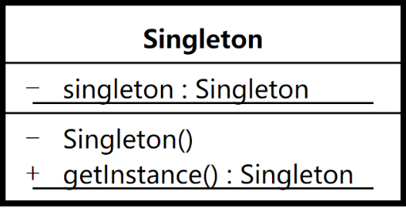
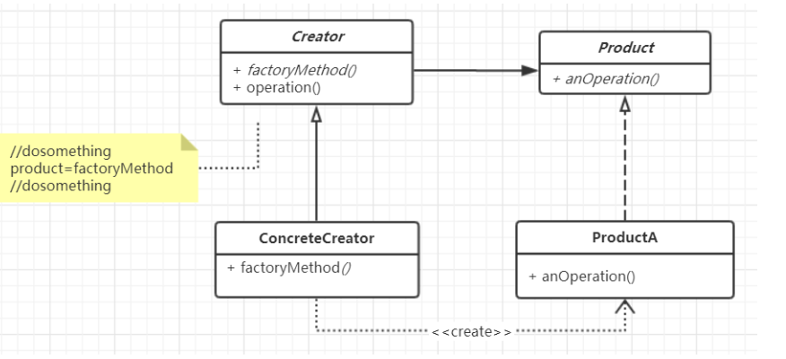

# 设计模式

## 1. 单例模式

Singleton

**模式定义：**保证一个类只有一个实例，并且提供一个全局访问点

**运用场景：**重量级的对象，不需要多个实例，如线程池，数据库连接池。



### 1.1 懒汉模式

延迟加载， 只有在真正使用的时候，才开始实例化。

1. 线程安全问题
2. double check 加锁优化
3. 编译器(JIT)，CPU 有可能对指令进行重排序，导致使用到尚未初始化的实例，可以通过添加<font color=red>**volatile**</font> 关键字进行修饰， 对于<font color=red>**volatile**</font> 修饰的字段，可以防止指令重排。

```java
public class Demo {
    public static void main(String[] args) {
        Demo demo = new Demo();
    }
}
```

```shell
# cd到字节码目录
javap -v Demo.class
```

javap进行反编译，结果如下

```java
Last modified 2020-2-29; size 459 bytes
  MD5 checksum aba61d6feacd2b4af87e55d01ee4a15a
  Compiled from "Demo.java"
public class com.zxj.singleton.hungry_singleton.Demo
  minor version: 0
  major version: 52
  flags: ACC_PUBLIC, ACC_SUPER
Constant pool:
   #1 = Methodref          #4.#19         // java/lang/Object."<init>":()V
   #2 = Class              #20            // com/zxj/singleton/hungry_singleton/Demo
   #3 = Methodref          #2.#19         // com/zxj/singleton/hungry_singleton/Demo."<init>":()V
   #4 = Class              #21            // java/lang/Object
   #5 = Utf8               <init>
   #6 = Utf8               ()V
   #7 = Utf8               Code
   #8 = Utf8               LineNumberTable
   #9 = Utf8               LocalVariableTable
  #10 = Utf8               this
  #11 = Utf8               Lcom/zxj/singleton/hungry_singleton/Demo;
  #12 = Utf8               main
  #13 = Utf8               ([Ljava/lang/String;)V
  #14 = Utf8               args
  #15 = Utf8               [Ljava/lang/String;
  #16 = Utf8               demo
  #17 = Utf8               SourceFile
  #18 = Utf8               Demo.java
  #19 = NameAndType        #5:#6          // "<init>":()V
  #20 = Utf8               com/zxj/singleton/hungry_singleton/Demo
  #21 = Utf8               java/lang/Object
{
  public com.zxj.singleton.hungry_singleton.Demo();
    descriptor: ()V
    flags: ACC_PUBLIC
    Code:
      stack=1, locals=1, args_size=1
         0: aload_0
         1: invokespecial #1                  // Method java/lang/Object."<init>":()V
         4: return
      LineNumberTable:
        line 8: 0
      LocalVariableTable:
        Start  Length  Slot  Name   Signature
            0       5     0  this   Lcom/zxj/singleton/hungry_singleton/Demo;

  public static void main(java.lang.String[]);
    descriptor: ([Ljava/lang/String;)V
    flags: ACC_PUBLIC, ACC_STATIC
    Code:
      stack=2, locals=2, args_size=1
/*
这个为main方法，new为创建一个对象，#2 是常亮池（Constant pool）中的编号，对应表示new了一个Demo对象，在堆空间上创建一块空间，把空间的引用返回
*/
         0: new           #2                  // class com/zxj/singleton/hungry_singleton/Demo
/*
dup dup指令可以复制栈顶的一个字再压入栈,也就是把栈顶的内容做个备份
*/
         3: dup
/*
invokespecial 调用初始化方法 Method "<init>":()V 。会取出栈顶的值，对该空间进行初始化
*/
         4: invokespecial #3                  // Method "<init>":()V
/*
astore_1 取出栈顶的值，复制给新建的变量Demo demo中
*/      
         7: astore_1
         8: return
      LineNumberTable:
        line 10: 0
        line 11: 8
      LocalVariableTable:
        Start  Length  Slot  Name   Signature
            0       9     0  args   [Ljava/lang/String;
            8       1     1  demo   Lcom/zxj/singleton/hungry_singleton/Demo;
}
SourceFile: "Demo.java"

```

**懒汉模式示例代码**

```java
/**
 * 懒汉模式：当实际调用的时候才去创建对象，避免启动时加载过多的对象
 */
class LazySingleton {

    // volatile 防止指令重排
    private volatile static LazySingleton instance;

    // 私有的构造方法，禁止外部创建对象
    private LazySingleton() {

    }

    /**
     * double check双重检查，提高性能
     * 公开的获取示例的方法
     * @return
     */
    public static LazySingleton getInstance() {

        if (instance == null) {
            // 如果有并发操作，会在这行代码锁住，只允许一个线程执行
            // 如果没有加锁，当两个线程执行到instance == null时，会同时创建一个新的对象
            synchronized (LazySingleton.class) {
                // 如果有线程已经解锁，第二个线程也执行这行代码，则instance不会空，不会重复创建实例
                // 第二次检查
                if (instance == null) {
                    instance = new LazySingleton();
                }
                // new 一个对象，在字节码上的操作
                // JIT 即时编译 just in time，或者CPU 可能会对会对字节码上的指令进行重新排序
                // 1 分配空间
                // 2 初始化空间
                // 3 将空间地址进行赋值
                // 正常的顺序是123，可能重新排序后就是132，单线程结果是没有影响的

                // 如果有两个线程，第一个线程拿到了锁，执行了操作13，但是还没有进行初始化空间
                // instance已经不会空，但是指向的空间为空
                // 这时第二个线程也调用该方法获得实例，发现instance不为空，则返回了这个地址
                // 但是空间还没有初始化，调用方可能会出现空指针异常

                // 解决方法 volatile 防止指令重排序
            }
        }
        return instance;
    }
}
```

### 1.2 饿汉模式

类加载的初始化阶段就完成了实例的初始化 。本质上就是借助于jvm 类加载机制，保证实例的唯一性(初始化过程只会执行一次)及线程安全(JVM以同步的形式来完成类加载的整个过程)。
类加载过程:

1. 加载二进制数据到内存中， 生成对应的Class数据结构，   

2. 连接: 

   a. 验证

   b.准备(给类的静态成员变量赋默认值)

   c.解析 

3. 初始化: 给类的静态变量赋初值

只有在真正使用对应的类时，才会触发初始化 如( 当前类是启动类即 main函数所在类，直接进行new 操作，访问静态属性、访问静态方 法，用反射访问类，初始化一个类的子类等.)

```java
/**
 * 当调用getInstance的，jvm会判断内存是否有HungrySingleton这个实例，如果没有这会先加载类
 * 1. 加载二进制数据到内存中， 生成对应的Class数据结构，
 * 2. 连接:
 *    a. 验证
 *    b. 准备(给类的静态成员变量赋默认值)
 *    c. 解析
 * 3. 初始化: 给类的静态变量赋初值
 * jvm可以保证该流程只执行一次，可以保证instance为单例
 */
class HungrySingleton {
    private static HungrySingleton instance = new HungrySingleton();

    private HungrySingleton() {

    }

    public static HungrySingleton getInstance() {
        return instance;
    }
}
```

### 1.3 静态内部类

1. 本质上是利用类的加载机制来保证线程安全 
2. 只有在实际使用的时候，才会触发类的初始化，所以也是懒加载的一 种形式。

```java
/**
 * 静态内部类方式，懒加载模式
 */
class InnerClassSingleton {
    // 当被调用的时候才会被加载
    private static class InnerClassHolder {
        private static InnerClassSingleton instance = new InnerClassSingleton();
    }

    private InnerClassSingleton() {

    }

    public static InnerClassSingleton getInstance() {
        return InnerClassHolder.instance;
    }
}
```

### 1.4 反射攻击实例

```java
//反射机制，获取构造方法
        Constructor<InnerClassSingleton> declaredConstructor = InnerClassSingleton.class.getDeclaredConstructor();
        //将private改为public
        declaredConstructor.setAccessible(true);
        //创建一个实例
        InnerClassSingleton innerClassSingleton = declaredConstructor.newInstance();

        //获取内存中的示例
        InnerClassSingleton innerClassSingleton1 = InnerClassSingleton.getInstance();
        System.out.println(innerClassSingleton == innerClassSingleton1);
```

输出结果为false，表示反射创建的对象是新实例化了一个对象，这时单例就不会单例。对于饿汉模式和静态内部类的方式可以通过在构造方法判断实例是否为空，然后抛异常的方式拒绝新建实例，懒汉模式就不可以，懒汉模式本身实例为空，调用的时候才创建对象，就会直接抛异常。

```java
/**
 * 静态内部类方式，懒加载模式
 */
class InnerClassSingleton {
    // 当被调用的时候才会被加载
    private static class InnerClassHolder {
        private static InnerClassSingleton instance = new InnerClassSingleton();
    }

    private InnerClassSingleton() {
        // 构造方法中添加判断，可以方式反射重复实例化
        if(InnerClassHolder.instance != null) {
            throw new RuntimeException("单例不允许重复实例化");
        }

    }

    public static InnerClassSingleton getInstance() {
        return InnerClassHolder.instance;
    }
}
```

### 1.5 枚举类型 

1. 天然**不支持**反射创建对应的实例，且有自己的**反序列化机制** 
2. 利用类加载机制保证**线程安全**

```java
    //Constructor 反射创建对象是，如果是enum类型会报错	
		@CallerSensitive
    public T newInstance(Object ... initargs)
        throws InstantiationException, IllegalAccessException,
               IllegalArgumentException, InvocationTargetException
    {
        if (!override) {
            if (!Reflection.quickCheckMemberAccess(clazz, modifiers)) {
                Class<?> caller = Reflection.getCallerClass();
                checkAccess(caller, clazz, null, modifiers);
            }
        }
        //判断是否为enum类型
        if ((clazz.getModifiers() & Modifier.ENUM) != 0)
            throw new IllegalArgumentException("Cannot reflectively create enum objects");
        ConstructorAccessor ca = constructorAccessor;   // read volatile
        if (ca == null) {
            ca = acquireConstructorAccessor();
        }
        @SuppressWarnings("unchecked")
        T inst = (T) ca.newInstance(initargs);
        return inst;
    }
```

枚举的单例模式

```java
enum EnumSingleton {
    INSTANCE;
    public void print() {
        System.out.println(this.hashCode());
    }
}
```

对EnumSingleton进行反编译

```shell
 javap -v -p EnumSingleton.class
```

反编译内容

```java
Classfile /Volumes/MyFile/workspace/intellijidea/design_patterns/out/production/design_patterns/com/zxj/singleton/enum_singleton/EnumSingleton.class
  Last modified 2020-2-29; size 1272 bytes
  MD5 checksum f1121bf253875e1295aa55a3def10c8e
  Compiled from "EnumSingletonTest.java"
    
//jvm会生成一个final的class，并且继承了java中的Enum抽象类

final class com.zxj.singleton.enum_singleton.EnumSingleton extends java.lang.Enum<com.zxj.singleton.enum_singleton.EnumSingleton>
  minor version: 0
  major version: 52
  flags: ACC_FINAL, ACC_SUPER, ACC_ENUM
    
 //常量池
    
Constant pool:
   #1 = Fieldref           #4.#37         // com/zxj/singleton/enum_singleton/EnumSingleton.$VALUES:[Lcom/zxj/singleton/enum_singleton/EnumSingleton;
   #2 = Methodref          #38.#39        // "[Lcom/zxj/singleton/enum_singleton/EnumSingleton;".clone:()Ljava/lang/Object;
   #3 = Class              #17            // "[Lcom/zxj/singleton/enum_singleton/EnumSingleton;"
   #4 = Class              #40            // com/zxj/singleton/enum_singleton/EnumSingleton
   #5 = Methodref          #13.#41        // java/lang/Enum.valueOf:(Ljava/lang/Class;Ljava/lang/String;)Ljava/lang/Enum;
   #6 = Methodref          #13.#42        // java/lang/Enum."<init>":(Ljava/lang/String;I)V
   #7 = Fieldref           #43.#44        // java/lang/System.out:Ljava/io/PrintStream;
   #8 = Methodref          #4.#45         // com/zxj/singleton/enum_singleton/EnumSingleton.hashCode:()I
   #9 = Methodref          #46.#47        // java/io/PrintStream.println:(I)V
  #10 = String             #14            // INSTANCE
  #11 = Methodref          #4.#42         // com/zxj/singleton/enum_singleton/EnumSingleton."<init>":(Ljava/lang/String;I)V
  #12 = Fieldref           #4.#48         // com/zxj/singleton/enum_singleton/EnumSingleton.INSTANCE:Lcom/zxj/singleton/enum_singleton/EnumSingleton;
  #13 = Class              #49            // java/lang/Enum
  #14 = Utf8               INSTANCE
  #15 = Utf8               Lcom/zxj/singleton/enum_singleton/EnumSingleton;
  #16 = Utf8               $VALUES
  #17 = Utf8               [Lcom/zxj/singleton/enum_singleton/EnumSingleton;
  #18 = Utf8               values
  #19 = Utf8               ()[Lcom/zxj/singleton/enum_singleton/EnumSingleton;
  #20 = Utf8               Code
  #21 = Utf8               LineNumberTable
  #22 = Utf8               valueOf
  #23 = Utf8               (Ljava/lang/String;)Lcom/zxj/singleton/enum_singleton/EnumSingleton;
  #24 = Utf8               LocalVariableTable
  #25 = Utf8               name
  #26 = Utf8               Ljava/lang/String;
  #27 = Utf8               <init>
  #28 = Utf8               (Ljava/lang/String;I)V
  #29 = Utf8               this
  #30 = Utf8               Signature
  #31 = Utf8               ()V
  #32 = Utf8               print
  #33 = Utf8               <clinit>
  #34 = Utf8               Ljava/lang/Enum<Lcom/zxj/singleton/enum_singleton/EnumSingleton;>;
  #35 = Utf8               SourceFile
  #36 = Utf8               EnumSingletonTest.java
  #37 = NameAndType        #16:#17        // $VALUES:[Lcom/zxj/singleton/enum_singleton/EnumSingleton;
  #38 = Class              #17            // "[Lcom/zxj/singleton/enum_singleton/EnumSingleton;"
  #39 = NameAndType        #50:#51        // clone:()Ljava/lang/Object;
  #40 = Utf8               com/zxj/singleton/enum_singleton/EnumSingleton
  #41 = NameAndType        #22:#52        // valueOf:(Ljava/lang/Class;Ljava/lang/String;)Ljava/lang/Enum;
  #42 = NameAndType        #27:#28        // "<init>":(Ljava/lang/String;I)V
  #43 = Class              #53            // java/lang/System
  #44 = NameAndType        #54:#55        // out:Ljava/io/PrintStream;
  #45 = NameAndType        #56:#57        // hashCode:()I
  #46 = Class              #58            // java/io/PrintStream
  #47 = NameAndType        #59:#60        // println:(I)V
  #48 = NameAndType        #14:#15        // INSTANCE:Lcom/zxj/singleton/enum_singleton/EnumSingleton;
  #49 = Utf8               java/lang/Enum
  #50 = Utf8               clone
  #51 = Utf8               ()Ljava/lang/Object;
  #52 = Utf8               (Ljava/lang/Class;Ljava/lang/String;)Ljava/lang/Enum;
  #53 = Utf8               java/lang/System
  #54 = Utf8               out
  #55 = Utf8               Ljava/io/PrintStream;
  #56 = Utf8               hashCode
  #57 = Utf8               ()I
  #58 = Utf8               java/io/PrintStream
  #59 = Utf8               println
  #60 = Utf8               (I)V
{
  
  //静态属性 INSTANCE
  
  public static final com.zxj.singleton.enum_singleton.EnumSingleton INSTANCE;
  
  //描述符，它的类型
  
    descriptor: Lcom/zxj/singleton/enum_singleton/EnumSingleton;
  
  //访问限制符
  
    flags: ACC_PUBLIC, ACC_STATIC, ACC_FINAL, ACC_ENUM

 // 多个每个成员的值，数组
      
  private static final com.zxj.singleton.enum_singleton.EnumSingleton[] $VALUES;
    descriptor: [Lcom/zxj/singleton/enum_singleton/EnumSingleton;
    flags: ACC_PRIVATE, ACC_STATIC, ACC_FINAL, ACC_SYNTHETIC

//获取values的方法
                 
  public static com.zxj.singleton.enum_singleton.EnumSingleton[] values();
    descriptor: ()[Lcom/zxj/singleton/enum_singleton/EnumSingleton;
    flags: ACC_PUBLIC, ACC_STATIC
    Code:
      stack=1, locals=0, args_size=0
         0: getstatic     #1                  // Field $VALUES:[Lcom/zxj/singleton/enum_singleton/EnumSingleton;
         3: invokevirtual #2                  // Method "[Lcom/zxj/singleton/enum_singleton/EnumSingleton;".clone:()Ljava/lang/Object;
         6: checkcast     #3                  // class "[Lcom/zxj/singleton/enum_singleton/EnumSingleton;"
         9: areturn
      LineNumberTable:
        line 17: 0

//valueOf方法
                   
  public static com.zxj.singleton.enum_singleton.EnumSingleton valueOf(java.lang.String);
    descriptor: (Ljava/lang/String;)Lcom/zxj/singleton/enum_singleton/EnumSingleton;
    flags: ACC_PUBLIC, ACC_STATIC
    Code:
      stack=2, locals=1, args_size=1
         0: ldc           #4                  // class com/zxj/singleton/enum_singleton/EnumSingleton
         2: aload_0
         3: invokestatic  #5                  // Method java/lang/Enum.valueOf:(Ljava/lang/Class;Ljava/lang/String;)Ljava/lang/Enum;
         6: checkcast     #4                  // class com/zxj/singleton/enum_singleton/EnumSingleton
         9: areturn
      LineNumberTable:
        line 17: 0
      LocalVariableTable:
        Start  Length  Slot  Name   Signature
            0      10     0  name   Ljava/lang/String;

//私有的构造方法
                   
  private com.zxj.singleton.enum_singleton.EnumSingleton();
                   
    //接收String和int类型的参数，返回值为空
                   
    descriptor: (Ljava/lang/String;I)V
    flags: ACC_PRIVATE
    Code:
      stack=3, locals=3, args_size=3
         0: aload_0
         1: aload_1
         2: iload_2
         3: invokespecial #6                  // Method java/lang/Enum."<init>":(Ljava/lang/String;I)V
         6: return
      LineNumberTable:
        line 17: 0
      LocalVariableTable:
        Start  Length  Slot  Name   Signature
            0       7     0  this   Lcom/zxj/singleton/enum_singleton/EnumSingleton;
    Signature: #31                          // ()V

  public void print();
    descriptor: ()V
    flags: ACC_PUBLIC
    Code:
      stack=2, locals=1, args_size=1
         0: getstatic     #7                  // Field java/lang/System.out:Ljava/io/PrintStream;
         3: aload_0
         4: invokevirtual #8                  // Method hashCode:()I
         7: invokevirtual #9                  // Method java/io/PrintStream.println:(I)V
        10: return
      LineNumberTable:
        line 20: 0
        line 21: 10
      LocalVariableTable:
        Start  Length  Slot  Name   Signature
            0      11     0  this   Lcom/zxj/singleton/enum_singleton/EnumSingleton;

//静态代码块
                   
  static {};
    descriptor: ()V
    flags: ACC_STATIC
    Code:
      stack=4, locals=0, args_size=0
         0: new           #4                  // class com/zxj/singleton/enum_singleton/EnumSingleton
         3: dup
         4: ldc           #10                 // String INSTANCE
         6: iconst_0
         7: invokespecial #11                 // Method "<init>":(Ljava/lang/String;I)V
        10: putstatic     #12                 // Field INSTANCE:Lcom/zxj/singleton/enum_singleton/EnumSingleton;
        13: iconst_1
        14: anewarray     #4                  // class com/zxj/singleton/enum_singleton/EnumSingleton
        17: dup
        18: iconst_0
        19: getstatic     #12                 // Field INSTANCE:Lcom/zxj/singleton/enum_singleton/EnumSingleton;
        22: aastore
        23: putstatic     #1                  // Field $VALUES:[Lcom/zxj/singleton/enum_singleton/EnumSingleton;
        26: return
      LineNumberTable:
        line 18: 0
        line 17: 13
}
Signature: #34                          // Ljava/lang/Enum<Lcom/zxj/singleton/enum_singleton/EnumSingleton;>;
SourceFile: "EnumSingletonTest.java"

```

可以看出enum枚举类在编译的时候回继承java.lang.Enum，所以也调用父类的构造方法，方法中有两个参数，String和int类型。

```java
public abstract class Enum<E extends Enum<E>>
        implements Comparable<E>, Serializable {
      protected Enum(String name, int ordinal) {
        this.name = name;
        this.ordinal = ordinal;
    }
}
```

通过反射对enum类创建对象，会报错

```java
//反射创建enum的对象，会报错，enum天生不支持反射创建对象
        Constructor<EnumSingleton> declaredConstructor = EnumSingleton.class.getDeclaredConstructor(String.class, int.class);
        declaredConstructor.setAccessible(true);
        EnumSingleton instance = declaredConstructor.newInstance("INSTANCE", 0);
```

异常信息，所以enum不能用过反射来创建对象

```java
Exception in thread "main" java.lang.IllegalArgumentException: Cannot reflectively create enum objects
	at java.lang.reflect.Constructor.newInstance(Constructor.java:417)
	at com.zxj.singleton.enum_singleton.EnumSingletonTest.main(EnumSingletonTest.java:18)
```

### 1.6 序列化

可以利用 指定方法来替换从反序列化流中的数据 如下

用静态内部类的代码示例，继承Serializable接口，支持序列化

```java
class InnerClassSingleton implements Serializable {
    // 当被调用的时候才会被加载
    private static class InnerClassHolder {
        private static InnerClassSingleton instance = new InnerClassSingleton();
    }

    private InnerClassSingleton() {
        // 构造方法中添加判断，可以方式反射重复实例化
        if(InnerClassHolder.instance != null) {
            throw new RuntimeException("单例不允许重复实例化");
        }

    }

    public static InnerClassSingleton getInstance() {
        return InnerClassHolder.instance;
    }
}
```

序列化到文件中

```java
//序列号到文件中
        ObjectOutputStream oos = new ObjectOutputStream(new FileOutputStream("testSerializable"));
        oos.writeObject(instance);
        oos.close();
```

然后从文件中读取

```java
//读取文件
        ObjectInputStream ois = new ObjectInputStream(new FileInputStream("testSerializable"));
        InnerClassSingleton o = ((InnerClassSingleton) ois.readObject());
```

比较内存中和序列化中的对象是否为同一个（目前不是同一个实例），反序列化操作对单例造成了破坏。反序列化创建对象不会调用构成函数，而是有自己的反序列化机制，从字节流中拿数据。

**解决方法:**添加readResolve方法

```java
/**
 * 静态内部类方式，懒加载模式
 */
class InnerClassSingleton implements Serializable {
    //序列化后兼容各个版本，如果有修改代码
    public static final long serialVersionUID = 42L;
    // 当被调用的时候才会被加载
    private static class InnerClassHolder {
        private static InnerClassSingleton instance = new InnerClassSingleton();
    }

    private InnerClassSingleton() {
        // 构造方法中添加判断，可以方式反射重复实例化
        if(InnerClassHolder.instance != null) {
            throw new RuntimeException("单例不允许重复实例化");
        }

    }

    public static InnerClassSingleton getInstance() {
        return InnerClassHolder.instance;
    }

    /**
     * 使反序列化后的实例和内存中的实例为同一个实例
     * @return
     * @throws ObjectStreamException
     */
    Object readResolve() throws ObjectStreamException {
        return InnerClassHolder.instance;
    }
}
```

再次序列化然后反序列化为对象的时候，显示为同一个实例

### 1.7 源码中的应用

```java
//Spring&JDK
java.lang.Runtime
org.springframework.aop.framework.ProxyFactoryBean
org.springframework.beans.factory.support.DefaultSingletonBeanRegistry
org.springframework.core.ReactiveAdapterRegistry
//Tomcat
org.apache.catalina.webresources.TomcatURLStreamHandlerFactory
// 反序列化指定数据源
java.util.Currency
```

## 2. 工厂方法模式

Factory Method

模式定义: 定义一个用于创建对象的接口，让子类决定实例化哪一个类。Factory Method 使得一个类的实例化延迟到子类



运用场景，代码重构。（需要重构的代码）

```java
/*
需要重构的代码
*/
public class FactoryMethod {
    public static void main(String[] args) {
        Application application = new Application();
        ProductA productA = application.getProductA();
        productA.method();
    }
}

//假设以后还会有其他的产品，B C D
class ProductA {
    public void method() {
        System.out.println("product a");
    }
}


class Application {
    //以后就会重新修改代码，不符合开闭原则
    private ProductA createProduct() {
        // TODO something else
        return new ProductA();
    }

    ProductA getProductA() {
        ProductA productA = createProduct();
        return productA;
    }
}
```

### 2.1 简单工厂

简单工厂不是设计模式，只是一种编程习惯，或者思想，将product共有的方法抽象出来，实际的product继承该接口，创建对象时，可以通过指定的参数进行创建对象。但是如果添加了product，则还是会修改SimpleFactory的代码，不符合开闭原则。

```java
public class FactoryMethod {
    public static void main(String[] args) {
        Application application = new Application();
        Product productA = application.getProductA("b");
        productA.method();
    }
}

/**
 * 简单工厂，不是设计模式，只是编程习惯
 * 解决了new 的问题，统一管理
 */
class SimpleFactory {
    public static Product createProduct(String type) {
        switch (type) {
            case "a":
                return new ProductA();
            case "b":
                return new ProductB();
            default:
                return null;
        }
    }
}

/**
 * 进行product的抽象
 */
interface Product {
    void method();
}

class ProductA implements Product{
    @Override
    public void method() {
        System.out.println("product a");
    }
}

class ProductB implements Product{
    @Override
    public void method() {
        System.out.println("product b");
    }
}

class Application {
    private Product createProduct(String type) {
        // TODO something you want to do
        return SimpleFactory.createProduct(type);
    }

    Product getProductA(String type) {
        Product productA = createProduct(type);
        return productA;
    }
}
```

### 2.2 抽象方法

```java
public class FactoryMethod {
    public static void main(String[] args) {
        AbstractFactoryProduct abstractFactoryProduct = new ConcreateProductB();
        Product product = abstractFactoryProduct.getProduct();
        product.method();
    }
}

/**
 * 进行product的抽象
 */
interface Product {
    void method();
}

class ProductA implements Product{
    @Override
    public void method() {
        System.out.println("product a");
    }
}

class ProductB implements Product{
    @Override
    public void method() {
        System.out.println("product b");
    }
}

/**
 * 抽象工厂
 * 抽象方法，将创建对象延迟到子类
 * 把创建对象的方法定义为抽象，具体创建由子类创建
 * 如果有新添加的product，只需要新建一个创建的工厂继承该抽象类，即可创建新product
 * 符合开闭原则，对扩展打开，对修改关闭
 */
abstract class AbstractFactoryProduct {
    abstract Product createProduct();

    Product getProduct() {
        Product product = createProduct();
        // TODO something you want to do
        return product;
    }
}

/**
 * 创建productA的工厂
 */
class ConcreateProductA extends AbstractFactoryProduct {
    @Override
    Product createProduct() {
        // TODO something you want to do
        return new ProductA();
    }
}

/**
 * 创建productB的工厂
 */
class ConcreateProductB extends AbstractFactoryProduct {
    @Override
    Product createProduct() {
        // TODO something you want to do
        return new ProductB();
    }
}
```

### 2.3 应用场景

1. 当你不知道改使用对象的确切类型的时候 
2. 当你希望为库或框架提供扩展其内部组件的方法时

主要优点

1. 将具体产品和创建者解耦
2. 符合单一职责原则
3. 符合开闭原则

### 2.4 源码中的应用

```java
//javaapi
// 静态工厂方法
Calendar.getInstance()
java.text.NumberFormat.getInstance()
java.util.ResourceBundle.getBundle()
// 工厂方法
java.net.URLStreamHandlerFactory
javax.xml.bind.JAXBContext.createMarshaller
```

